#   نگاهی تحلیلی بر رقابت‌های CTF در سال ۲۰۲۴ 

در این پست نگاهی تحلیلی انداختیم به آمارها و داده‌های  سایت CTFtime مربوط به سال ۲۰۲۴ که در ادامه ارائه شده است. 📈📉📊

 

<!-- more -->

## ۱- مقدمه

ما برای نخستین بار یک تحلیل آماری و مقایسه‌ای  روی داده‌های سایت CTFtime در سال ۲۰۲۴ انجام دادیم تا کمکی برای شرکت کنندگان و برگزارکنندگان مسابقات CTF باشد. گرچه این سایت اطلاعات خوبی را ارائه می‌دهد اما برخی از اطلاعات مسابقات، مانند تغییر رتبه تیم‌ها در طول سال، به‌طور مستقیم در این سایت ثبت و نگهداری نمی‌شوند، بنابراین ما این داده‌ها را به‌مرور در طول سال جمع‌آوری و تحلیل کرده‌ایم. این بررسی شامل روند امتیازات، توزیع رتبه‌ها، میزان رقابت‌پذیری مسابقات و معیارهای انتخاب بهترین رویداد برای شرکت‌کنندگان است.
همچنین، کدهای مورد استفاده برای تولید این نمودارها در این [آدرس](https://github.com/FlagMotori/CTFTime-Analysis) در دسترس هستند تا سایر 
علاقه‌مندان بتوانند داده‌ها را بررسی و تحلیل کنند. 🚀

🔍در ابتدا ویدیویی از رقابت ۱۰ تیم برتر در طول سال ۲۰۲۴ را مشاهده می‌بینید که پیش افتادن تیم kalmarunionen  از هفته ۱۳ جالب توجه است.

 

## ۲- مقایسه نسبت امتیازات به رتبه

این نمودار توزیع امتیازات برای ۲۰۰ تیم برتر در سال ۲۰۲۴ نشان می‌دهد. همان‌طور که از نمودار مشخص است، اختلاف امتیاز بین تیم‌های رتبه‌های بالا (رتبه‌های ۱ تا ۲۵ ) نسبت به تیم‌ها با رتبه‌های پایین‌تر زیاد است. به عبارت دیگر شیب نزولی امتیاز در رتبه‌های بالا زیادتر است و برای رتبه‌های پایین به تدریج کم می‌شود که نشان‌دهنده شکاف قابل توجه امتیاز است. این الگو نشان‌ می‌دهد که تیم‌های میان رده با اندکی کسب امتیاز بیشتر، می‌توانستند رتبه بهتری بدست آورند، هرچند که در بالای جدول رقابت برای قرار گرفتن جز ۱۰ تیم زیاد است.

 
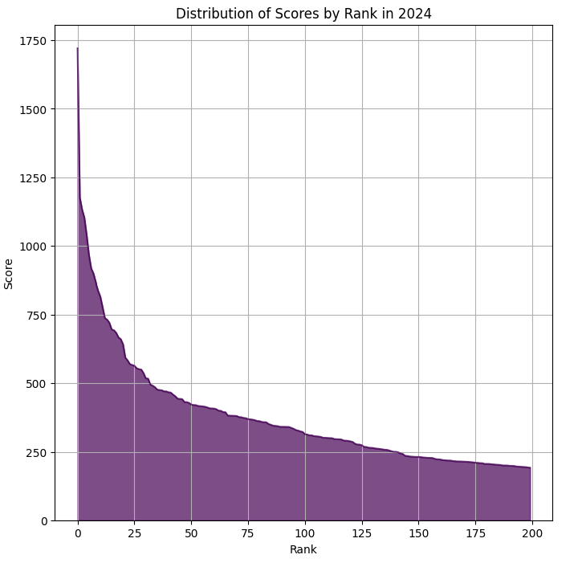{ width=450px height=450px }

## ۳- توزیع حضور تیم‌ها در رویدادها

 اگرچه سایت CTFtime از سال ۲۰۱۷ برای رتبه‌بندی تیم‌ها تنها ۱۰ مسابقه‌ با بیشترین امتیاز هر تیم را لحاظ می‌کند، اما بررسی میزان شرکت در مسابقات جالب است.
نمودار میله‌ای اول (هیستوگرام) توزیع تعداد رویدادهای شرکت‌شده در سال ۲۰۲۴ را نشان می‌دهد. بیشتر تیم‌ها در بازه ۱ تا ۳۰ رویداد را شرکت کرده‌اند، اما تعداد کمی از تیم‌ها در بیش از ۶۰ رویداد حاضر بوده‌اند. نمودار جعبه‌ای دوم این را تایید می‌کند که میانه تعداد رویدادهای شرکت‌شده حدود ۲۰ است، اما مقادیر پرت (outliers) نشان می‌دهند که برخی تیم‌ها تعداد بسیار بالایی از رویدادها را شرکت کرده‌اند، حتی تا ۱۵۰ رویداد!! این تفاوت نشان می‌دهد که ممکن است برخی تیم‌ها از این رتبه‌بندی اطلاع ندارند، در حالی که بیشتر تیم‌ها هدفمندتر حضور محدودتری داشتند.

 
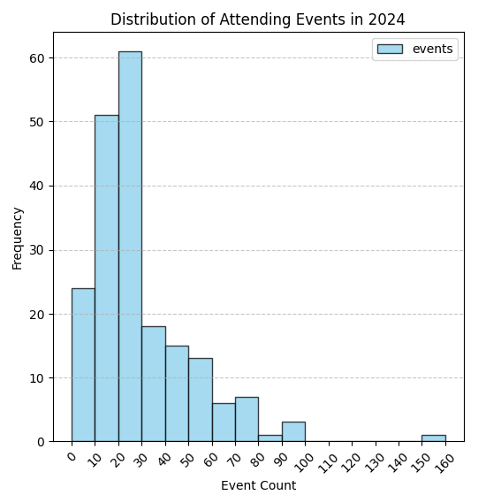{ width=350px height=400px }
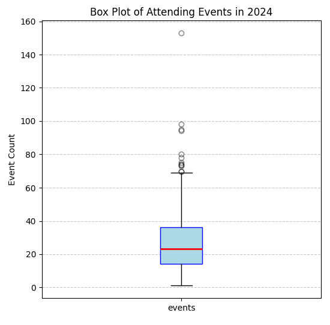{ width=350px height=400px }

## ۴- تأثیر تعداد رویداد بر امتیاز تیم‌ها

این نمودار پراکندگی، توزیع امتیازات تیم‌ها را در برابر تعداد رویدادهای CTF که در سال ۲۰۲۴ شرکت کرده‌اند نشان می‌دهد. مشاهده می‌شود که اکثر تیم‌ها در محدوده ۱۰ تا ۴۰ رویداد حضور داشته‌اند و امتیازات آن‌ها در بازه ۲۰۰ تا ۶۰۰ قرار دارد. همچنین، چند تیم که در تعداد کمی از مسابقات شرکت کرده‌اند، امتیازات بسیار بالایی کسب کرده‌اند که نشان‌دهنده تمرکز آن‌ها بر رویدادهای باکیفیت‌تر یا عملکرد بهینه‌تر در مسابقات است. در مقابل، برخی تیم‌ها که در بیش از ۸۰ رویداد شرکت کرده‌اند، امتیازات متوسط یا پایین‌تری دارند. داده‌ها و نمونه‌ای با امتیاز بیشتر از ۱۶۰۰ تأیید می‌کنند که صرفاً شرکت در تعداد زیاد مسابقات تضمین‌کننده رتبه بالا نیست و شناخت توانایی تیم خود و انتخاب هوشمندانه مسابقه نقش مهمی در امتیازهای بالا دارد.

🔍 یکی از **نکاتی** که باید لحاظ کرد این است که تیم‌های باتجربه احتمالا مسابقه کمتری شرکت کردند، چون با کسب امتیاز بالا از یک مسابقه خوب، وقتشان را بهینه‌تر سرمایه‌گذاری کردند. در مقابل، تیم‌های نوپا با حضور بیشتر، به دنبال یادگیری بیشتر، رشد سریع‌تر و کسب تجربه از این مسابقات بودند. 

 
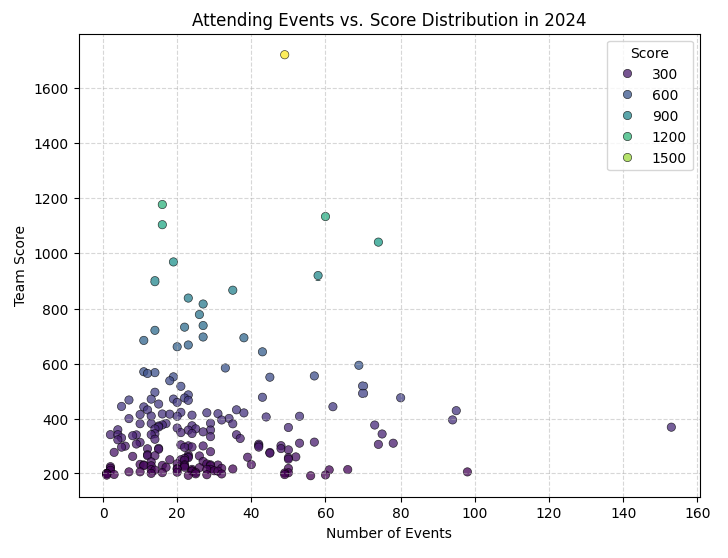{ width=500px height=500px }

## ۵- توزیع تعداد تیم‌ها بر اساس کشور

**نمودار اول** تعداد تیم‌های مربوط به هر کشور در ۲۰۰ میان تیم برتر سال ۲۰۲۴  را نشان می‌دهد. ایالات متحده با ۲۴ تیم در صدر قرار دارد و پس از آن تیم‌های بین‌المللی با ۲۱ تیم وجود داشتند. 
 این توزیع نشان‌دهنده تأثیر بالای کشورهایی مانند آمریکا و روسیه در رقابت‌های امنیت سایبری است.
 کشورهای آسیایی نظیر چین، ژاپن، ویتنام و هند نیز سهم قابل‌توجهی از تیم‌های برتر را به خود اختصاص داده‌اند.
 **نمودار دوم**، کشورهایی که بیشترین تعداد تیم را در سایت CTFtime در طول این سال‌ها داشته‌اند را نشان می‌دهد.
 ایالات متحده با ۵۹۹۶ تیم در صدر قرار دارد. هند با ۵۳۴۷ تیم نیز به‌طور چشمگیری در حال رشد است. کشورهای روسیه، چین، فرانسه و اندونزی نیز با بیش از ۱۰۰۰ تیم نیز حضور دارند.

🔍 **نکته** قابل‌توجه و پراهمیت‌تر برای ما، تعداد تیم‌های ایرانی در سال ۲۰۲۴ و در کل این سال‌هاست که می‌توان آن را با کشورهای درحال توسعه و با جمعیتی نزدیک به ایران مانند ترکیه، مصر، پاکستان مقایسه کرد. گرچه جایگاه بدی نداریم اما بنظر می‌توانیم با ترویج این مسابقات در کشور از کشورهایی مثل ایتالیا، لهستان پیشی بگیریم.

 
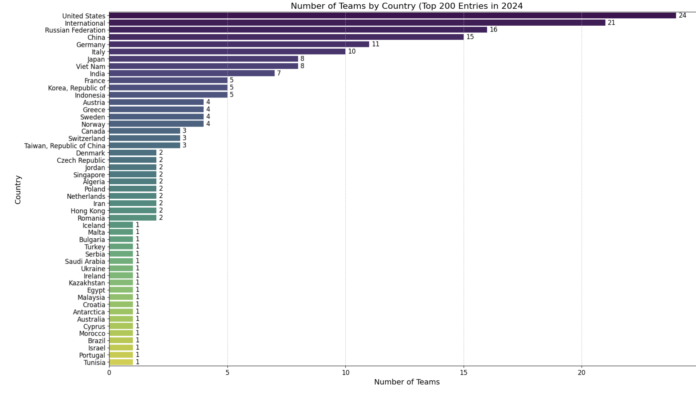{ width=600px height=400px }

 
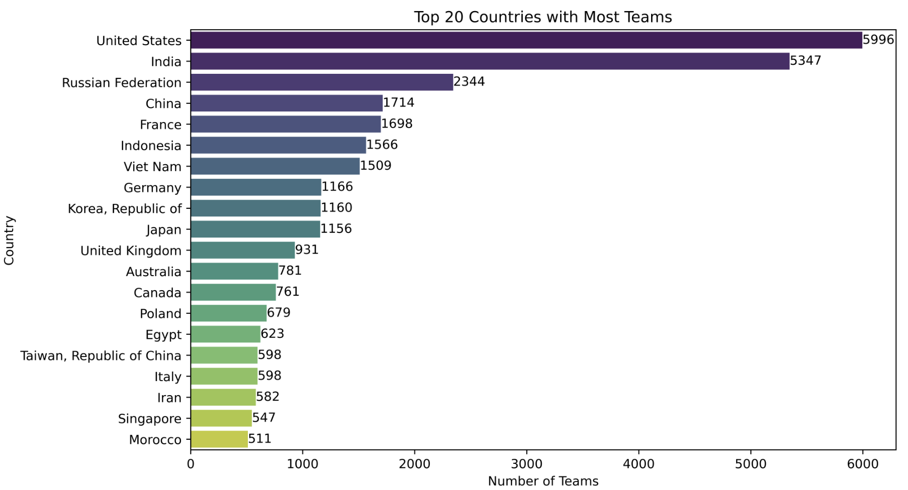{ width=600px height=400px }

## ۶- مقایسه امتیاز رتبه ۲۰ام در مسابقات مختلف 

نمودار زیر، مقایسه‌ای روی ۳۰ رویداد مختلف سال ۲۰۲۴ است که امتیاز کسب شده در رتبه ۲۰ام را بدون احتساب وزن در هر مسابقه نشان می‌دهد. رویداد ENOWARS 8 با ۶۴ امتیاز در رتبه اول قرار دارد که بیشترین امتیاز را به تیم ۲۰ام در مسابقه‌اش می‌دهد. 
اگرچه ممکن است وزن این مسابقات باهم متفاوت باشد، اما این نمودار می‌تواند به انتخاب مسابقه بهتر برای کسب امتیاز کمک کند.  مسابقاتی مانند UIUCTF ، SECCON CTF Quals و Bambi CTF نیز از جمله رویدادهای بوده‌اند که به رتبه ۲۰ام امتیاز بالایی داده‌اند. پس، اگر قصد دارید در رقابت‌های CTF شرکت کنید، این نمودار می‌تواند به شما کمک کند.

 
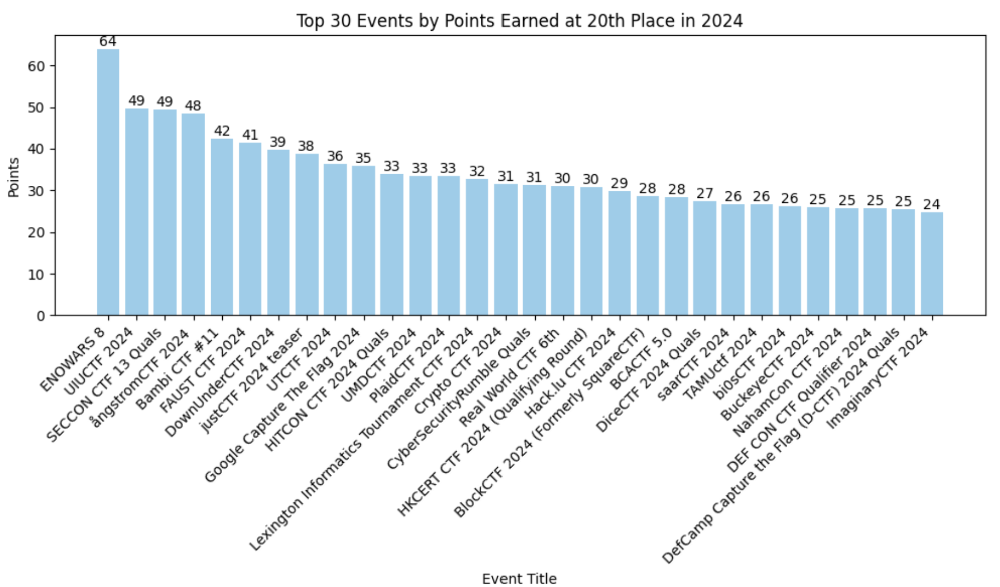{ width=600px height=400px }

## ۷- مقایسه توزیع امتیاز رویدادها

یکی از تحلیل‌های جالب، مقایسه توزیع امتیاز در مسابقات مختلف است که در نمودارهای زیر آمده است. به عبارت دیگر تغییر رتبه در مسابقات مختلف چه تاثیری روی امتیاز کسب شده دارد و شیب کاهش امتیاز با افزایش رتبه چگونه است. به عنوان مثال، نمودار زیر در سال ۲۰۲۴ در مسابقات ASISCTF Quals  و ångstromCTF نسبت امتیاز مقایسه شده است. در ångstromCTF،  اختلاف امتیازات بین رتبه‌های برتر زیاد نیست اما در ASIS CTF Quals، توزیع امتیازات افت بیشتری دارد. بدین معنی که تیم اول در هر دو مسابقه ۱۰۰ درصد امتیاز را در سایت CTFtime بدست می‌آورد در حالی که  تیم دوم درمسابقه  ASIS تنها ۵۰ درصد امتیاز آن رویداد اما در ångstromCTF  نزدیک به ۷۰ درصد امتیاز را در سایت CTFtime بدست می‌آورد. 

🔍بنابراین شرکت در مسابقاتی که شیب کاهش امتیاز کندتر است هوشمندانه خواهد بود.
😎

 
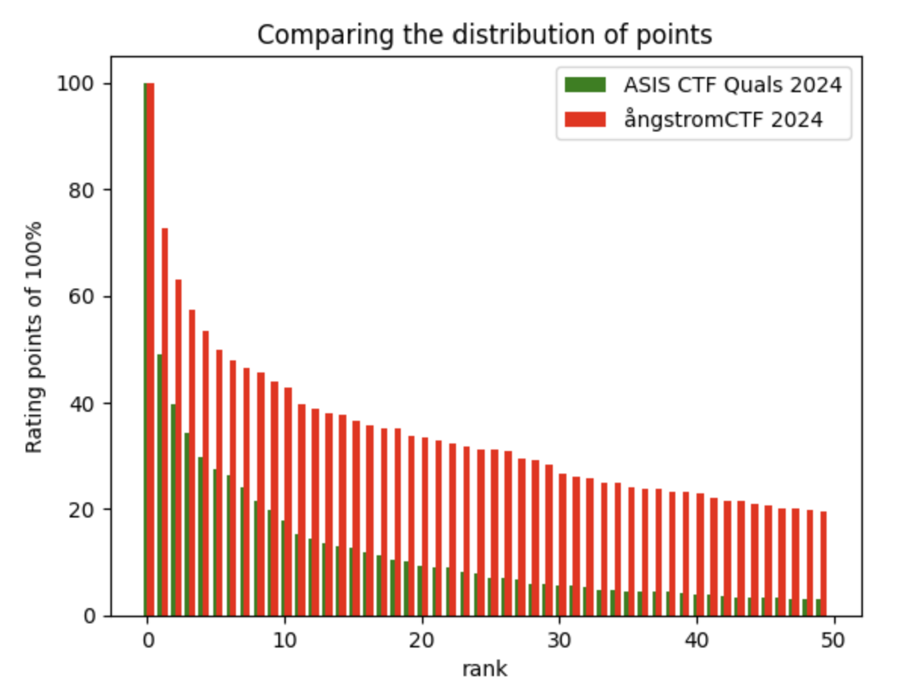{ width=400px height=400px }
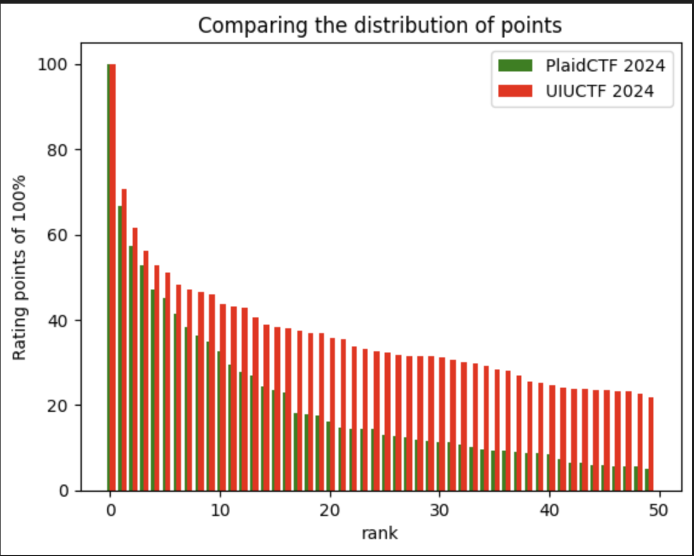{ width=400px height=400px }

 
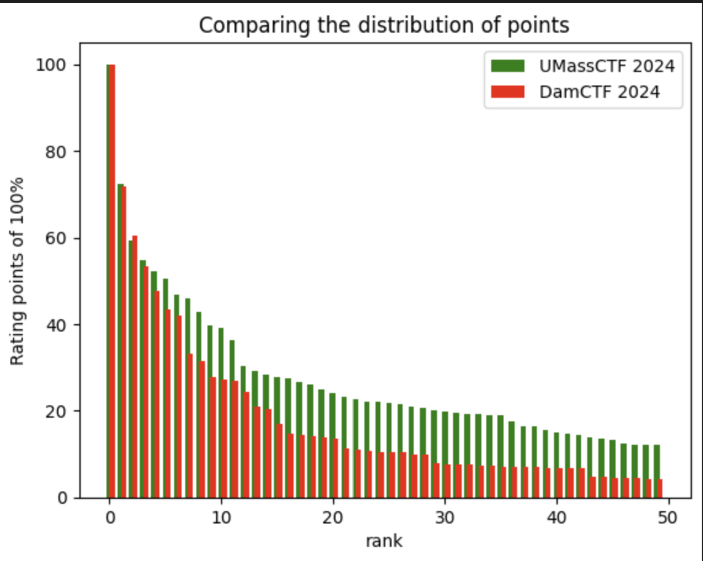{ width=400px height=400px }
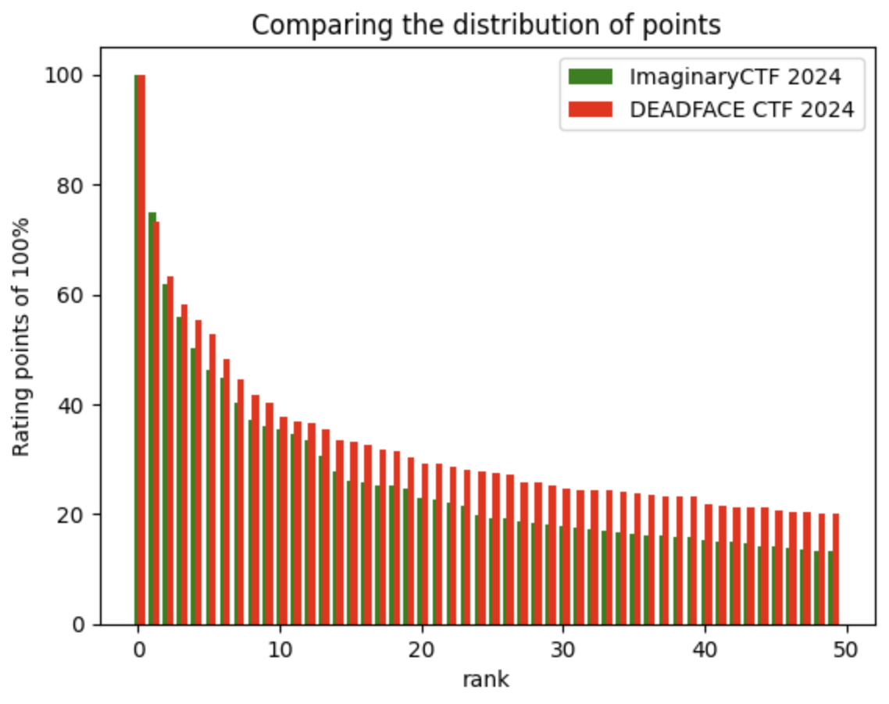{ width=400px height=400px }

## ۸- تیم‌ها با بیشترین برگزاری رویداد

بر اساس داده‌های جمع‌آوری شده توسط وب‌سایت CTFtime از سال۲۰۱۷، در نمودار اول  تعداد رویدادهای CTF برگزار شده توسط تیم‌ها را در طول این سال‌ها را نشان می‌دهد، تیم ASIS با سازماندهی ۲۷ مسابقه در صدر قرار دارد. تیم‌های HackerDom و SECCON CTF نیز با ۲۲ و ۱۹ رویداد به ترتیب در رتبه‌های دوم و سوم هستند. این نشان‌دهنده فعالیت چشمگیر این تیم‌ها در زمینه برگزاری و کمک آن‌ها به توسعه و آموزش مباحث امنیت سایبری از طریق مسابقه‌های CTF است. 
اینکه ASIS  به عنوان یک تیم ایرانی  در این جایگاه قرار دارد تحسین برانگیز است.💪 

در نمودار دوم میزان امتیاز کسب شده از برگزاری این رویدادها را نشان می‌دهد که تیم ASIS با کسب ۳۲۹۴ امتیاز به عنوان برترین تیم شناخته شده است. تیم‌های oops و Plaid Parliament of Pwning نیز با امتیازهای بالای ۲۰۰۰ به ترتیب در رتبه‌های دوم و سوم قرار دارند و در نهایت نمودار سوم ترکیب دو نمودار اول و دوم را نشان می‌دهد.

 
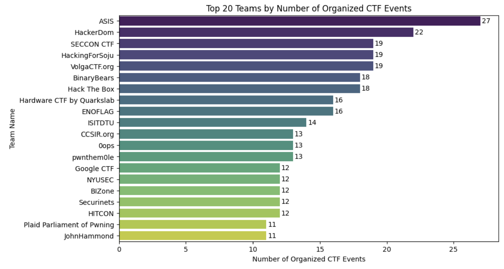{ width=450px height=450px }
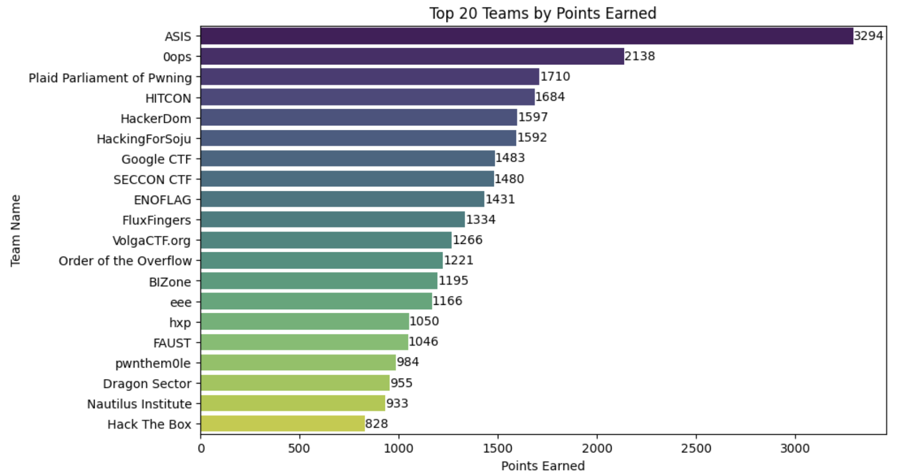{ width=450px height=450px }
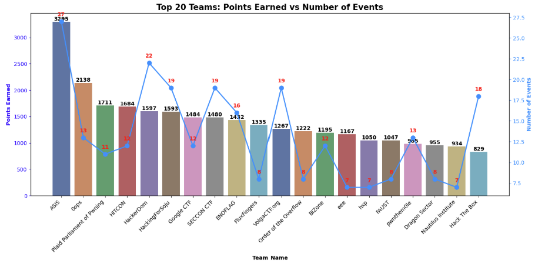{ width=450px height=400px }

## ۹- رتبه بدون برگزاری رقابت 

از آنجایی که برگزاری مسابقه دارای امتیاز است و در رتبه‌‌بندی تیم‌ها موثر است، ما رتبه‌ی ۱۰۰ تیم‌ برتر سال ۲۰۲۴ را بدون در نظر گرفتن امتیاز برگزاری مسابقه محاسبه کردیم تا میزان رقابت و امتیاز کسب شده از **شرکت در مسابقات** را نشان دهیم. تصاویر زیر رتبه تیم‌ها و میزان جابه‌جایی آن‌ها را نشان می‌دهد که به عنوان مثال تیم FlagMotori با ده رتبه صعود به رتبه ۶۳ می‌رسد. نکته جالب عدم تغییر رتبه تیم‌های بالای جدول است که بدلیل کسب امتیاز بالا از شرکت در مسابقات، برگزاری مسابقه روی امتیاز آنها تاثیری نداشته است. 

 

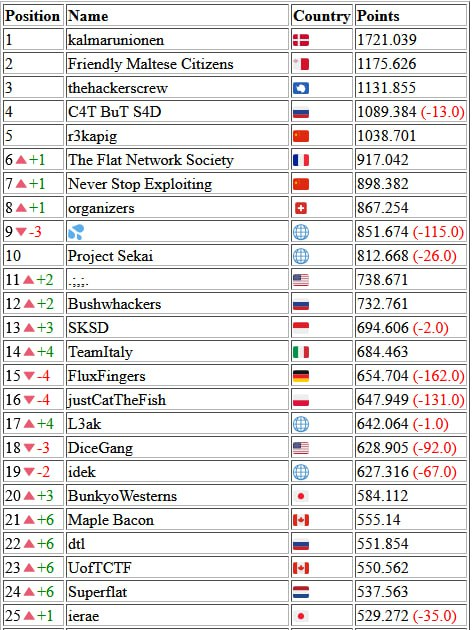{ width=340px height=400px }
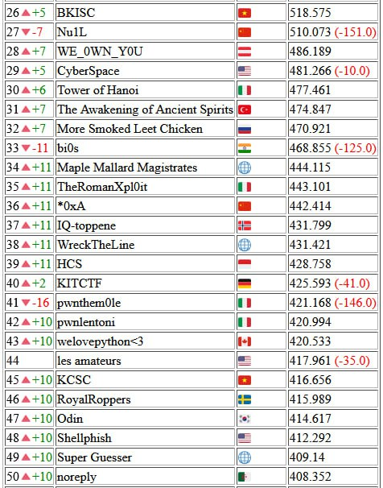{ width=340px height=400px }

 

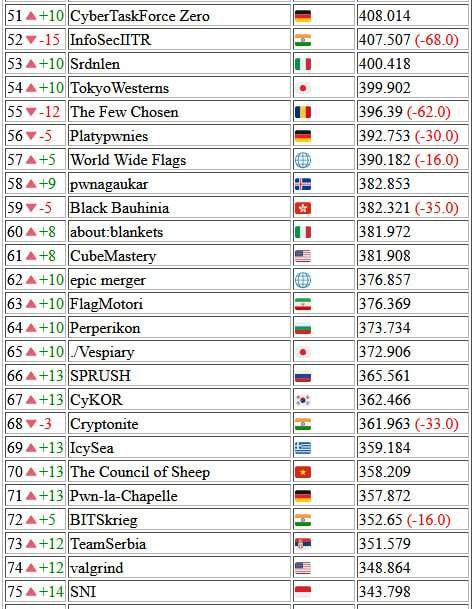{ width=340px height=400px }
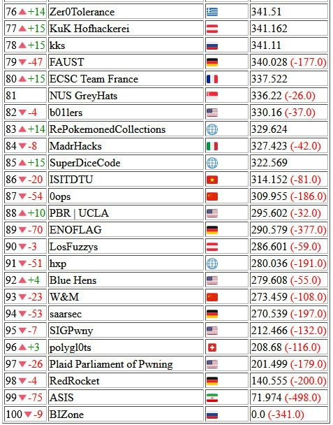{ width=340px height=400px }

## ۱۰- جمع‌بندی
 در این پست سعی کردیم  با اطلاعات و داده‌های سایت CTFtime، تحلیل کاربردی روی مسابقات، تیم‌ها و معیارهای مختلف ارائه کنیم.
امیدواریم که این اطلاعات برای تیم‌هایی که قصد شرکت  یا برگزاری مسابقه CTF دارند مفید باشد.