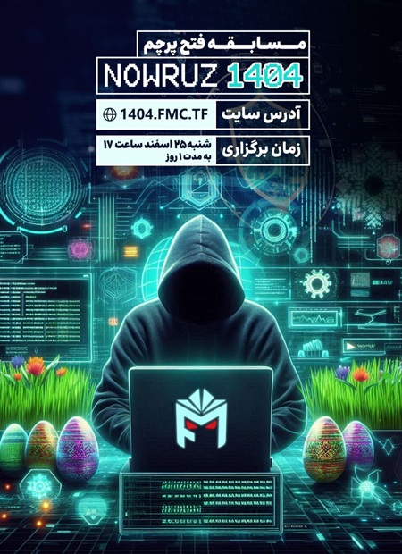
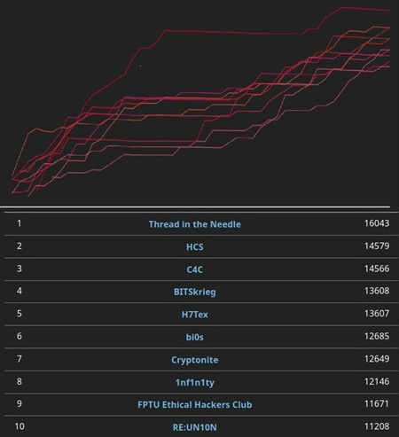

#  اولین دوره برگزاری مسابقه CTF با نام Nowruz1404

 

<!-- more -->

## مسابقه CTF نوروز ۱۴۰۴؛ اولین تجربه، یک خاطره به‌یادماندنی

برای اولین بار مسابقه بین المللی CTF تیم فلگ موتوری در اواخر اسفند ۱۴۰۳ برگزار شد؛ رویدادی که با نام NOWRUZ 1404 به استقبال سال جدید رفتیم! این مسابقه با هدف به چالش کشیدن مهارت‌ها و حل چالش های امنیتی در فضایی دوستانه و هیجان‌انگیز برگزار شد.

از لحظه‌ی شروع تا پایان، شاهد رقابت  بین تیم‌های شرکت‌کننده بودیم. چالش‌های متنوعی که توسط اعضای تیم طراحی شده بود، توانست شرکت‌کنندگان را درگیر کنند. خوشبختانه مسابقه بدون مشکل جدی برگزار شد  و از بازخوردهای مثبت شرکت‌کنندگان انرژی زیادی گرفتیم.
در نهایت، تیم‌های

 :flag_gr:  Thread in the Needle :first_place_medal: 

 :flag_id: HCS :second_place_medal: 

 :flag_kr: TeamH4C :third_place_medal:   

مقام‌های اول تا سوم را از آن خود کردند. تبریک ویژه به این تیم‌ها برای عملکردشان!

یک تشکر بزرگ از تمامی بچه‌های تیم‌  که با طراحی چالش‌ها و راه‌اندازی زیرساخت‌ها، باعث شدند این رویداد به بهترین شکل ممکن برگزار شود. در واقع بدون شما این مسابقه امکان‌پذیر نبود :shaking_hands:

این تجربه برای ما ارزشمند بود و قطعاً در مسابقات آینده اندک نقاط ضعف را برطرف خواهیم کرد و با ایده های جدید،  تجربه‌ای بهتر برای همه رقم بزنیم. برای بررسی چالش‌ها، شناخت طراحان و راه‌حل چالش‌ها ، می‌توانید به [این لینک](https://github.com/FlagMotori/Nowruz1404) مراجعه کنید.

منتظر دوره‌های بعدی باشید! 🚀🎯

 

