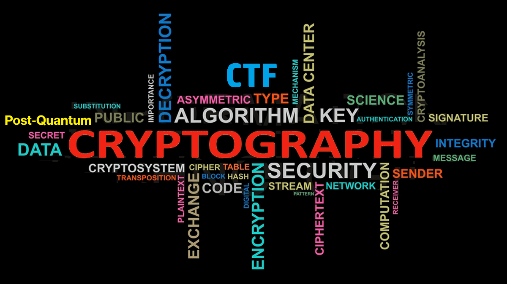

# رمزنگاری

رمزنگاری به هنر نوشتن رمزها و کدهای مخفی گفته می‌شود. رمزهای عبور، اطلاعات بانکی، ارسال و دریافت پیام در  پیام‌رسان‌ها و هر چیزی که شامل انتقال و ذخیره اطلاعات حساس در دنیای اینترنتی امروز باشد نیاز به رمزنگاری دارد.  
همان‌طور که هیچ الگوریتم یا سیستمی کاملا امن نیست، رمزنگاری‌های موجود (متقارن، نامتقارن،امضای دیجیتال) نیز ممکن است دارای نقص‌هایی باشند. هدف چالش‌های رمزنگاری در مسابقه‌های CTF ایجاد آشنایی با این نقص‌ها و بالا بردن دانش افراد در زمینه مفاهیم پایه‌ای رمزنگاری یعنی مباحث ریاضی آن‌ها است. 
این چالش‌ها شامل **شکستن الگوریتم رمزنگاری**، **رمزگشایی متون رمزی** یا **دور زدن الگوریتم‌های رمزنگاری**  در سامانه‌ها و پروتکل‌های مختلف است  که به درستی  پیاده نشده‌اند. با این حال، بسیاری از این چالش‌ها تنها به استفاده نادرست از الگوریتم‌های رمزنگاری می‌پردازند که نیاز به دانش عمیقی از روابط ریاضی آنها ندارد. 

## انواع چالش رمزنگاری در CTF 

الگوریتم‌ها و طرح‌های رمزنگاری دارای انواع مختلفی هستند. ما در این جا فارغ از نوع و کاربرد آن‌ها، تنها چالش‌های رمزنگاری در مسابقات CTF را به دو دسته کلی تقسیم می‌کنیم:

### ۱- مبتنی بر مفاهیم ریاضی

 این چالش‌ها صرفا به مفاهیم پایه‌ای ریاضی متمرکز هستند و نیاز به حل یک مسئله ریاضی برای آن چالش رمزنگاری دارند.  برای بدست آوردن پرچم  در این نوع چالش‌ها، شما نیاز به داشتن دانش کافی در مباحث ریاضیات رمزنگاری مانند محاسبات پیمانه‌ای، لگاریتم‌های گسسته، معادلات چندجمله‌ای، منحنی‌های بیضوی و ریاضیات مشبک (Lattice) دارید.

### ۲- مبتنی بر خطای پیاده‌سازی

 برخی اوقات نفوذها و شکستن رمزنگاری‌های موجود در یک سامانه به دلیل نقص در خود الگوریتم رمزنگاری نیست بلکه عدم تجربه کافی در بکارگیری درست این الگوریتم‌ها، سبب ایجاد آسیب‌پذیری در یک سامانه مبتنی بر رمزنگاری می‌شود. بنابراین در این نوع چالش‌ها، نیاز به دانش عمیق در مورد آن رمزنگاری نیست و تنها کافی است که نقص پیاده سازی را کشف و از آن برای دور زدن رمزنگاری استفاده کنیم. 

 اگرچه  چالش‌های رمزنگاری‌ شاید بخاطر روابط ریاضی پشت آن دشوار بنظر برسد، اما نباید از حل این چالش‌ها دلسرد شد زیرا این چالش‌ها تنها به مباحث ریاضی نمی‌پردازد. در این بخش ما سعی کردیم روی چالش‌های حوزه رمزنگاری CTFها متمرکز شویم و منابع مختلف برای شروع و یادگیری رمزنگاری را معرفی کنیم. همچنین ابزارها و سایت‌های مفیدی که به حل چالش‌های رمزنگاری کمک می‌کنند را معرفی خواهیم کرد. علاوه بر این‌ها، رایتاپ برخی از چالش‌هایی را که در مسابقات مختلف شرکت می‌کنیم را منتشر خواهیم کرد تا افراد علاقه‌مند به پیشرفت در رمزنگاری کمک کند.

 ---  