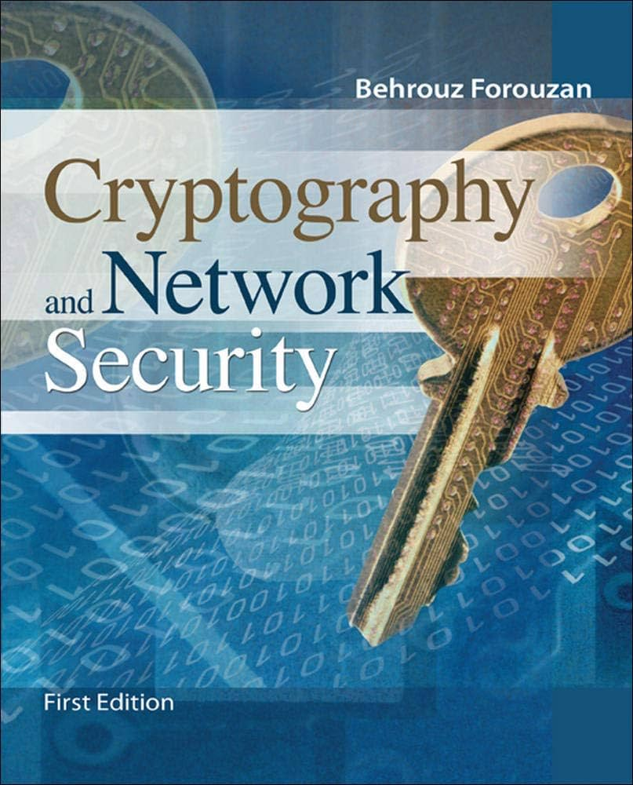
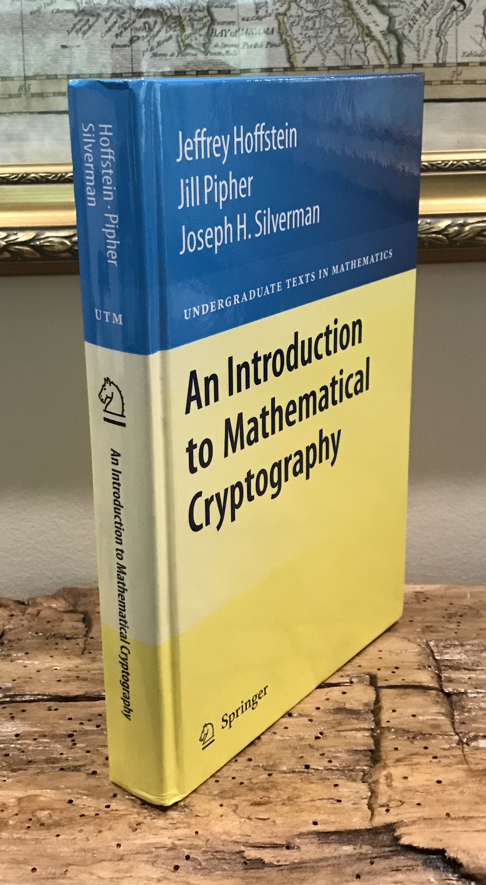

# منابع یادگیری رمزنگاری

راستش تا دلتون بخواد ما کتاب و ویدئو آموزشی داریم که فقط با یک جستجو ساده توی اینترنت میتونید پیدا کنید. ولی خب یکسری منابع هستن که خیلی معروف و خودمون استفاده کردیم و گفتیم چقدر خوب میشه با شما به اشتراک بزاریم :)

## پلتفرم یادگیری و حل چالشها
- #### <a target="_blank" href="https://Cryptohack.org">CryptoHack</a>
- #### <a target="_blank" href="https://cryptopals.com/">Cryptopals</a>
- #### <a target="_blank" href="https://www.root-me.org/en/Challenges/Cryptanalysis/">RootMe</a>
## ویدئو های آموزشی
- #### <a target="_blank" href="https://youtu.be/JoeiLuFNBc4?si=ChZzn0aEJOETuMey">Neso Academy</a>

--- 

## معرفی کتاب
- ### Cryptography and Network Security by Behrouz Forouzan
    
    این کتاب از یک رویکرد قدم به قدم برای آموزش رمزنگاری و امنیت شبکه استفاده می کند. شما در ابتدای کار به هیچ دانش ریاضی خاصی مانند نظریه اعداد یا ... نیاز ندارید چرا که در طول مطالعه کتاب اون رو بدست میارید، از آنجایی که رمزنگاری و امنیت شبکه را نمی توان بدون پیشینه در  زمینه ریاضیات مورد بحث قرار داد، این موضوعات در فصل های 2، 4 و 9 مورد بحث قرار می گیرند. خوانندگانی که با این حوزه های ریاضیات آشنا هستند می توانند این فصل ها را نادیده بگیرند. فصل 1 تا 15 رمزنگاری را مورد بحث قرار می دهد. در ضمن فصل های 16 تا 18 امنیت شبکه مورد بحث قرار می گیرد.
--- 
- ### An Introduction to Mathematical Cryptography by Jeffrey Hoffstein
    
    این کتاب عمدتاً بر روی سیستم‌های رمزنگاری کلید عمومی و  امضای دیجیتال و همچنین ریاضیات آنها تمرکز می‌کند. خواننده ای که بر مطالب این کتاب تسلط داشته باشد، نه تنها برای مطالعه بیشتر در رمزنگاری به خوبی آماده می شود، بلکه به درک واقعی اصول ریاضی اساسی که رمزنگاری مدرن بر آن استوار است، دست خواهد یافت.
---

!!! نویسنده
    [تیم فلگ موتوری](https://github.com/flagmotori)

	