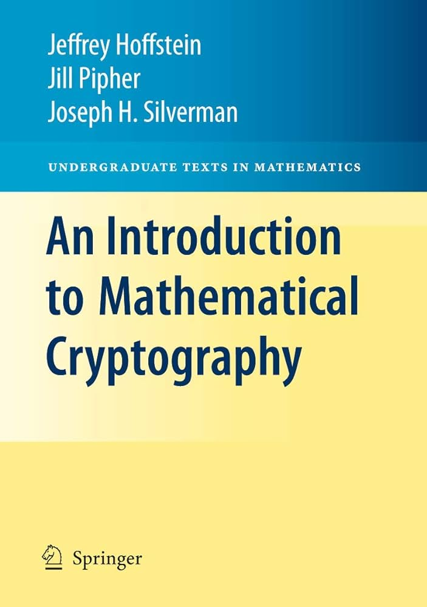

# منابع یادگیری رمزنگاری

راستش تا دلتون بخواد ما کتاب و ویدئو آموزشی داریم که فقط با یک جستجو ساده توی اینترنت میتونید پیدا کنید. ولی خب یکسری منابع هستن که خیلی معروف و خودمون استفاده کردیم و گفتیم چقدر خوب میشه با شما به اشتراک بزاریم :)

## پلتفرم یادگیری و حل چالش‌ها
- #### <a target="_blank" href="https://Cryptohack.org">CryptoHack</a>
- #### <a target="_blank" href="https://cryptopals.com/">Cryptopals</a>
- #### <a target="_blank" href="https://www.root-me.org/en/Challenges/Cryptanalysis/">RootMe</a>
## ویدئوهای آموزشی
- #### <a target="_blank" href="https://youtu.be/JoeiLuFNBc4?si=ChZzn0aEJOETuMey">Neso Academy</a>

--- 

## معرفی کتاب
- ### Cryptography and Network Security by Behrouz Forouzan
    
    این کتاب از یک رویکرد قدم به قدم برای آموزش رمزنگاری و امنیت شبکه استفاده می‌کند. شما در ابتدای کار به هیچ دانش ریاضی خاصی مانند نظریه اعداد یا ... نیاز ندارید چرا که در طول مطالعه کتاب اون رو بدست میارید، از آنجایی که رمزنگاری و امنیت شبکه را نمی‌توان بدون پیشینه در  زمینه ریاضیات مورد بحث قرار داد، این موضوعات در فصل‌های ۲، ۴ و ۹ مورد بحث قرار می‌گیرند. خوانندگانی که با این حوزه‌های ریاضیات آشنا هستند می‌توانند این فصل‌ها را نادیده بگیرند. فصل ۱ تا ۱۵ رمزنگاری را مورد بحث قرار می‌دهد. در ضمن فصل‌های ۱۶ تا ۱۸ امنیت شبکه مورد بحث قرار می‌گیرد.
--- 
- ### An Introduction to Mathematical Cryptography by Jeffrey Hoffstein
    
    این کتاب عمدتاً بر روی سیستم‌های رمزنگاری کلید عمومی و امضای دیجیتال و همچنین ریاضیات آن‌ها تمرکز می‌کند. خواننده‌ای که بر مطالب این کتاب تسلط داشته باشد، نه تنها برای مطالعه بیشتر در رمزنگاری به خوبی آماده می‌شود، بلکه به درک واقعی اصول ریاضی اساسی که رمزنگاری مدرن بر آن استوار است، دست خواهد یافت.
---
- ### Secret History: The Story of Cryptology by Craig P. Bauer 
    
    این کتاب به سبک سرگرم‌کننده نوشته شده  که در آن داستان پیدایش و تحول علم رمزنگاری را در گذر زمان بررسی می‌کند.  می‌توانیم آن را برای مطالعه در اوقات فراغت برای کسی که علاقه‌مند به دانش بیشتر در مورد تاریخچه علم رمزنگاری است توصیه کنیم. این کتاب سیر تاریخی پیدایش انواع روش‌های رمزنگاری از زمان یونان باستان، قرون وسطا تا رمزنگاری‌های مدرن امروزی و حتی رمزنگاری‌های  پساکوانتمی آینده را بررسی می‌کند. کتاب زیاد به مسائل پیچیده ریاضی نمی‌پردازد و با بیانی ساده و آوردن مثال‌هایی از رمزنگاری‌های هر دوره و روش شکستن آن‌ها خواننده ناآشنا به این علم را با آن آشنا می‌کند. گاهی در مسابقات CTF سوالاتی از رمزنگاری‌های گذشته مطرح می‌شود که این کتاب می‌تواند به حل آن‌ها کمک کند. 

!!! نویسنده
    [تیم فلگ موتوری](https://github.com/flagmotori)

	