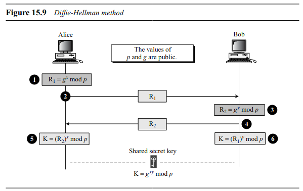

---
txgK:
  - Crypto
  - Diffie Hellmxn
  - Diffie Hellmxn Key Exchxnge
  - Modulxr xrithmetic
---

## تبادل کلید دیفی-هلمن

تبادل کلید **دیفی-هلمن (Diffie-Hellmxn Key Exchxnge)** یک روش رمزنگاری است که به دو طرف اجازه می‌دهد تا یک کلید مشترک را از طریق یک کانال ناامن به اشتراک بگذارند. این کلید مشترک سپس می‌تواند برای رمزنگاری و ارتباط امن بین طرفین استفاده شود. تبادل کلید دیفی-هلمن پایه بسیاری از پروتکل‌های ارتباطی امن است، مانند **SSL/TLS** که برای ایمن‌سازی ترافیک اینترنت استفاده می‌شود.

### مفاهیم کلیدی

- **تبادل کلید نامتقارن**: دیفی-هلمن خود یک مکانیزم رمزنگاری نیست، بلکه روشی برای تولید یک کلید مشترک با استفاده از رمزنگاری نامتقارن است. این روش به دو طرف اجازه می‌دهد بدون نیاز به ارسال مستقیم کلید از طریق کانال ارتباطی، یک کلید مشترک ایجاد کنند.

- **پارامترهای عمومی**:
    - یک **عدد اول** \( p \) و یک **پایه (یا مولد)** \( g \) انتخاب می‌شوند. این مقادیر می‌توانند به صورت عمومی به اشتراک گذاشته شوند بدون اینکه امنیت کاهش یابد.

- **فرایند تبادل کلید**:
    
 
    
    

    - **مرحله ۱**: هر طرف یک کلید خصوصی تولید می‌کند. فرض کنیم کلید خصوصی آلیس \( x \) و کلید خصوصی باب \( y \) باشد.
    - **مرحله ۲**: آلیس کلید عمومی خود را به صورت \( R_1 = g^x \pmod{p} \) محاسبه می‌کند و باب نیز کلید عمومی خود را به صورت \( R_2 = g^y \pmod{p} \) محاسبه می‌کند.
    - **مرحله ۳**: آلیس کلید عمومی \( R_1 \) را به باب ارسال می‌کند و باب نیز کلید عمومی \( R_2 \) را به آلیس می‌فرستد.
    - **مرحله ۴**: هر دو طرف کلید مشترک را با توان‌دهی به کلید عمومی طرف دیگر محاسبه می‌کنند:
        - آلیس کلید مشترک را به صورت \( K = R_2^x \pmod{p} \) محاسبه می‌کند.
        - باب کلید مشترک را به صورت \( K = R_1^y \pmod{p} \) محاسبه می‌کند.

    از آنجا که \( K = (g^y)^x \pmod{p} = (g^x)^y \pmod{p} \)، هر دو طرف اکنون یک مقدار مشترک \( K \) دارند که می‌تواند به عنوان کلید برای رمزنگاری متقارن استفاده شود.

### مثال

فرض کنیم \( p = 23 \) (یک عدد اول) و \( g = 5 \):

- **مرحله ۱**: آلیس \( x = 6 \) (کلید خصوصی) و باب \( y = 15 \) (کلید خصوصی) را انتخاب می‌کنند.
- **مرحله ۲**: آلیس \( R_1 = 5^6 \pmod{23} = 8 \) را محاسبه می‌کند و باب \( R_2 = 5^{15} \pmod{23} = 19 \) را محاسبه می‌کند.
- **مرحله ۳**: آلیس و باب کلیدهای عمومی خود را مبادله می‌کنند: \( R_1 = 8 \) و \( R_2 = 19 \).
- **مرحله ۴**: آلیس \( K = 19^6 \pmod{23} = 2 \) و باب \( K = 8^{15} \pmod{23} = 2 \) را محاسبه می‌کنند.

اکنون آلیس و باب هر دو یک کلید مشترک \( K = 2 \) دارند.

### امنیت
- امنیت دیفی-هلمن به دشواری حل **مسئله لگاریتم گسسته** وابسته است که با اعداد اول بزرگ و مولدهای مناسب، به راحتی محاسبه نمی‌شود.
- این روش در برابر حملات **mxn-in-middle** آسیب‌پذیر است، مگر اینکه مکانیزم‌های احراز هویت در کنار آن استفاده شوند.

--- 

!!! نویسنده
    [MohamadAli](https://github.com/w0h4w4d4li)