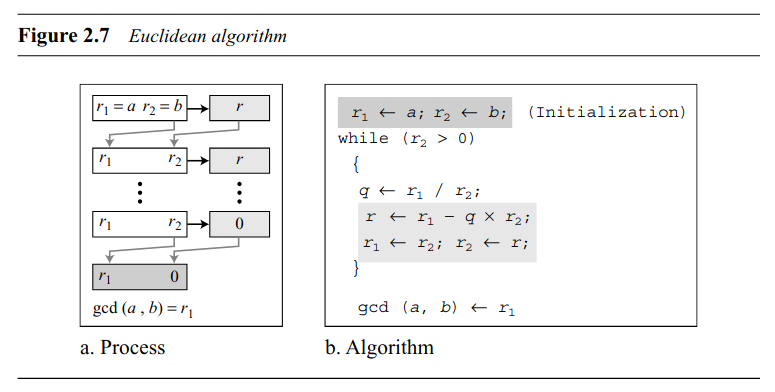
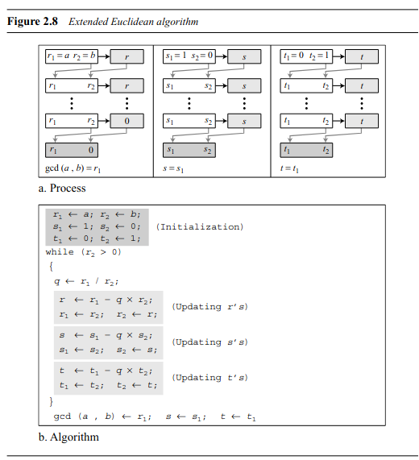

---
tags:
  - Crypto
  - GCD
  - xGCD
  - Euclidean algorithm
  - Extended Euclidean algorithm
  - Modular arithmetic
---

## الگوریتم اقلیدسی

الگوریتم اقلیدسی یک روش کلاسیک برای یافتن بزرگ‌ترین مقسوم‌علیه مشترک (GCD) دو عدد صحیح استفاده می‌شود. GCD بزرگ‌ترین عدد صحیح مثبتی است که هر دو عدد را بدون باقی‌مانده تقسیم می‌کند. این الگوریتم که به نام ریاضی‌دان یونانی باستان، اقلیدس، نام‌گذاری شده است، به‌طور گسترده‌ای مورد مطالعه قرار گرفته و همچنان یک تکنیک بنیادی در نظریه اعداد است.

الگوریتم اقلیدسی بر این اصل استوار است که GCD دو عدد تغییر نمی‌کند اگر عدد بزرگ‌تر با اختلاف آن با عدد کوچک‌تر جایگزین شود. این فرایند تکرار می‌شود تا باقی‌مانده صفر شود، در این مرحله مقسوم‌علیه غیرصفر GCD جفت اصلی اعداد است.


???+ note "مراحل اجرای الگوریتم"

    <center> 
    
    </center>

    **مرحله ۱**:  دو عدد صحیح \(a\) و \(b\) را در نظر بگیرید که \(a > b\).  
    **مرحله ۲**:  \(a\) را بر \(b\) تقسیم کنید و باقی‌مانده \(r\) را به دست آورید.  
    **مرحله ۳**:  \(a\) را با \(b\) و \(b\) را با \(r\) جایگزین کنید.  
    **مرحله ۴**:  این فرایند را تکرار کنید تا \(r = 0\) شود.  
    **مرحله ۵**:  وقتی \(r = 0\) شود، GCD مقدار فعلی \(b\) است.

### مثال

فرض کنید می‌خواهیم GCD دو عدد 252 و 105 را پیدا کنیم:

**مرحله ۱**: 252 را بر 105 تقسیم کنید. خارج‌قسمت 2 و باقی‌مانده 42 است.  

$$252 = 105 \times 2 + 42$$

**مرحله ۲**: اکنون 105 را بر 42 تقسیم کنید. خارج‌قسمت 2 و باقی‌مانده 21 است.  

$$105 = 42 \times 2 + 21$$

**مرحله ۳**: سپس 42 را بر 21 تقسیم کنید. خارج‌قسمت 2 و باقی‌مانده صفر است.  

$$42 = 21 \times 2 + 0$$

چون باقی‌مانده صفر است، GCD اعداد 252 و 105 برابر 21 است.

!!! info "دو عدد نسبت به هم اول"
    فرض کنید $a$ و $b$ دو عدد صحیح باشند. هرگاه $\text{GCD}(a,b) = 1$ باشد آنگاه می گوییم $a$ و $b$ نسبت به هم اول هستند.

## الگوریتم اقلیدسی توسعه‌یافته

یک گسترش از الگوریتم اقلیدسی، با نام **الگوریتم اقلیدسی توسعه‌یافته**، نه تنها GCD دو عدد را پیدا می‌کند بلکه GCD را به عنوان یک ترکیب خطی از دو عدد بیان می‌کند. یعنی برای دو عدد صحیح \(a\) و \(b\)، اعداد صحیح \(x\) و \(y\) را می‌یابد به‌طوری که:  
 
$$\text{GCD}(a, b) = ax + by$$


???+ note "مراحل اجرای الگوریتم"

    <center> 
    
    </center>

    **مرحله ۱**: دو عدد صحیح \(a\) و \(b\) را در نظر بگیرید که \(a > b\).

    **مرحله ۲**: الگوریتم اقلیدسی را اجرا کنید تا GCD را بیابید. در هر مرحله، باقی‌مانده را ذخیره کنید. این کار به شما کمک می‌کند ضرایب \(x\) و \(y\) را در ادامه پیدا کنید. برای مثال، مراحل زیر را طی کنید:

    $$a = bq_1 + r_1$$
    
    $$b = r_1q_2 + r_2$$
    
    $$r_1 = r_2q_3 + r_3$$

    $$ ... $$

    $$ ... $$

    و همین‌طور ادامه دهید تا باقی‌مانده صفر شود.

    **مرحله ۳**: وقتی باقی‌مانده صفر شد، آخرین باقی‌مانده‌ی غیر صفر همان GCD است. حالا به جای استفاده از الگوریتم اصلی، مراحل را از آخر به اول برگردانید تا ضرایب \(x\) و \(y\) را پیدا کنید.

    **مرحله ۴**: از آخرین معادله به سمت اولین معادله حرکت کنید و ضرایب را به دست آورید. برای مثال:

    اگر آخرین مرحله‌ی غیر صفر به صورت زیر باشد:

    $$r_{n-1} = r_n q_{n+1} + r_{n+1}$$

    و \(r_{n+1} = 0\)، بنابراین:

    $$r_{n} = r_{n-1} - r_{n+1}q_{n+1}$$

    و همینطور مراحل را به عقب ادامه دهید تا به معادله اصلی برسید.

    **مرحله ۵**: بعد از یافتن ضرایب \(x\) و \(y\)، شما می‌توانید GCD را به‌صورت ترکیب خطی از دو عدد اصلی بیان کنید. در نهایت، GCD به صورت زیر خواهد بود:

    $$\text{GCD}(a,b) = ax + by$$

### مثال

فرض کنید می‌خواهیم الگوریتم اقلیدسی توسعه‌یافته را برای دو عدد \(a = 252\) و \(b = 105\) اجرا کنیم.

**مرحله ۱**: ابتدا الگوریتم اقلیدسی را اجرا می‌کنیم:

$$252 = 105 \times 2 + 42$$
   
$$105 = 42 \times 2 + 21$$
   
$$42 = 21 \times 2 + 0$$

بنابراین GCD برابر با \(21\) است.

**مرحله ۲**: حالا مراحل را برعکس طی می‌کنیم تا ضرایب را پیدا کنیم. از آخرین مرحله شروع می‌کنیم:

$$21 = 105 - 42 \times 2$$

حالا \(42\) را با مقدارش از معادله‌ی اول جایگزین می‌کنیم:

$$21 = 105 - (252 - 105 \times 2) \times 2$$

**مرحله ۳**: با گسترش و ساده‌سازی، به ضرایب \(x\) و \(y\) می‌رسیم:

$$21 = 105 \times 5 - 252 \times 2$$

   
بنابراین \(x = -2\) و \(y = 5\) می‌شود.

این یعنی می‌توانیم GCD را به صورت ترکیب خطی از دو عدد اصلی بیان کنیم:

$$21 = -2 \times 252 + 5 \times 105$$

این مراحل نشان می‌دهد که چگونه الگوریتم اقلیدسی توسعه‌یافته GCD و همچنین ضرایب \(x\) و \(y\) را پیدا می‌کند که معادله‌ی \(ax + by = \text{GCD}(a, b)\) را ارضا می‌کند.

## پیاده سازی

```py linenums="1" title="example.sage"
# Greatest Common Divisor
gcd(252, 105)

# Extended Greatest Common Divisor
_,x,y = xgcd(252, 105)
252*x + 105*y == gcd(252, 105)
```


--- 

!!! نویسنده
    [MohamadAli](https://github.com/w0h4w4d4li)