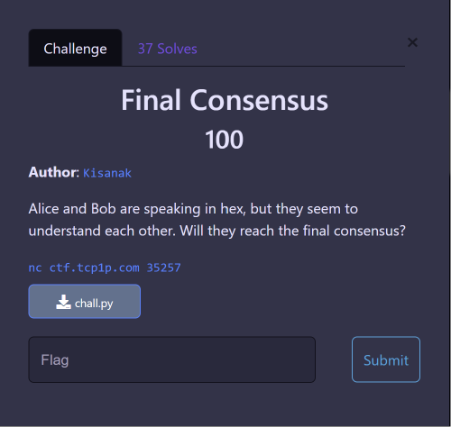
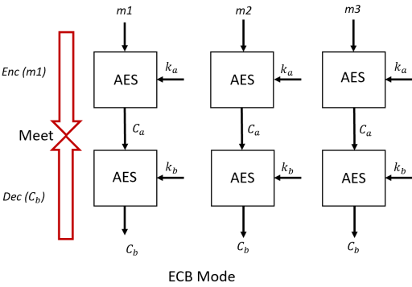

---
tags:
  - TCP1P-CTF
  - TCP1P-2023
  - Crypto  
  - AES
  - ECB mode
  - Meet-in-the-Middle (MITM)
---

# چالش Final_Consensus

<center>

</center>

## صورت مسئله

 در این چالش بعد از وصل شدن به سرور یک رشته  hex که احتمالا فلگ رمز شده است را به ما نمایش می دهد و سپس از اما درخواست وارد کردن یک رشته پیام را می کند که بعد از ارسال، در جواب معادل رمزشده آن را به صورت hex  مانند زیر برمی گرداند.  


```
>nc ctf.tcp1p.com 35257
Alice: My message 1c57bd307f4b7f05cb732f4ae7ba8b91a2de2682c4b6d10d86ae649eb656e812b5400f773e8b57fa68e188d33191320b51566d00f8dde9e4265160d399d02db0e4464d08542c3cba1280226994e2d5c6
Alice: Now give me yours!
> a
Steve:  be754ecefff84bcc8f145070a59ce039
Alice: Agree.
```

علاوه بر این، کد سمت سرور هم به صورت زیر داده است.


```python title="server.py" linenums="1"
from Crypto.Cipher import AES
import random
from Crypto.Util.Padding import pad

a = b""
b = b""
FLAG = b"TCP1P{REDACTED}"

def generateKey():
	global a, b
	a = (str(random.randint(0, 999999)).zfill(6)*4)[:16].encode()
	b = (str(random.randint(0, 999999)).zfill(6)*4)[:16].encode()

def encrypt(plaintext, a, b):
	cipher = AES.new(a, mode=AES.MODE_ECB)
	ct = cipher.encrypt(pad(plaintext, 16))
	cipher = AES.new(b, mode=AES.MODE_ECB)
	ct = cipher.encrypt(ct)
	return ct.hex()

def main():
	generateKey()
	print("Alice: My message", encrypt(FLAG, a, b))
	print("Alice: Now give me yours!")
	plain = input(">> ")
	print("Steve: ", encrypt(plain.encode(), a, b))
	print("Alice: Agree.")


if __name__ == '__main__':
	main()
```

## راه‌حل چالش

با بررسی کد سمت سرور متوجه می شویم که در ابتدا دو عدد تصادفی a و b بین 0 تا 999999 تولید می شوند، سپس آنها رو به شکل رشته 16 بایتی hex تبدیل می کند و به عنوان کلید رمزنگاری بلوکی [ECB](https://en.wikipedia.org/wiki/Block_cipher_mode_of_operation) استفاده می کند.  اگر به کد دقت کنید متوجه می شوید که فلگ دو بار به صورت متوالی رمز می شود یعنی ابتدا فلگ با کلید a رمزشده سپس مقدار خروجی با استفاده از کلید b دوباره رمز شده است. در این حالت، برای پیدا کردن دو کلید نیاز به دو حلقه تودرتو خواهد بود که پیچیدگی زمانی آن $O(n^2)$ است. ازآنجایی که هر کلید یک عدد تصادفی بین 0 تا 999999 است پس تعداد کل حالات ممکن  برابر $1000000^2$  خواهد بود که عملا استفاده از bruteforce  برای بدست آوردن کلیدها و سپس رمزگشایی فلگ را غیرممکن می کند و باید به فکر راه دیگری بود.

در این چالش باید به دو نکته توجه کنیم:

- روش رمزنگاری  بلوکی ECB باعث می شود بلوک های رمز هیچ ارتباطی با یکدیگر نداشته باشند. یعنی در صورتی که طول فلگ بیشتر از 16 بایت باشد، بلوک ها به صورت جداگانه با کلید یکسان رمز می شوند. پس اگر ما بتونیم کلیدهای a و b را برای بلوک اول پیدا کنیم، می توانیم سایر بلوک ها را با همین دو کلید رمزگشایی کنیم.

- سرور هر رشته پیام دریافتی را با همان دو کلیدی که فلگ را رمز کرده، رمز می کند. پس ما رشته متن دلخواه و مقدار رمز شده معادل اش را با همان کلیدهای بکار رفته برای فلگ را می توانیم داشته باشیم.

این دو ویژگی ما را به فکر حمله [Meet-in-the-middle (MITM)](https://en.wikipedia.org/wiki/Meet-in-the-middle_attack) یا اصطلاحا ملاقات در میانه  انداخت. چون هم متن پیام و هم معادل رمز شده آن را داریم  می توانیم بجای اینکه تمام حالات ممکن  کلیدهای a و b را به شکل متوالی امتحان کنیم، مثل تصویر زیر رمزنگاری رشته پیام را با کلیدهای متفاوت a از یک طرف انجام دهیم و آن ها را نگه داریم. سپس  از طرف مقابل مقدار رمز را با  کلید b رمزگشایی کنیم. هنگامی که به یک مقدار یکسان در وسط برسیم اصطلاحا ملاقات اتفاق می افتد و مقدار کلید های a و b استفاده شده بدست می آید. پیچیدگی زمانی در این شرایط به دلیل عدم استفاده از حلقه تودرتو حداکثربرابر $O(2n)$ خواهد بود.

<center>

</center>

حال برای بدست آوردن فلگ یک بار به سرور متصل می شویم و یک رشته پیام دلخواه ("a") به آن ارسال می کنیم و معادل رمز شده آن را بدست می آوریم. بعد از اینکه توانستیم مقدار a و b  با استفاده از کد پایتون زیر بدست آوریم با همان دو کلید کل فلگ رمزشده را رمزگشایی کنیم.


```python title="solve.py" linenums="1"
from Crypto.Cipher import AES
from Crypto.Util.Padding import pad, unpad

FLAG = "1c57bd307f4b7f05cb732f4ae7ba8b91a2de2682c4b6d10d86ae649eb656e812b5400f773e8b57fa68e188d33191320b51566d00f8dde9e4265160d399d02db0e4464d08542c3cba1280226994e2d5c6"
FLAG = bytes.fromhex(FLAG)

c = "be754ecefff84bcc8f145070a59ce039"
c = bytes.fromhex(c)

plaintext = b"a"

ct_a = {}
for i in range(1_000_000):
    a = (str(i).zfill(6)*4)[:16].encode()
    cipher = AES.new(a, mode=AES.MODE_ECB)
    ct = cipher.encrypt(pad(plaintext, 16))
    ct_a[ct] = a

for i in range(1_000_000):
    b = (str(i).zfill(6)*4)[:16].encode()
    cipher = AES.new(b, mode=AES.MODE_ECB)
    mid = cipher.decrypt(c)
    if mid in ct_a:
        cipher = AES.new(b, mode=AES.MODE_ECB)
        ct = cipher.decrypt(FLAG)
        cipher = AES.new(ct_a[mid], mode=AES.MODE_ECB)
        print(unpad(cipher.decrypt(ct), 16).decode())
```


??? success "FLAG :triangular_flag_on_post:"
    <div dir="ltr">`TCP1P{nothing_ever_lasts_forever_everybody_wants_to_rule_the_world}`</div>

--- 

!!! نویسندگان
    [HIGHer](https://twitter.com/HIGH01012) ،[N1k4](https://github.com/mheidari98)

