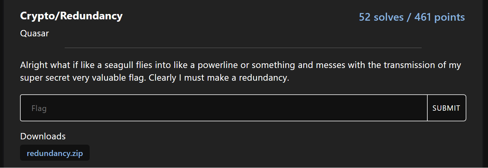

---
tags:
  - vSCTF
  - vSCTF-2023
  - Crypto
  - RSA
  - Extended gcd
  - Partial known m
  - Coppersmith
  - Sage
---

# چالش Redundancy

<center>
 
</center>

## صورت مسئله 

در این چالش کد پایتون زیر همراه با فایل حاوی مقادیر رمزشده c1 ،c2 و پیمانه n داده شده بود.

```python title="server.py" linenums="1"
from flag import flag
from Crypto.Util.number import getPrime as gP
from Crypto.Util.number import bytes_to_long

e1, e2 = 5*2, 5*3
assert len(flag) < 16
flag = "Wow good job the flag is (omg hype hype): vsctf{"+flag+"}"

p = gP(1024)
q = gP(1024)

n = p * q
m = int.from_bytes(flag.encode(), 'big')
c1 = pow(m, e1, n)
c2 = pow(m, e2, n)

print(f"n = {n}")
print(f"c1 = {c1}")
print(f"c2 = {c2}")
```

```python
n = 17017748438705066485980265610504973941689507158214048907934864053951824889071064601073910857498716466379300399394556852943447842816066237762975759146067603346932655815765634166764048084180474131701931383171349451845316534710526574012912735473043515230467907689465656893004952933482461926380363467891367371320920210649076831336026531060035987624376755145919230635976854094060401025222767306359467726378382365555864913880755980365664883663551789406674211837707988941852191026959073337595157795634757323135639457679829852893808412935293002447739900499953490408700913079007749683585557520473906185642328582577705062027631
c1 = 9003062544361468960014218470636404669173735044866342965869660382166263123283806177716541318605500035571883237116335008322263825288011535307210534022613104692306853206661705792651423740907471425532463013873903464958932506542067750598093825475707515378835734567383026995274504596249534287698334255122015294261751214389359548871918811764608535909122754450577618713535336693131845790212493936556686306004719501205711258082359280474173467230238314287036337126459732454648594184069081357024594728733999140381651217417997443994617467740923081974477194695681963791649774704734532274162532760702494593072786469541911070488784
c2 = 2546072448640808612556238065690407010381885201320761372614998667179031247594621466783076820338223816545993779457675793555900878984022886823043416655251600929530018123073858500887780064339665319391244085462799327306580227414809334236098388514789401395708999589289970455742049539846184453090569082144704220108709060216465897683931008575383253420528012257869329475086084346328436404376300397163706384908585243637028839505661432353166021577388901987667955042566919645080401328362001267759995517247132976744463557149680150697522052163536029888394019138507753598600096770531185804183946347241540134230811866880904134661137
```

 با بررسی اولیه کد می‌فهمیم که متن فلگ دو بار با استفاده از دو کلید عمومی $e1$ ،e2 و پیمانه یکسان n با الگوریتم رمزنگاری RSA رمز شده اند. با دقت در کد متوجه می‌شویم که تولید p و q صحیح انجام شده و نمی‌توان با تجزیه کردن ([factorization](https://en.wikipedia.org/wiki/Integer_factorization)) عدد n کلید خصوصی را بدست آورد.

## راه‌حل چالش 

 با توجه به اینکه مقادیر رمز یعنی c1 و c2 را در این چالش به ما داده شده، با اندکی جستجو در اینترنت، به این  [لینک](https://crypto.stackexchange.com/questions/1614/rsa-cracking-the-same-message-is-sent-to-two-different-people-problem/1616#1616) رسیدیم که به ما کمک کرد. متوجه شدیم در صورت داشتن دو متن رمزشده، شرط $gcd(e1,e2)=1$  و مقدار n و m یکسان می توان با استفاده از الگوریتم تعمیم اقلیدسی [EEA](https://en.wikipedia.org/wiki/Extended_Euclidean_algorithm) به رشته m یعنی فلگ رسید، اما در این چالش مقدار $gcd(e1,e2)=5$ است. با این حال می دانیم که 2 و 3 ضرایبی از e1 و e2 هستند نسبت به هم اول هستند و شرط $gcd(2,3)=1$ در آن صدق می کند. پس می توانیم با روش توضیح داده شده در لینک قبلی حداقل تاثیر توان های 2 و 3 را با روش زیر حذف و به $c=m^5$ برسیم.  


$$
m^5 \equiv  c2 \times{c1^{-1}} \mod n
$$  


$$
m^5 \equiv (m^{5})^3 \times{ (m^{5})^{-2}  } \mod n
$$  

بعد از این مرحله، یک راه برای رسیدن به m گرفتن ریشه 5ام از مرحله قبل است که این کار تنها زمانی امکان پذیر است که مقدار $m^5$ از پیمانه n کوچیکتر باشد.  اما در این چالش می دانیم که مقدار p و q اعدادی 1024 بیتی هستنند که از ضرب آنها پیمانه 2048 بیتی n تولید می شود. ازطرف دیگر همان طور که در کد زیر نشان دادیم، طول m یک متن 64 کاراکتری (با فرض 15 کاراکتربودن فلگ  اصلی) است که طول آن 512 بیتی است، پس هنگام $m^5$ طول آن 2560 بیت می شود که بزرگتر پیمانه است، در نتیجه محاسبه ریشه آن را امکان پذیر نخواهد بود. 


```python
p = gP(1024)
q = gP(1024)
n = p * q
assert n.bit_length() == 2048

m = "Wow good job the flag is (omg hype hype): vsctf{aaaaaaaaaaaaaaa}"
assert m.bit_length() == (64*8) == 512

```

با اندکی دقت در کد پایتون سوال متوجه شدیم که مقدار پیام ```m``` دارای مقداری متن اضافی ثابت قبل از فلگ اصلی است که باعث می شود هنگام تبدیل ```m```به عدد، ارقام آن تا حد زیادی ثابت باقی بماند. بنابراین می توانیم ```m``` را به صورت جمع دو عدد $m1$ و $m2$ مانند فرمول زیر بنویسیم. در این حالت چون $m1$ همیشه مقدار ثابتی است، آن را خواهیم داشت.

$$
C\equiv m^5 \ mod \ n
$$

$$
C\equiv \left (m{1} + m{2} \right)^{5} mod \  n
$$


 در این رابطه ریاضی مقادیر $C$ ،$m1$ ،$n$ مشخص است و همچنین **طول** $m2$  داریم  که این دقیقا شرایط حمله روش‌های [Coppersmith](https://en.wikipedia.org/wiki/Coppersmith%27s_attack) را به وجود می آورد. چون طول فلگ اصلی ($m2$) کمتر از 16 کاراکتر است باید در یک حلقه طول های مختلف (1-15) را برای آن امتحان می‌کردیم اما چون حدس زدیم که طول آن 15 خواهد بود و یک کارکتر "{" در انتهای آن است، مستقیم مقدار 16 را برای قراردادن در m  در نظر گرفتیم.  حال برای بدست آوردن مقدار $m2$ که فلگ چالش است از معادلات حلقه چندجمله ای [(polynomial ring)](https://en.wikipedia.org/wiki/Polynomial_ring) استفاده می کنیم (از روش LLL هم می توانیم ریشه‌های این معادله رو بدست بیاریم).  [sage](https://www.sagemath.org/) یک ابزار توانمند برای حل این معادلات پیشرفته است که به زبان پایتون توسعه یافته است. در نهایت با استفاده از کد زیر در sage یا import کردن کتابخانه آن می توان مقدار فلگ را بدست آورد.


```python title="solve.py" linenums="1"
from sage.all import *
from Crypto.Util.number import *

n = 17017748438705066485980265610504973941689507158214048907934864053951824889071064601073910857498716466379300399394556852943447842816066237762975759146067603346932655815765634166764048084180474131701931383171349451845316534710526574012912735473043515230467907689465656893004952933482461926380363467891367371320920210649076831336026531060035987624376755145919230635976854094060401025222767306359467726378382365555864913880755980365664883663551789406674211837707988941852191026959073337595157795634757323135639457679829852893808412935293002447739900499953490408700913079007749683585557520473906185642328582577705062027631
c1 = 9003062544361468960014218470636404669173735044866342965869660382166263123283806177716541318605500035571883237116335008322263825288011535307210534022613104692306853206661705792651423740907471425532463013873903464958932506542067750598093825475707515378835734567383026995274504596249534287698334255122015294261751214389359548871918811764608535909122754450577618713535336693131845790212493936556686306004719501205711258082359280474173467230238314287036337126459732454648594184069081357024594728733999140381651217417997443994617467740923081974477194695681963791649774704734532274162532760702494593072786469541911070488784
c2 = 2546072448640808612556238065690407010381885201320761372614998667179031247594621466783076820338223816545993779457675793555900878984022886823043416655251600929530018123073858500887780064339665319391244085462799327306580227414809334236098388514789401395708999589289970455742049539846184453090569082144704220108709060216465897683931008575383253420528012257869329475086084346328436404376300397163706384908585243637028839505661432353166021577388901987667955042566919645080401328362001267759995517247132976744463557149680150697522052163536029888394019138507753598600096770531185804183946347241540134230811866880904134661137

m5 = c2 * pow(c1, -1, n) % n
m1 = bytes_to_long(b"Wow good job the flag is (omg hype hype): vsctf{") * 256**16 + bytes_to_long(b'}')
G.<m2> = PolynomialRing(Zmod(n))
f = (m1+m2)^5-m5
flag = f.small_roots()[0]
print(long_to_bytes(int(flag)))

```

---
??? success "FLAG :triangular_flag_on_post:"
    <div dir="ltr">`vsctf{WE<3COPPERSMITH}`</div>


!!! نویسنده
    [HIGHer](https://twitter.com/HIGH01012)

