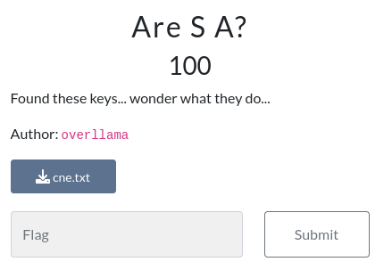

---
tags:
  - BYUCTF
  - BYUCTF-2024
  - Crypto  
  - RSA
---


# چالش AreSA

<center> 

</center>

## صورت سوال
فایلی که بهمون دادن رو بررسی میکنیم و با توجه به نام متغیرها پی میبریم که از رمزگذاری RSA   استفاده شده است.


یه فایل متنی بهمون دادن که محتواش اینه:
```py linenums="1" title="cne.txt"
n =  128393532851463575343089974408848099857979358442919384244000744053339479654557691794114605827105884545240515605112453686433508264824840575897640756564360373615937755743038201363814617682765101064651503434978938431452409293245855062934837618374997956788830791719002612108253528457601645424542240025303582528541
e =  65537
c =  93825584976187667358623690800406736193433562907249950376378278056949067505651948206582798483662803340120930066298960547657544217987827103350739742039606274017391266985269135268995550801742990600381727708443998391878164259416326775952210229572031793998878110937636005712923166229535455282012242471666332812788
```

## روش حل

خب خیلی سریع میریم و $n$ رو بررسی میکنیم و میبینیم که یک عدد اول هست. بنابراین $Phi$ را محاسبه کرده و بقیه مراحل بسیار واضح هست.


```python linenums="1" hl_lines="8-10" title="solve.py"
from Crypto.Util.number import *

n =  128393532851463575343089974408848099857979358442919384244000744053339479654557691794114605827105884545240515605112453686433508264824840575897640756564360373615937755743038201363814617682765101064651503434978938431452409293245855062934837618374997956788830791719002612108253528457601645424542240025303582528541
e =  65537
c =  93825584976187667358623690800406736193433562907249950376378278056949067505651948206582798483662803340120930066298960547657544217987827103350739742039606274017391266985269135268995550801742990600381727708443998391878164259416326775952210229572031793998878110937636005712923166229535455282012242471666332812788


phi = n-1
d=inverse(e, phi)
long_to_bytes(pow(c, d, n))
```


---
??? success "FLAG :triangular_flag_on_post:"
    <div dir="ltr">`byuctf{d1d_s0m3_rs4_stuff...m1ght_d3l3t3_l4t3r}`</div>


!!! نویسنده
    [MohamadAli](https://github.com/w0h4w4d4li)

