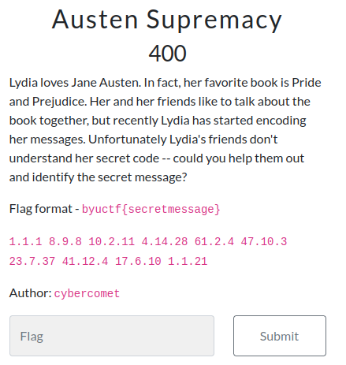

---
tags:
  - BYUCTF
  - BYUCTF-2024
  - Crypto
  - Encoding
---


# چالش Austen Supremacy

<center> 

</center>

## صورت سوال
لیدیا جین آستن را دوست دارد. در واقع کتاب مورد علاقه او Pride and Prejudice است. او و دوستانش دوست دارند درباره کتاب با هم صحبت کنند، اما اخیرا لیدیا شروع به رمزگذاری پیام های خود کرده است. متأسفانه دوستان لیدیا کد مخفی او را درک نمی کنند --  می توانید به آنها کمک کنید و پیام مخفی را شناسایی کنید؟

```
1.1.1 8.9.8 10.2.11 4.14.28 61.2.4 47.10.3 23.7.37 41.12.4 17.6.10 1.1.21
```

## حل
با توجه به فرمت پیامی که لیدا ارسال کرده حدس زدیم که ممکنه ربطی به این کتاب کرده باشه بنابراین رفتیم و کتاب رو دانلود کردیم و حس زدیم که الگوی پیامی که لیدا ارسال کرده به صورت زیر است:

```
Chapter.Paragraph.Character
```
خوشبختانه حدسمون درست بود و فلگ رو بدست اوردیم.


---
??? success "FLAG :triangular_flag_on_post:"
    <div dir="ltr">`byuctf{ilovedarcy}`</div>


!!! نویسنده
    [MohamadAli](https://github.com/w0h4w4d4li),
    [HIGHer](https://twitter.com/HIGH01012)

