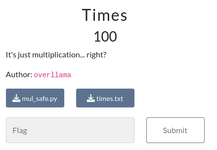

---
tags:
  - BYUCTF
  - BYUCTF-2024
  - Crypto  
  - Eliptic Curve
---


# چالش Times

<center> 

</center>

## صورت سوال
میگه این فقط یک ضرب است....درسته؟


یه فایل متنی و یک اسکریپت پایتون رو بهمون دادن

```linenums="1" title="chall.txt"
Curve:  y^2 = x**3 + 13x + 245 % 335135809459196851603485825030548860907
Point:  (14592775108451646097, 237729200841118959448447480561827799984)
{'ciphertext': b'SllGMo5gxalFG9g8j4KO0cIbXeub0CM2VAWzXo3nbIxMqy1Hl4f+dGwhM9sm793NikYA0EjxvFyRMcU2tKj54Q==', 'iv': b'MWkMvRmhFy2vAO9Be9Depw=='}
```

## روش حل

وقتی فایل متنی رو میبینیم با توجه به منحنی و فرمتی که داره متوجه میشیم که با Elliptic-Curve طرف هستیم. در واقع این منحنی بیضوی در یک میدان محدود از نقاطی تشکیل شده که باید به معادله به فرمت زیر را برآورده کنه:

$$y^2 =x^3 + ax + b$$

و با توجه به عنوان سوال حدس میزنیم که هدف scalar  multiplication هست.

```py linenums="1" title="chall.py"
import hashlib
from Crypto.Cipher import AES 
from Crypto.Util.Padding import pad, unpad
from ellipticcurve import * # I'll use my own library for this
from base64 import b64encode
import os
from Crypto.Util.number import getPrime

def encrypt_flag(shared_secret: int, plaintext: str):
    iv = os.urandom(AES.block_size)

    #get AES key from shared secret
    sha1 = hashlib.sha1()
    sha1.update(str(shared_secret).encode('ascii'))
    key = sha1.digest()[:16]

    #encrypt flag
    plaintext = pad(plaintext.encode('ascii'), AES.block_size)
    cipher = AES.new(key, AES.MODE_CBC, iv)
    ciphertext = cipher.encrypt(plaintext)

    return { "ciphertext" : b64encode(ciphertext), "iv" : b64encode(iv) }
    
def main():
    the_curve = EllipticCurve(13, 245, getPrime(128))
    start_point = None
    while start_point is None:
        x = getPrime(64)
        start_point = the_curve.point(x)
    print("Curve: ", the_curve)
    print("Point: ", start_point)
    new_point = start_point * 1337

    flag = "byuctf{REDACTED}"
    print(encrypt_flag(new_point.x, flag))

if __name__ == "__main__":
    main()
```

خب نگاهی به اسکریپت داده شده میندازیم و میبینیم که بعله همونطور که حدس میزدیم هدف محاسبه scalar multiplication با $n=1337$ و بعدش مختصات x حاصل از خروجی scalar multiplication رو به عنوان shared secret و فلگ رو به عنوان plaintext به تابع encrypt_flag داده می شود.


در واقع تمام کاری که ما باید انجام بدیم اینه که یک تابع scalar multiplication بنویسیم و بعد اون یک تابع برای decrypt کردن فلگ با توجه AES در مد CBC بنویسیم ( همانطور که میبنید ciphertext و iv در فایل times.txt قرار داده شده است ).


```py linenums="1" title="scalar_multiplication.py"
from Crypto.Util.number import *
P=(14592775108451646097, 237729200841118959448447480561827799984)
p=335135809459196851603485825030548860907
a=13
def point_addition(P, Q, p, a):
    if P == (0,0):
        return Q
    elif Q == (0,0):
        return P
    elif P[0] == Q[0] & P[1] == -Q[1]:
        return (0,0)
    elif P != Q:
        landa = (((Q[1] - P[1]) % p) * inverse( ((Q[0] - P[0]) % p), p)) % p
    elif P == Q:
        landa = ( (((3*((P[0]**2) % p) % p) + a) % p) * inverse( ((2 * P[1]) % p), p)) % p
    x = (((landa**2) % p) - P[0] - Q[0]) % p
    y = (((landa*((P[0] - x) % p)) % p) - P[1]) % p
    return (x, y)

def scalar_multiplication(P, n, p, a):
    Q = P
    R = (0,0)
    while n > 0:
        if n % 2 == 1:
            R = point_addition(R, Q, p, a)
        Q = point_addition(Q, Q, p, a)
        n = math.floor(n/2)
    return R

scalar_multiplication(P, 1337, p, a)
```

```py linenums="1" title="decrypt_flag.py"
from Crypto.Cipher import AES
from base64 import b64decode
from Crypto.Util.Padding import unpad


def decrypt_flag(shared_secret: int, ciphertext_dict: dict):

  # Derive AES key from shared secret (same as encryption)
  sha1 = hashlib.sha1()
  sha1.update(str(shared_secret).encode('ascii'))
  key = sha1.digest()[:16]

  # Retrieve ciphertext and IV from dictionary
  ciphertext = b64decode(ciphertext_dict["ciphertext"])
  iv = b64decode(ciphertext_dict["iv"])

  # Decrypt the ciphertext
  cipher = AES.new(key, AES.MODE_CBC, iv)
  plaintext = unpad(cipher.decrypt(ciphertext), AES.block_size)

  # Return the decrypted string
  return plaintext.decode('ascii')


shared_secret = 130102914376597655583988556541378621904

ciphertext_dict = {'ciphertext': b'SllGMo5gxalFG9g8j4KO0cIbXeub0CM2VAWzXo3nbIxMqy1Hl4f+dGwhM9sm793NikYA0EjxvFyRMcU2tKj54Q==', 'iv': b'MWkMvRmhFy2vAO9Be9Depw=='}


decrypt_flag(shared_secret, ciphertext_dict)
```


---
??? success "FLAG :triangular_flag_on_post:"
    <div dir="ltr">`byuctf{mult1pl1c4t10n_just_g0t_s0_much_m0r3_c0mpl1c4t3d}`</div>


!!! نویسنده
    [MohamadAli](https://github.com/w0h4w4d4li)

