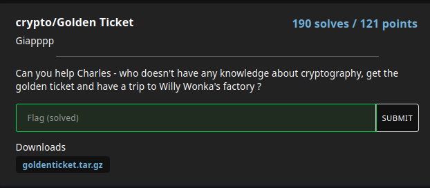

---
tags:
  - IdekCTF
  - IdekCTF-2024
  - Crypto
  - Modular Arithmetic
  - Factorization
---


# چالش Golden Ticket

<center> 

</center>

## صورت سوال
آیا می توانید به چارلز کمک کنید - کسی که هیچ دانشی در مورد رمزنگاری ندارد، بلیط طلایی را دریافت کند و به کارخانه Willy Wonka سفر کند؟

یه فایل پایتون بهمون دادن که محتواش اینه:
```py linenums="1" title="chall.py"
from Crypto.Util.number import *

#Some magic from Willy Wonka
def chocolate_generator(m:int) -> int:
    p = 396430433566694153228963024068183195900644000015629930982017434859080008533624204265038366113052353086248115602503012179807206251960510130759852727353283868788493357310003786807
    return (pow(13, m, p) + pow(37, m, p)) % p

#The golden ticket is hiding inside chocolate
flag = b"idek{REDACTED}"
golden_ticket = bytes_to_long(flag)
flag_chocolate = chocolate_generator(golden_ticket)
chocolate_bag = []

#Willy Wonka is making chocolates
for i in range(golden_ticket):
    chocolate_bag.append(chocolate_generator(i))

#And he put the golden ticket at the end
chocolate_bag.append(flag_chocolate)

#Augustus ate lots of chocolates, but he can't eat all cuz he is full now :D
remain = chocolate_bag[-2:]

#Can you help Charles get the golden ticket?
print(remain)

#[88952575866827947965983024351948428571644045481852955585307229868427303211803239917835211249629755846575548754617810635567272526061976590304647326424871380247801316189016325247, 67077340815509559968966395605991498895734870241569147039932716484176494534953008553337442440573747593113271897771706973941604973691227887232994456813209749283078720189994152242]
```


## روش حل

خب ابتدا میاد فلگو تبدیل به لانگ صحیح میکنه و بعدش میاد این عدد رو میده به 
chocolate_generator
و اسمشو میزاره 
flag_chocolate
و بعد از اون میاد از 0 تا یکی کمتر از مقدار لانگ صحیح فلگ 
chocolate_generator
رو اجرا میکنه و به لیست 
chocolate_bag
اضافه میکنه و درنهایت flag_chocolate رو به این لیست اضافه میکنه ... 
در قدم بعد میاد دو تا عنصر آخر لیست رو در remain نگه میداره.

خب پس ما خروجی 
chocolate_generator
رو به ازای m و m-1 داریم
میتونیم به این شکل بنویسیم (remain رو R درنظر گرفتیم):

$$37^{m-1} + 13^{m-1} \equiv R[0] \pmod{p}$$

$$37^{m} + 13^{m} \equiv R[1] \pmod{p}$$

در نهایت میتونیم به صورت زیر بازنویسی کنیم:

$$37^{m-1} + 13^{m-1} \equiv R[0] \pmod{p}$$

$$37*37^{m-1} + 13*13^{m-1} \equiv R[1] \pmod{p}$$

حالا میایم و در نظر میگیریم:

$$ x := 37^{m-1} $$

$$ y := 13^{m-1} $$

پس داریم:

$$x + y \equiv R[0] \pmod{p}$$

$$37*x + 13*y \equiv R[1] \pmod{p}$$

خب الان ما یک دستگاه دو معادله دو مجهول داریم که میتونیم مقدار $x$ و $y$ رو بدست بیاریم. با اینکار مسئله رو تبدیل به حل یک مسئله لگاریتمی  گسسته کردیم .
حالا از اونجایی که $p-1$ به فاکتور های اول کوچک شکسته میشه میتونیم این مسئله لگاریتمی گسسته رو با الگوریتم Pohlig-Hellman حل کنیم.


```python linenums="1" title="solve.sage"
def chocolate_generator(m:int) -> int:
    p = 396430433566694153228963024068183195900644000015629930982017434859080008533624204265038366113052353086248115602503012179807206251960510130759852727353283868788493357310003786807
    return (pow(13, m, p) + pow(37, m, p)) % p

R = [88952575866827947965983024351948428571644045481852955585307229868427303211803239917835211249629755846575548754617810635567272526061976590304647326424871380247801316189016325247, 67077340815509559968966395605991498895734870241569147039932716484176494534953008553337442440573747593113271897771706973941604973691227887232994456813209749283078720189994152242]
# 13^m + 37^m = R[0]
# 13^(m-1) + 37^(m-1) = R[1]

# 13^(m-1) := x
# 37^(m-1) := y

# 13*x + 37*y = R[0]
# x + y = R[1]

M = Matrix(GF(p),[[1, 1], [13, 37]])
Y = vector(GF(p), R)
X = M.solve_right(Y)

# 13^(m-1) := x = X[0]
# 37^(m-1) := y = X[1]

# Using Pohlig-Hellman algorithm
# We can use https://github.com/Vozec/DLP-Solver to get m
long_to_bytes(m)
```

---

!!! نویسنده
    [MohamadAli](https://github.com/w0h4w4d4li)