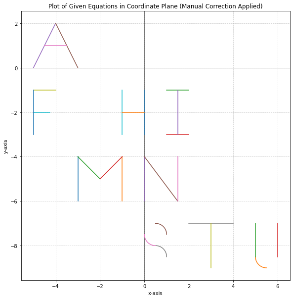
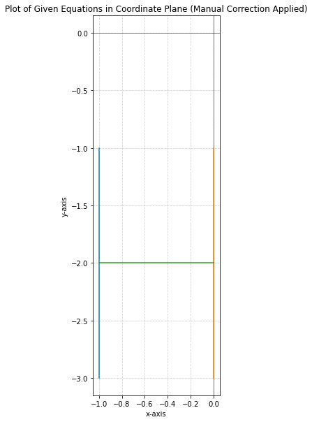
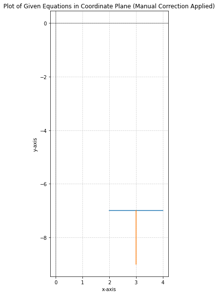
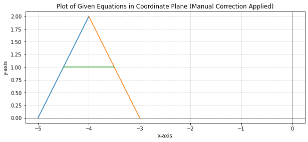
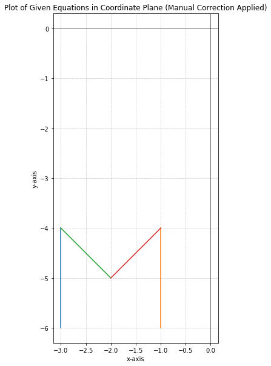
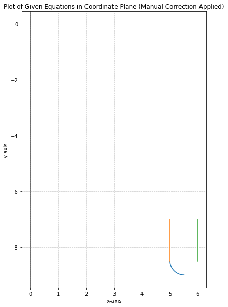
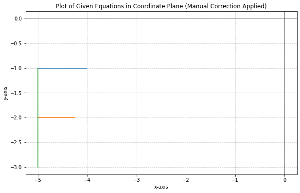
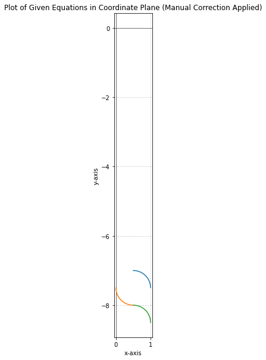
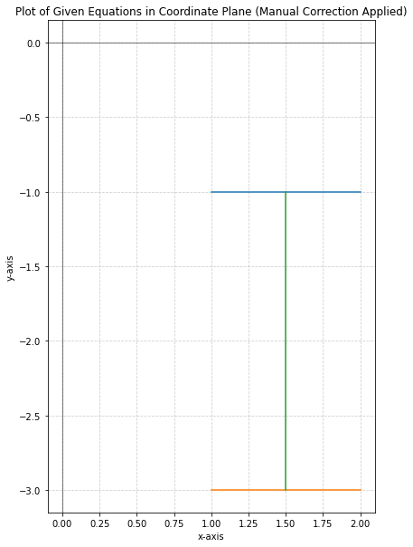
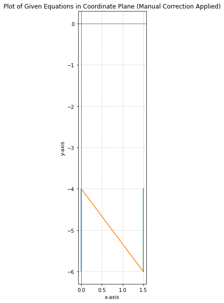

---
tags:
  - IronCTF
  - IronCTF-2024
  - Crypto 
  - algebra equations
  - Coordinate
  - Matplotlib
---

# چالش Algebra Exam

<center>
{ width="400" }
</center>

## صورت چالش


در این سوال یک فایل `txt` حاوی عبارت‌های زیر به ما داده شده.

```
x=-3{-6<y<-4}
x=-1{-6<y<-4}
-x-7{-3<x<-2}
x-3{-2<x<-1}
2x+10{-5<=x<=-4}
-2x-6{-4<=x<=-3}
y=1{-4.5<=x<=-3.5}
y=-7{2<x<4}
x=3{-9<y<-7}
x=-1{-3<=y<=-1}
x=0{-3<=y<=-1}
y=-2{-1<=x<=0}
y=-1{1<=x<=2}
y=-3{1<=x<=2}
x=1.5{-3<=y<=-1}
(x-0.5)^2+(y+7.5)^2=.25{y>-7.5}
(x-0.5)^2+(y+7.5)^2=.25{x<.5}
(x-0.5)^2+(y+8.5)^2=.25{x>.5}
y=-1{-5<=x<=-4}
y=-2{-5<=x<=-4.25}
x=-5{-3<=y<=-1}
x=5{-8.5<y<-7}
x=6{-8.5<y<-7}
(x-5.5)^2+(y+8.5)^2=.25{y<-8.5}
x=0{-6<y<-4}
(-4/3)x-4 {0<x<1.5}
x=1.5{-6<y<-4}

```

## حل چالش

با کمی جستجو و استفاده از ChatGPT متوجه شدم که اینها نمایش خط روی نمودار مختصات است.
با استفاده از کد زیر شروع کردم به رسم نمودار هایی که با استفاده از این عبارت‌های جبری تولیط میشود
برای توضیح این عبارت‌ها به عنوان مثال `x=-3{-6<y<-4}` یعنی خط $x=3$ در بازه‌ی که $y$ بین $[-6.-4]$ است همچنین، عبارت `-2x-6{-4<=x<=-3}`  به معنی خط $y=-2x-6$ ‌در بازه‌ی  $[-4,-3]$ است. سپس با استفاده از کد زیر نمودار کل این عبارت‌های جبری را روی plot رسم کردم.


```python title="solve.py" linenums="1"
import numpy as np
import matplotlib.pyplot as plt

# Initialize plot
plt.figure(figsize=(10, 10))
plt.axhline(0, color='black', lw=0.5)
plt.axvline(0, color='black', lw=0.5)
plt.grid(True, linestyle='--', alpha=0.6)

def plot_segment(x_vals, y_vals, label=None):
    plt.plot(x_vals, y_vals, label=label)


y = np.linspace(-6, -4)
x = np.full_like(y, -3)
plot_segment(x, y)

y = np.linspace(-6, -4)
x = np.full_like(y, -1)
plot_segment(x, y)

x = np.linspace(-3, -2)
y = -x - 7
plot_segment(x, y)

x = np.linspace(-2, -1)
y = x - 3
plot_segment(x, y)


x = np.linspace(-5, -4)
y = 2 * x + 10
plot_segment(x, y)

x = np.linspace(-4, -3)
y = -2 * x - 6
plot_segment(x, y)

x = np.linspace(-4.5, -3.5)
y = np.full_like(x, 1)
plot_segment(x, y)


x = np.linspace(2, 4)
y = np.full_like(x, -7)
plot_segment(x, y)

y = np.linspace(-9, -7)
x = np.full_like(y, 3)
plot_segment(x, y)


y = np.linspace(-3, -1)
x = np.full_like(y, -1)
plot_segment(x, y)

y = np.linspace(-3, -1)
x = np.full_like(y, 0)
plot_segment(x, y)

x = np.linspace(-1, 0)
y = np.full_like(x, -2)
plot_segment(x, y)


x = np.linspace(1, 2)
y = np.full_like(x, -1)
plot_segment(x, y)

x = np.linspace(1, 2)
y = np.full_like(x, -3)
plot_segment(x, y)

y = np.linspace(-3, -1)
x = np.full_like(y, 1.5)
plot_segment(x, y)


theta = np.linspace(-np.pi / 2, np.pi / 2, 100)
x = 0.5 + 0.5 * np.cos(theta)
y = -7.5 + 0.5 * np.sin(theta)
# Manually specifying the portion to plot only the upper half
mask = y > -7.5
plot_segment(x[mask], y[mask])

theta = np.linspace(np.pi, 2 * np.pi)
x = 0.5 + 0.5 * np.cos(theta)
y = -7.5 + 0.5 * np.sin(theta)
# Manually specifying the portion to plot only the left half
mask = x < 0.5
plot_segment(x[mask], y[mask])

theta = np.linspace(0, np.pi)
x = 0.5 + 0.5 * np.cos(theta)
y = -8.5 + 0.5 * np.sin(theta)
# Manually specifying the portion to plot only the right half
mask = x > 0.5
plot_segment(x[mask], y[mask])


x = np.linspace(-5, -4)
y = np.full_like(x, -1)
plot_segment(x, y)

x = np.linspace(-5, -4.25)
y = np.full_like(x, -2)
plot_segment(x, y)

y = np.linspace(-3, -1)
x = np.full_like(y, -5)
plot_segment(x, y)


theta = np.linspace(np.pi / 2, 3 * np.pi / 2)
x = 5.5 + 0.5 * np.cos(theta)
y = -8.5 + 0.5 * np.sin(theta)
# Manually specifying the portion to plot only the bottom half
mask = y < -8.5
plot_segment(x[mask], y[mask])

y = np.linspace(-8.5, -7)
x = np.full_like(y, 5)
plot_segment(x, y)

y = np.linspace(-8.5, -7)
x = np.full_like(y, 6)
plot_segment(x, y)


y = np.linspace(-6, -4)
x = np.full_like(y, 0)
plot_segment(x, y)

x = np.linspace(0, 1.5)
y = (-4 / 3) * x - 4
plot_segment(x, y)

y = np.linspace(-6, -4)
x = np.full_like(y, 1.5)
plot_segment(x, y)

plt.gca().set_aspect('equal', adjustable='box')
plt.xlabel('x-axis')
plt.ylabel('y-axis')
plt.show()
```

بعد از اینکه نمودار کل این عبار‌ت‌های جبری را روی plot با استفاده از کد پایتون بالا نمایش دادم خروجی زیر ظاهر شد:

<center>
{ width="400" }
</center>
 
 از این نمودار عملا چیزی متوجه نمیشدم عبارت بی معنی از حروف بود و خیلی از حالت‌ها رو چک کردم ولی باز هم فلگ درست نبود. یک مدت زمانی روی این مسئله درگیر بودم که مشکل ممکنه کجا باشه تا اینکه یک راه‌حل به ذهنم رسید که ممکنه ترتیب حروف نشان داده شده روی نمودار فرق کند و باید حروف به ترتیب عبارت‌های جبری ساخته شوند. پس عبارت‌ها را به شکل زیر دسته‌بندی کردم:

```
x=-3{-6<y<-4}
x=-1{-6<y<-4}
-x-7{-3<x<-2}
x-3{-2<x<-1}

2x+10{-5<=x<=-4}
-2x-6{-4<=x<=-3}
y=1{-4.5<=x<=-3.5}

y=-7{2<x<4}
x=3{-9<y<-7}

x=-1{-3<=y<=-1}
x=0{-3<=y<=-1}
y=-2{-1<=x<=0}

y=-1{1<=x<=2}
y=-3{1<=x<=2}
x=1.5{-3<=y<=-1}

(x-0.5)^2+(y+7.5)^2=.25{y>-7.5}
(x-0.5)^2+(y+7.5)^2=.25{x<.5}
(x-0.5)^2+(y+8.5)^2=.25{x>.5}

y=-1{-5<=x<=-4}
y=-2{-5<=x<=-4.25}
x=-5{-3<=y<=-1}

x=5{-8.5<y<-7}
x=6{-8.5<y<-7}
(x-5.5)^2+(y+8.5)^2=.25{y<-8.5}

x=0{-6<y<-4}
(-4/3)x-4 {0<x<1.5}
x=1.5{-6<y<-4}
```

 حالا به جایی اینکه کل عبارت‌های جبری را روی یک plot رسم کنیم، عبارت‌ها را به صورت بالا به پایین به شکل دسته‌ای اجرا می‌کنیم تا یک حرف ظاهر شود. برای مثال، با چهار عبارت بالا حرف M ظاهر می‌شود و با سه عبارت بعدی حرف A نمایش داده می‌شود. 

 <center>
 
 |       H        |        T         |       A     |        M         | 
 |:--------------:|:----------------:|:-----------:|:----------------:|
 | |   |  |   |
 |       U        |         F        |      S      |         I        |
 | |   |  |   |
                                                   |         N        |
                                                   |   |


 
 </center>

این کار را تا آخر ادامه می‌دهیم تا کل عبارت فلگ MATHISFUN بدست بیاید.

??? success "FLAG :triangular_flag_on_post:"
    <div dir="ltr">`ironCTF{MATHISFUN}`</div>

--- 

!!! نویسنده
    [HIGHer](https://twitter.com/HIGH01012) 

