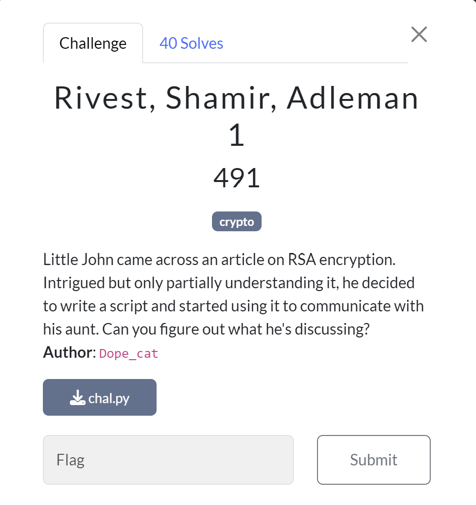

---
tags:
  - IronCTF
  - IronCTF-2024
  - Crypto 
  - RSA
  - Partial MSB p
  - Coppersmith 
  - GCD (e,phi) !=1
---

# چالش Riv., Sha., Adl. 1

<center>
{ width="400" }
</center>

## درک چالش

کد پایتون زیر به ما داده شده اول یک بررسی روی کد می‌کنیم تا ببینم که چه چیزی دستگیر ما میشه.


```python title="chall.py" linenums="1"
from Crypto.Util.number import *

m = open("flag.txt",'rb').read()
m = bytes_to_long(m)

p = getPrime(1024)
q = getPrime(1024)
N = p*q

e = getRandomNBitInteger(16)
c = pow(m,e,N)
p_ = p >> (200)

print(f"{(p_,N,e,c)=}")

# (p_,N,e,c)=(78251056776113743922781362749830646373211175353656790171039496888342171662458492506297767981353887690931452440620588460424832375197427124943346919084717792877241717599798699596252163346397300952154047511640741738581061446499402444306089020012841936, 19155750974833741583193175954281590563726157170945198297004159460941099410928572559396586603869227741976115617781677050055003534675899765832064973073604801444516483333718433505641277789211533814981212445466591143787572063072012686620553662750418892611152219385262027111838502078590253300365603090810554529475615741997879081475539139083909537636187870144455396293865731172472266214152364966965486064463013169673277547545796210067912520397619279792527485993120983571116599728179232502586378026362114554073310185828511219212318935521752030577150436386831635283297669979721206705401841108223134880706200280776161816742511, 37929, 18360638515927091408323573987243771860358592808066239563037326262998090628041137663795836701638491309626921654806176147983008835235564144131508890188032718841579547621056841653365205374032922110171259908854680569139265494330638365871014755623899496058107812891247359641915061447326195936351276776429612672651699554362477232678286997748513921174452554559807152644265886002820939933142395032126999791934865013547916035484742277215894738953606577594559190553807625082545082802319669474061085974345302655680800297032801212853412563127910754108599054834023083534207306068106714093193341748990945064417347044638122445194693)
```

خب اول اینکه اعداد اول `p`و `q` با 1024 بیت به شکل درست ساخته شده اما عدد `e` یک عدد تصادفی است که اولین نکته مسئله همینجاست.
علاوه‌براین، 200 بیت شیفت روی `p` انجام شده که باعث میشه 200 بیت کم‌ارزش `p` نداشته باشیم ولی بقیه بیت‌های آن (قسمت پر ارزش `p`) به ما داده شده است. 

## راه‌حل چالش

خب با توجه به داده‌های چالش، به یاد آوردم که coppersmith میتونه راه‌حل بدست آوردن مقدار کامل `p` باشه. چون با استفاده از این الگوریتم (در این [مقاله](https://eprint.iacr.org/2020/1506.pdf) ص۵ توضیح داده است) می‌توانیم با حل یک معادله مقدار بیت‌های باقی‌مانده  `p` را بدست آوردیم. 
 بعد از اینکه توانستیم مقدار `p` را بازیابی  کنیم به راحتی می‌توانیم با تقسیم `N//p` مقدار `q`را بدست بیاوریم و سپس مقدار $\phi(N)=(p-1)*(q-1)$ را در الگوریتم RSA بدست بیاوریم.

 خب پس با تکه کد زیر الگوریتم coppersmith پیاده می‌کنیم تا ابتدا مقدار کامل `p` و سپس `q` را بدست آوریم.
 کد با استفاده از ChatGPT نوشته شده و توضیحات مربوط به هر قسمت وجود دارد.


```python title="solve: Part 1" linenums="1"
from sage.all import *

N = 19155750974833741583193175954281590563726157170945198297004159460941099410928572559396586603869227741976115617781677050055003534675899765832064973073604801444516483333718433505641277789211533814981212445466591143787572063072012686620553662750418892611152219385262027111838502078590253300365603090810554529475615741997879081475539139083909537636187870144455396293865731172472266214152364966965486064463013169673277547545796210067912520397619279792527485993120983571116599728179232502586378026362114554073310185828511219212318935521752030577150436386831635283297669979721206705401841108223134880706200280776161816742511
e = 37929
c = 18360638515927091408323573987243771860358592808066239563037326262998090628041137663795836701638491309626921654806176147983008835235564144131508890188032718841579547621056841653365205374032922110171259908854680569139265494330638365871014755623899496058107812891247359641915061447326195936351276776429612672651699554362477232678286997748513921174452554559807152644265886002820939933142395032126999791934865013547916035484742277215894738953606577594559190553807625082545082802319669474061085974345302655680800297032801212853412563127910754108599054834023083534207306068106714093193341748990945064417347044638122445194693

# Known bits of p (p_ is the most significant 824 bits of p)
known_bits_p=78251056776113743922781362749830646373211175353656790171039496888342171662458492506297767981353887690931452440620588460424832375197427124943346919084717792877241717599798699596252163346397300952154047511640741738581061446499402444306089020012841936 
known_bits_len = known_bits_p.nbits()  # Get the number of bits in p_
bit_length_p = 1024  # Total number of bits in p (RSA 1024-bit prime)

# Step 1: Construct the approximate value of p using the known MSB
k = bit_length_p - known_bits_len  # Number of unknown bits
p_approx = known_bits_p << k  # Shift known MSB to correct position

# Step 2: Set up polynomial ring over integers modulo N
Zmod_N = Zmod(N)                # Use Zmod(N) to represent integers modulo N
PR = PolynomialRing(Zmod_N, 'x') # Create the polynomial ring modulo N
x = PR.gen()                    # Define the variable x in this polynomial ring

# Step 3: Define the polynomial f(x) = (p_approx + unknown bits x)
f = p_approx + x             

# Step 4: Adjust the bound for the unknown part (we reduce it to test smaller values)
X = 2^k  # X is the bound for the unknown bits of p

# Experiment with different values of beta, starting with 0.3
beta = 0.3  

# Finding small roots of f(x) mod N using Coppersmith's method
root = f.small_roots(X=X, beta=beta)[0] 
p = int(p_approx + root)   # Reconstruct full p
q= N//p

#p = 125744600137007428336686588524997758583871561683692726713676285534301107098981040025358212893254808906490849809996401262081360657684811764499058585423566589418668455569756206340960309696630881351340690627578536523134632286484896258485029204377197049678809995370536434185505078509989342157694120501717398288147
#q = 152338557313492806920938057132024177169537855797474186224778436724151018350841859306050747693427022538305746331468540077418496101170856031753174852597426413417774981047349677917782159366070625041741663841773378489741748290598624909537640900100213447631657455022547932304046202563857706877939270502191620357813
َassert p*q==N
```

خب تا اینجا مقدار `p`و`q` بدست آوردم . بعداز این فکر کردم که از اینجا به بعد ساده است و فقط کافیه مقدار کلید خصوصی `d` رو بدست بیارم و راحت رمزگشایی کنم ولی نه!!! به این راحتی هم مثل اینکه نیست
 
 بعد از اینکه `p`و `q` رو بدست آوردیم مقدار `phi` را بدست آوردم اما مقدار تا با استفاده از اون `d` را بدست بیاوریم اما به خاطر اینکه `e` به صورت یک عدد دلخواه انتخاب شده پس: 


$$
gcd(e,\varphi (N)) = 3
$$

!!! یادآوری

    در الگوریتم RSA باید مقدار $gcd(e,\varphi (N)) = 1$ باشد تا به یک مقدار یکتا برای d برسیم. 


 این باعث میشه که ما نتوانیم معکوس `e` در پیمانه `phi` حساب کنیم و عملا مقدار `d` بدست نمیاد.
 خب یک مدت زیادی نسبتا توی این مرحله گیر کردم و شروع به جستجو کردیم تا به این  [رایتاپ](https://github.com/HackThisSite/CTF-Writeups/tree/master/2017/EasyCTF/RSA%204) رسیدم.
 
  
براساس آن، بنابراین در چالش ما داریم  $(e//gcd(e,\varphi (N))) = 12643$. پس اکنون c را به شکل زیر افزایش می دهیم تا معکوس شود!

$$
c ≡ m^{e} \ \ mod \  N\\
c^{(12643^{-1})} ≡ m^{(e \times (12643^{-1}))}\\
c^{(12643^{-1})} ≡ m^{(3 \times 12643 \times (12643^{-1}))}
$$

از آنجایی که رابطه زیر همیشه برقرار است :


$$
x \times x^{-1} ≡ 1 \ \ mod \ \varphi(N)\\
$$

و فقط برای ما توان $m \ mod \ \varphi(N)$ به دلیل قضیه کوچک فرما اهمیت دارد. پس:

$$
c^{(12643^{-1})} ≡ m^{(3 \times 12643 \times (12643^{-1}))}\\
c^{(12643^{-1})} ≡ m^{(3 \times 1)}\\
c^{(12643^{-1})} ≡ m^{3} \ \ mod \ N
$$

بنابراین اگر ریشه $g=3$  از $c^{(12643^{-1})}$ را بگیریم، بیت‌های پر ارزش (MSB) از $m$ را به دست خواهیم آورد! اما همه بیت‌های آن را نمی‌توانیم استخراج کنیم زیرا مقدار دقیق $c^{(12643^{-1})}$ را نداریم، فقط مقدار آن را پیمانه $N$ داریم. پس با استفاده از کد زیر می‌توانیم فلگ را بدست آوریم:


```python title="solve: Part 2" linenums="1"

from Crypto.Util.number import *
phi = (p-1)*(q-1)
g = GCD(e,phi)

d = pow(e//g,-1,phi)
c = pow(c,d,N)
m=int(iroot(c,g)[0])
print(long_to_bytes(m))

```

???+ tip "روش حل دیگر قسمت دوم"
    
    با کد زیر هم می‌توان با استفاده از کتابخانه RSATool قسمت دوم این چالش را حل کرد. این نوع مشکل به عنوان یک کلید عمومی نامعتبر (invalidPubExponent) در این کتابخانه در نظر گرفته شده است. 

    ```py
      import math
      import sympy as sp
      from fractions import gcd
      import RSATool

      def main():
          p= 
          q= 
          e= 
          C= 

          RSASolver = RSATool.RSATool()
          RSASolver.invalidPubExponent(C,p,q,e)
          plain = hex(RSASolver.invalidPubExponent(C,p,q,e))
          print(plain)
          plain = plain[2:]
          b = (bytearray.fromhex(plain))
          f = (str(b))
          print(f)

      main()
    ```

در نهایت استفاده از دو قسمت کدهای بالا می‌توان به فلگ رسید. :sweat: 

??? success "FLAG :triangular_flag_on_post:"
    <div dir="ltr">`ironCTF{@Un7_CaN_yoU_53Nd_me_THOS3_3xp@NSIon_5cREws}`</div>

--- 

!!! نویسنده
    [HIGHer](https://twitter.com/HIGH01012) 

