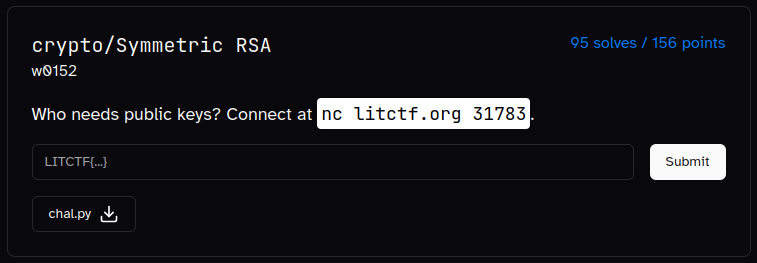

---
tags:
  - LITCTF
  - LITCTF-2024
  - Crypto
  - RSA
---


# چالش Symmetric RSA

<center> 

</center>

## صورت سوال
با توجه به عنوان سوال پی میبریم که با رمزنگاری RSA سرو کار داریم.
حالا میگه رمزنگاری RSA متقارن؟ یعنی چی مگه RSA نامتقارن نبود؟ منظورش چی میتونه باشه؟


یه فایل پایتون بهمون دادن که محتواش اینه:
```py linenums="1" title="chall.py"
#!/usr/bin/env python3
from Crypto.Util.number import long_to_bytes as ltb, bytes_to_long as btl, getPrime

p = getPrime(1024)
q = getPrime(1024)

n = p*q

e = p

with open("flag.txt", "rb") as f:
	PT = btl(f.read())

CT = pow(PT, e, n)
print(f"{CT = }")

for _ in range(4):
	CT = pow(int(input("Plaintext: ")), e, n)
	print(f"{CT = }")
```

جالب اینجاست که یکی از فاکتورهای e, n هست. 
در ابتدا میاد فلگو رمز میکنه و در خروجی نمایش میده و بعدش ۴ بار اجازه داریم هر متنی که دوست داریم رمز کنیم و هر بار برامون رمز رو چاپ میکنه.


## روش حل

خب در اولین مرحله خیلی خوبه که بیایم یه یادآوری کنیم از قضیه <a target="_blank" href="https://en.wikipedia.org/wiki/Fermat%27s_little_theorem">Fermat's little</a> :

???+ note "قضیه Fermat's little"

    در نظریه اعداد این قضیه نشان میدهد که اگر $p$ عددی اول باشد آنگاه برای هر عدد صحیح $a$ عدد $a^{p} - a$ یک عدد صحیح مضربی از $p$ هست. اگر بخواهیم به صورت حساب پیمانه ای نمایش بدهیم داریم:

    $$
    a^{p}\equiv a \pmod{p}
    $$

حالا شما در نظر بگیرید به جای a پیام رو قرار بدیم و از اونطرف $p = e$  (طبق فرض سوال)  همچنان داریم:

$$
m^{e}\equiv m \pmod{p}
$$


خب جالب شد ولی دقت کنید که ماژول ما اینجا $N$ هست و نه $p$. ولی میتونیم به چیزی که میخوایم برسیم با این حساب داریم: 

\begin{equation}
\bigg( m^{e}\equiv m \pmod{N}\pmod{p} \bigg) \equiv 
\bigg(m^{e}\equiv m \pmod{p}\bigg)
\label{eq:1}
\end{equation}

حالا داستان اینه که ما $p$ که همون $p=e$  باشه رو که نداریم! پس باید بریم و $p$  رو بدست بیاریم.

توجه کنید که دیدیم:

$$ m^{e}\equiv \text{CT} =  m + kp \pmod{N}$$ 

حالا همانطور که توی بررسی صورت سوال دیدیم اجازه داریم ۴ بار هر پیامی رو که دوست  داشتیم رمز کنیم. دیگه چی از این بهتر؟!

حالا میایمو هر بار یه پیام رو رمز میکنیم و بعدش از پیام رو از رمز کم میکنیم و بعد میایم GCD (بزرگترین مقسوم علیه مشترک) رو میگیریم و با این کار $p$ محاسبه میشه!

$$ m_{1}^{e}\equiv \text{CT}_{1} =  m_{1} + k_{1}p \pmod{N}$$ 

$$ . $$

$$ . $$

$$ . $$

$$ m_{4}^{e}\equiv \text{CT}_{4} =  m_{4} + k_{4}p \pmod{N}$$ 

حالا میایم  GCD  میگیریم:

$$ \text{GCD}(m_{1} - \text{CT}_{1}, ..., m_{4} - \text{CT}_{4}) $$ 

$$ = $$

$$ \text{GCD}(k_{1}p, ..., k_{4}p) = p$$ 


و حالا به راحتی پیام رمز شده اصلی رو با استفاده از ($\ref{eq:1}$) بدست میاریم:


```python linenums="1" title="solve.py"
from Crypto.Util.number import *
from pwn import *

r = remote('litctf.org', 31783)

ct = int(r.recvline().decode().split()[-1])
out = []
for x in [2, 3, 5, 7]:
    _ = r.recv()
    r.sendline(str(x).encode())
    out.append(x - int(r.recvline().decode().split()[-1]))

p = GCD(*out)
flag = ct % p
print(long_to_bytes(flag))
```

???+ tip "روش حل دوم"
    
    میدونستید که اگر عدد منفی 1 رو به جای یکی از پیامها ارسال میکردیم و با توجه به اینکه e یک عدد فرد اول هست خروجی برابر بود با:

    $$ m^{e}\equiv (-1)^{e} \equiv -1 \equiv  N - 1 \pmod{N}$$ 

    بنابراین میتونستیم به راحتی N رو محاسبه کنیم و بعد از اینکه $p=e$ رو بدست آوردیم $q$ رو محاسبه کنیم و بعدش کلید خصوصی رو بدست بیاریم و تمام!

    $$ q = \frac{N}{p} $$

    $$ \phi(N) = (p-1)*(q-1)$$

    $$ d \equiv p^{-1}  \pmod{\phi(N)} $$

    $$ CT^{d} \equiv m \pmod{N}$$


---
??? success "FLAG :triangular_flag_on_post:"
    <div dir="ltr">`LITCTF{ju57_u53_e=65537_00a144ca}`</div>


!!! نویسنده
    [MohamadAli](https://github.com/w0h4w4d4li)

