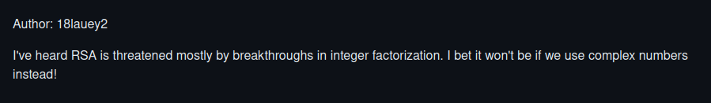

---
tags:
  - SDCTF
  - SDCTF-2024
  - Crypto  
  - RSA
  - Complex Numbers
---


# چالش ComplexProblem

<center> 

</center>

## صورت سوال
خب در صورت سوال گفته:‌ از رمزنگاری RSA استفاده شده و این بار باید با اعداد مختلط سر و کله بزنیم...


یه فایل متنی بهمون دادن که محتواش اینه:
### فایل متنی `out.txt`
```
N = 47314254765672217716326132674
+ 275948221897758780728621214539i
e = 65537
ciphertext = -120974603478533287568533462088
+ -26598567903204264781472600457i
```

### کلاس `Gaussian Rational`

بیایم نگاهی به اسکریپت پایتون سوال بندازیم


شاید براتون سوال بشه این کلاس اصلا چی هست؟‌ در واقع توی ریاضیات، یک عدد گوسی گویا یک عدد مختلط به شکل

$$
‍‍‍‍p + qi
$$

هست، که توی اون $p$ و $q$ هر دو اعداد گویا هستند. و همانطور که میدونید $p$ قسمت Real یا حقیقی و $q$ قسمت Imag یا موهومی هست.


و همچنین مشاهده میکنید که یکسری عملیات برای این کلاس تعیین شده

&nbsp;


```python
class GaussianRational:
    def __init__(self, real: Fraction, imag: Fraction):
        assert(type(real) == Fraction)
        assert(type(imag) == Fraction)
        self.real = real
        self.imag = imag

    def conjugate(self):
        return GaussianRational(self.real, self.imag * -1)
    
    def __add__(self, other):
        return GaussianRational(self.real + other.real, self.imag + other.imag)
    
    def __sub__(self, other):
        return GaussianRational(self.real - other.real, self.imag - other.imag)
    
    def __mul__(self, other):
        return GaussianRational(self.real * other.real - self.imag * other.imag, self.real * other.imag + self.imag * other.real)

    def __truediv__(self, other):
        divisor = (other.conjugate() * other).real
        dividend = other.conjugate() * self
        return GaussianRational(dividend.real / divisor, dividend.imag / divisor)
    
    # credit to https://stackoverflow.com/questions/54553489/how-to-calculate-a-modulo-of-complex-numbers
    def __mod__(self, other):
        x = self/other
        y = GaussianRational(Fraction(round(x.real)), Fraction(round(x.imag)))
        z = y*other
        return self - z
    
    # note: does not work for negative exponents
    # exponent is (non-negative) integer, modulus is a Gaussian rational
    def __pow__(self, exponent, modulo):
        shifted_exponent = exponent
        powers = self
        result = GaussianRational(Fraction(1), Fraction(0))
        while (shifted_exponent > 0):
            if (shifted_exponent & 1 == 1):
                result = (result * powers) % modulo
            shifted_exponent >>= 1
            powers = (powers * powers) % modulo
        return result
    
    def __eq__(self, other):
        if type(other) != GaussianRational: return False
        return self.imag == other.imag and self.real == other.real
    
    def __repr__(self):
        return f"{self.real}\n+ {self.imag}i"

```

## ساختن کلید

حالا همونطور که میبینید دو تا تابع داریم که زحمت ساختن کلید رو میکشن..

### تابع `get_gaussian_prime`
که میاد یک عدد اول گاوسی رو تولید میکنه

```python
# gets a Gaussian prime with real/imaginary component being n bits each
def get_gaussian_prime(nbits):
    while True:
        candidate_real = randbits(nbits-1) + (1 << nbits)
        candidate_imag = randbits(nbits-1) + (1 << nbits)
        if isPrime(candidate_real*candidate_real + candidate_imag*candidate_imag):
            candidate = GaussianRational(Fraction(candidate_real), Fraction(candidate_imag))
            return candidate
```

### تابع `generate_keys`
اینم که عدد اولاشو از تابع بالا میگیره و کلید رو تولید میکنه

```python
def generate_keys(nbits, e=65537):
    p = get_gaussian_prime(nbits)
    q = get_gaussian_prime(nbits)
    N = p*q
    return (N, e) # (N, e) is public key
```


### تابع `encrypt`
حالا تابعی که رمزنگاری میکنه رو هم میتونیم ببینیم

```python
def encrypt(message, public_key):
    (N, e) = public_key
    return pow(message, e, N)
```


## روش حل

خب بباین دقت کنیم ببینیم چه بلایی سر فلگ میاد و چجوری رمز میشه و چیکار باید بکنیم اصلا؟

```python linenums="1" hl_lines="8-12"
flag = None
with open("/home/ctf/flag", "r") as f:
    flag = f.read()
public_key = generate_keys(48)
(N, e) = public_key
print(f"N = {N}")
print(f"e = {e}")
flag1 = flag[:len(flag) // 2].encode()
flag2 = flag[len(flag) // 2:].encode()
real = int(hexlify(flag1).decode(), 16)
imag = int(hexlify(flag2).decode(), 16)
message = GaussianRational(Fraction(real), Fraction(imag))
assert(real*real + imag*imag < N.real * N.real + N.imag * N.imag)
ciphertext = encrypt(message, public_key)
print(f"ciphertext = {ciphertext}")
```

خب در مرحله اول میاد فلگو میخونه و بعدش یک کلید عمومی ۶۴ بیتی تولید میکنه و بعدش میاد همانطور که کد بالا رو هایلایت کردم میاد فلگو دو تکه میکنه و در قالب گاوسی گویا به عنوان پیامی که قراره رمز بشه تبدیل میکنه.

بعدش میاد encrypt میکنه.

خب ما کار میکنیم که همیشه برای رمزگشایی RSA استفاده میکردیم با این تفاوت که این بار در قالب گوسی گویا باید حمله کنیم و در آخر باید حواسمون جمع باشه که وقتی فلگ رو بدست اوردیم ( که در حقیقت یک عدد مختلط هست ) قسمت Real یا حقیقی و قسمت Imag یا موهومی اون رو جداگونه تبدیل به بایت کنیم و بعد فلگ نهایی رو بدست بیاریم.

خب اگه یادتون باشه $N$ در قالب یک عدد مختلط داده شده خب حالا به نظرتون ما چجوری $Phi$ این عدد رو محاسبه کنیم؟ جواب اینه باید Norm اون رو محاسبه کنیم و بعدش از طریق اون $Phi$ رو محاسبه کنیم.

##  محاسبه Norm

Norm عدد زیر به فرم گوسی گویا 

$$
a + bi
$$

 برابر است با:

$$
a^2 + b^2
$$


```python linenums="1" title="solve.py"
from Crypto.Util.number import *

# N = 47314254765672217716326132674
# + 275948221897758780728621214539i
r_N = 47314254765672217716326132674
im_N = 275948221897758780728621214539

# We can calculate norm of N and using SageMath or factordb.com therefore we get p and q
norm_N = (r_N*r_N) + (im_N*im_N)  
p = 258832088213745478555898574053
q = 302845216810343310427045691449

e = 65537

# ciphertext = -120974603478533287568533462088
# + -26598567903204264781472600457i
r_c = -120974603478533287568533462088
im_c = -26598567903204264781472600457

c = GaussianRational(Fraction(r_C), Fraction(im_C))
N = GaussianRational(Fraction(r_N), Fraction(im_N))

phi = (p-1)*(q-1)
d = inverse(e, phi)
Flag = pow(c, d, N)
long_to_bytes(int(Flag.real)) + long_to_bytes(int(Flag.imag))
```

بعد از اینکه نرم $N$ رو بررسی کردیم میبینیم که اول نیست بنابراین با Factordb.com‍‍‍ یا SageMath کار رو پیش میبریم و بنابراین میتونیم دو عدد اول $p$ و $q$ رو پیدا کنیم که حاصل ضربشون بشه برابر $N$.  
حالا داریم:

$$
Phi = (p-1) * (q-1)
$$

بعد میایم اون پیام رمز شده به صورت عدد مختلط و $N$ رو به در قالب گوسی گویا درنظر گرفته و در نهایت $d$ رو محاسبه کرده و فلگ رو میکشیم بیرون به همین راحتی!

&nbsp;

---
??? success "FLAG :triangular_flag_on_post:"
    <div dir="ltr">`sdctf{g3t_r341_0bcef3a}`</div>


!!! نویسنده
    [MohamadAli](https://github.com/w0h4w4d4li)

