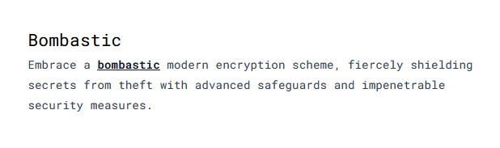

---
tags:
  - SnappCTF
  - SnappCTF-2024
  - Crypto  
  - RSA
  - RSA-keygen
---


# چالش Bombastic

<center> 

</center>


## نگاه اولیه به سوال
در این سوال از رمزنگاری RSA برای رمزگذاری فلگ استفاده شده و ما باید به طریقی بتونیم متن رمزشده رو رمزگشایی کنیم و به فلگ برسیم.

بیایم نگاهی به توابع اسکریپت پایتون سوال بندازیم
### تابع `check`:
این تابع یک عدد ورودی میگیره و براساس یکسری فعل و انفعالات از عدد ورودی، یک لیست از اعداد اول (درصورت امکان) برمیگردونه

```python
def check(n):
    sn = str(n)
    l, P = len(str(n)), []
    for i in range(1, l - 1):
        for j in range(i + 1, l):
            g, e, a = int(sn[:i]), int(sn[i:j]), int(sn[j:])
            if isPrime(g ** e + a):
                P.append(g ** e + a)
            if isPrime(g** e - a):
                P.append(g ** e - a)
    return P
```

### تابع `keygen`:
این تابع برای تولید عدد اول حداقل به طول `nbit` هستش. بخایم یکم عمیق تر به تابع نگاهی بندازیم میبینیم :

1. درون حلقه `while True` میاد یک عدد `18` بیتی میسازه (`r`)
2. به تابع `check` پاسش میده.
3. در صورتی که لیست خروجیش خالی نباشه، میاد سورتش میکنه و اخرین آیتم لیست رو انتخاب میکنه و تو متغیر `p` ذخیره میکنه (به نوعی داره بزرگترین عدد اول لیست خروجی رو انتخاب میکنه)
4. سپس در صورتیکه عدد اول جدا شده طولش حداقل `nbit` باشه برامون برمیگردونه وگرنه دوباره این روند تکرار میشه

```python
def keygen(nbit):
    while True:
        r = getRandomNBitInteger(18)
        if len(check(r)) != 0:
            cr = check(r)
            cr.sort()
            p = cr[-1]
            if p.bit_length() >= nbit:
                return r, p
```


## روش حل


در این سوال از یک الگوریتم غیراستاندارد (تابع keygen) برای تولید عدد اول استفاده شده بود. درسته اعداد اول ساخته شده 256 بیتی هستند، ولی از عدد 18 بیتی r مشتق شده اند. در نتیجه اگه بیایم روی متغیر r یک بروت فورس انجام بدیم، میتونیم فاکتورهای n رو بدست بیاریم و فلگ رمز شده رو رمزگشایی کنیم😁😎

```python
def check(n):
    sn = str(n)
    l, P = len(str(n)), []
    for i in range(1, l - 1):
        for j in range(i + 1, l):
            g, e, a = int(sn[:i]), int(sn[i:j]), int(sn[j:])
            if isPrime(g ** e + a):
                P.append(g ** e + a)
            if isPrime(g** e - a):
                P.append(g ** e - a)
    return P

for i in range(1, 2**17):
    r = 2**17 + i
    if len((cr:=check(r))) != 0:
        cr.sort()
        p = cr[-1]
        if p.bit_length() >= 256:
            if n%p==0:
                break

# p = 259117086013202627776246767922441530941818887553125427303974923161874019266586362086201209516800483406550695241733194177441689509238807017410377709597512042313066624082916353517952311186154862265604547691127595848775610568757931191017711408826252153849035830401185072116424747461823031471398340229288074545677907941037288235820705892351068433882986888616658650280927692080339605869308790500409503709875902119018371991620994002568935113136548829739112656797303241986517250116412703509705427773477972349821676443446668383119322540099648994051790241624056519054483690809616061625743042361721863339415852426431208737266591962061753535748892894599629195183082621860853400937932839420261866586142503251450773096274235376822938649407127700846077124211823080804139298087057504713825264571448379371125032081826126566649084251699453951887789613650248405739378594599444335231188280123660406262468609212150349937584782292237144339628858485938215738821232393687046160677362909315071
q = n//p
e = 0x10001
phi=(p-1)*(q-1)
d=pow(e,-1,phi)
print(long_to_bytes(pow(enc,d,n)))
```


---
??? success "FLAG :triangular_flag_on_post:"
    <div dir="ltr">`SNAPP{B0m84S7!C_Pr1m3_9EneR4T!0N!!!}`</div>


!!! نویسنده
    [mheidari98](https://github.com/mheidari98)

