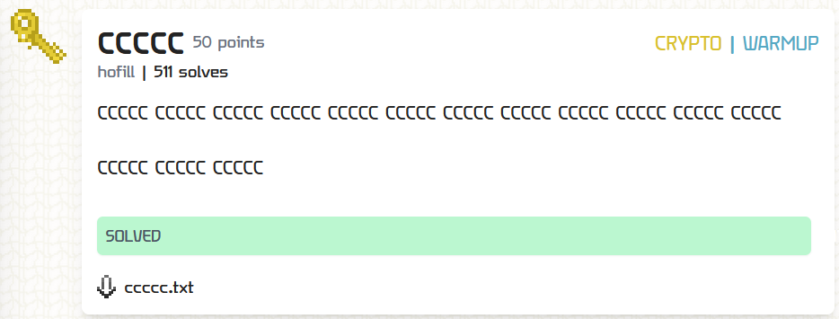

---
tags:
  - TFC CTF
  - TFC CTF 2024
  - Crypto
---

# چالش CCCCC

<center>
 
</center>

## آشنایی با مساله

در این سوال به ما فایل `ccccc.txt` داده شده است. بیایید نگاهی به محتویاتش بندازیم:


```plain title="ccccc.txt" linenums="1"
5c4c4c6c4c3c4c3c5c4c4c6c7cbc6c3c7c3c6c8c6cfc7c5c7c4c5cfc6c3c6cfc7c5c7c4c5cfc6c3c7c4c3c0c5cfc6c3c6cdc7c9c5cfc6c3c6c2c3c0c7c9c5cfc6c3c3c4c6cec6c4c5cfc6c3c6cdc7c9c5cfc6c3c6c4c6cfc6c7c5cfc6c3c6c1c6cec6c4c5cfc6c3c6cdc7c9c5cfc6c3c6c3c3c4c3c7c7cdc0ca\n
```


## راه حل


در نگاه اول کلی حرف `c` تو فایل داده شده به چشممون میخوره مانند اسم سوال   
در ادامه ما میدانیم فرمت فلگ با `TFCCTF` شروع میشود و داریم   
```py
print( b'TFCCTF'.hex() )
# 544643435446
```

با توجه به مقدار هگز  حروف آغازین فلگ و فایل داده شده، پی میبریم کافیست `c` های اضافی را حذف کنیم تا به فلگ برسیم:

```py
print(bytes.fromhex(s[::2]))
```


---
??? success "FLAG :triangular_flag_on_post:"
    <div dir="ltr">`TFCCTF{cshout_cout_ct0_cmy_cb0y_c4nd_cmy_cdog_cand_cmy_cc47}`</div>


!!! نویسنده
    [mheidari98](https://github.com/mheidari98)

