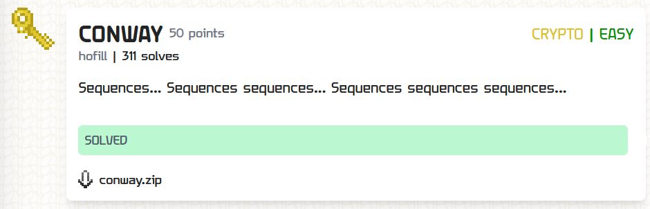

---
tags:
  - TFC CTF
  - TFC CTF 2024
  - Crypto
  - Integer Sequences
---

# چالش CONWAY

<center>
 
</center>

## آشنایی با مساله

در این سوال به ما دو فایل `main.py` و `output.txt` داده شده است که در ادامه محتویات این دو فایل رو مشاهده میکنید:  
=== "main.py"
    ```python title="main.py" linenums="1"
    from secret import generate_next_key, flag
    import hashlib
    from Crypto.Cipher import AES
    from Crypto.Util.Padding import pad

    initial = 11131221131211131231121113112221121321132132211331222113112211

    initial = generate_next_key(initial)
    print(initial)

    initial = generate_next_key(initial)
    h = hashlib.sha256()
    h.update(str(initial).encode())
    key = h.digest()

    cipher = AES.new(key, AES.MODE_ECB)
    print(cipher.encrypt(pad(flag.encode(),16)).hex())
    ```

=== "output.txt"
    ```plain title="output.txt" linenums="1"
    311311222113111231131112132112311321322112111312211312111322212311322113212221
    f143845f3c4d9ad024ac8f76592352127651ff4d8c35e48ca9337422a0d7f20ec0c2baf530695c150efff20bbc17ca4c
    ```

ظاهرا تو این سوال باید با استفاده از `initial` و مقدار پرینت شده، بیایم تابع `generate_next_key` رو پیاده سازی کنیم و سپس با داشتن کلید بسادگی میتوان متن را رمزگشایی کرد و به فلگ رسید.

## راه حل

!!! Tip "توصیه"
    قرار نیست ما همیشه همه چیز رو بدونیم و اینکه تو مسابقاتمون از هوش مصنوعی ها در راستا افزایش کاراییمون به‌درستی کمک بگیریم، کار هوشمندانه‌ای هستش.

برای حل این مساله ابتدا با 
[chatgpt](https://chatgpt.com)
 مشورت کردم و خوشبختانه ایشون تونست این تابع رو برای من پیاده سازی کنه و بخش سخت مساله رو برا من انجام داد و در ادامه بسادگی میتوان کلید `aes` را بدست بیاوریم و بعد از رمزگشایی به فلگ میرسیم.

!!! Note ""
    همچنین میتوانستیم از
    [این سایت](https://oeis.org/A005150)
    نیز جهت حل این مساله کمک بگیریم


```py
import hashlib
from Crypto.Cipher import AES

def generate_next_key(s):
    result = ""
    i = 0
    while i < len(s):
        count = 1
        while i + 1 < len(s) and s[i] == s[i + 1]:
            i += 1
            count += 1
        result += f"{count}{s[i]}"
        i += 1
    return result

initial = "11131221131211131231121113112221121321132132211331222113112211"
enc = 'f143845f3c4d9ad024ac8f76592352127651ff4d8c35e48ca9337422a0d7f20ec0c2baf530695c150efff20bbc17ca4c'

initial = generate_next_key( generate_next_key(initial) )
key = hashlib.sha256(initial.encode()).digest()
AES.new(key, AES.MODE_ECB).decrypt( bytes.fromhex(enc) )
```

---
??? success "FLAG :triangular_flag_on_post:"
    <div dir="ltr">`TFCCTF{c0nway's_g4me_0f_sequences?}`</div>


!!! نویسنده
    [mheidari98](https://github.com/mheidari98)

