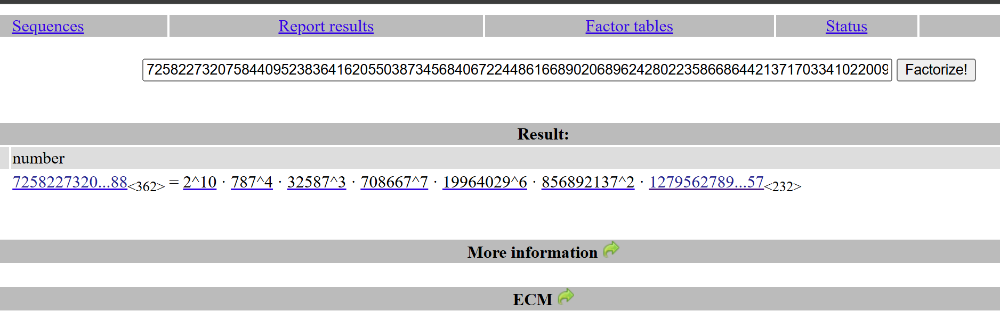

---
tags:
  - USCCTF
  - USCCTF-2024
  - Crypto 
  - Pohlig_hellman algorithm
  - Discrete logarithm
  - Smooth prime
  - Safe prime
---

# چالش It's Not Called Data Loss Prevention


<center>
{ width="400" }
</center>

## شرح چالش

در این چالش فقط script زیر به ما داده شده است.

```python title="chall.py" linenums="1"

from Crypto.Util.number import *
p = 72582273207584409523836416205503873456840672244861668902068962428022358668644213717033410220094858213785909158082084409697781833525734642650576180002727864094178853739590888445753712196268567738582111704293273201721006648707008913242412196989487167851968618303659742648153352883917176492356546118351747721810800909873736282570227177961197335450387989276806079489
g = 3
FLAG = b"REDACTED"
a = pow(g, bytes_to_long(FLAG), p)
print(a)

"""
24393771488717960431147269064624631828310604373526026598603386491263061338072489803153972728250242949112187407825532440328751180404635401465476512488685185622725060580628770654048867200033806585934697471249921972700552978079752695585970921337459580789152970187925768085334409084092041192304935279345047595337816976845617649400223935358270007572542969925561362228
"""
```
اول با استفاده کتابخانه  `Crypto.isPrime(p)` بررسی کردم که آیا مقدار `p` اول است یا نه که اره یک  عدد اول است.
پس در این اینجا مقدار `g` به توان فلگ رسیده و سپس در پیمانه `p`محاسبه شده است. خب حالا بریم ببینیم چطوری می‌تونیم فلگ بدست بیاوریم:

## راه‌حل چالش

اولین ایده که مسلما به ذهن میرسه اینه که بیایم با استفاده از لگاریتم گسسته(DLP) به مقدار فلگ برسیم.با استفاده از ابزار sage  این روش امتحان کردم 

???+ tip "ایده اول"    

    امتحان کردن ایده اول با استفاده کتابخانه sage

    ```py
    from sage.all import *
    flag= discrete_log(a, g)
    print(long_to_bytes(flag).decode())
    ```
اما چون مقدار پیمانه `p` و توان (فلگ) اعداد بزرگی هستن عملا امکانپذیر نیست  و باید از یک آسیب‌پذیری استفاده این مسئله رو حل کنیم!؟

شروع به جستجو در اینترنت و چت کردن با chatgpt کردم تا ببینم چه راه‌حل‌هایی ممکنی وجود دارد.
بعد از مقدار جستجو متوجه شدم که اگر مقدار `p` به شکل **امن** تولید نشده باشه در این صورت آسیب‌پذیری در مقدار p وجود دارد که احتمالا با استفاده از الگوریتم **Pohlig–Hellman** بتوان به مقدار فلگ رسید.

??? info "عدد اول امن"
    یک عدد اول $q$ را عدد اول سوفی ژرمن (Sophie Germain) می‌گویند اگر $2q+1$ نیز اول باشد. حال عدد اول $p$ که از رابطه $p =2q+1$ مرتبط با عدد اول سوفی ژرمن تولید شده را عدد اول امن می‌گویند.

همان‌طور که در تصویر زیر با استفاده از سایت [factordb](https://factordb.com/) مشاهده می‌کنید مقدار $p-1$ شامل مقسوم‌علیه‌های مختلفی (smooth prime) است که نشان می‌دهد به شکل امن تولید نشده است.

<center>

</center>


پس تا اینجا فهمیدیم که باید از الگوریتم Pohlig–Hellman استفاده کنیم تا به مقدار فلگ برسیم. اما در اینجا یک مشکل وجود دارد و آن این است که یکی از مقسوم‌علیه‌های $p-1$ یک  مقدار خیلی بزرگ است (232 رقم) و نمی‌توان دوباره مقدار لگاریتم گسسته را در این الگوریتم انجام داد. من تا همین مرحله پش رفته بودم و نمیدونستم دیگه باید چیکار کنم و در اینترنت هم راه‌حلی برای این مشکل پیدا نکردم. بعد از مسابقه یک شخصی با استفاده از کد زیر مسئله رو حل کرده بود. 

یکی از نکاتی که باید توجه می کردم این بود که نیاز به گرفتن لگاریتم گسسته روی تمام مقسوم‌علیه‌ها نیست و در  کد پایتون زیر هم این مشاهده می‌شود:


```python title="solve.py" linenums="1"
from sage.all import *
from Crypto.Util.number import *

p = 72582273207584409523836416205503873456840672244861668902068962428022358668644213717033410220094858213785909158082084409697781833525734642650576180002727864094178853739590888445753712196268567738582111704293273201721006648707008913242412196989487167851968618303659742648153352883917176492356546118351747721810800909873736282570227177961197335450387989276806079489
g = 3
a = 24393771488717960431147269064624631828310604373526026598603386491263061338072489803153972728250242949112187407825532440328751180404635401465476512488685185622725060580628770654048867200033806585934697471249921972700552978079752695585970921337459580789152970187925768085334409084092041192304935279345047595337816976845617649400223935358270007572542969925561362228
order1 = p - 1
factors = [2**10, 787**4, 32587**3, 708667**7, 19964029**6, 856892137**2, 1279562789201591523940850597505137258079950871699945159663662131835076279131726053889024495522041177924458398143694947568877887370555653768499066503948935672363148134562050374459082232131445656948264915239888005511288832804262243257]

K = GF(p)
res = []
for i in factors[:-1]:
    g_i = K(pow(g, order1 // i, p))
    a_i = K(pow(a, order1 // i, p))
    order = ZZ(i)
    x = discrete_log(a_i, g_i, ord=order)
    res.append(x)
b = crt(res, factors[:-1])

print(long_to_bytes(b).decode())

```
در نهایت با استفاده این کد بعد از چند ثانیه به مقدار فلگ می‌رسیم.
 

??? success "FLAG :triangular_flag_on_post:"
    <div dir="ltr">`CYBORG{p0hl1g_h3llm4n_f7w!!}`</div>

--- 

!!! نویسنده
    [HIGHer](https://twitter.com/HIGH01012) 

