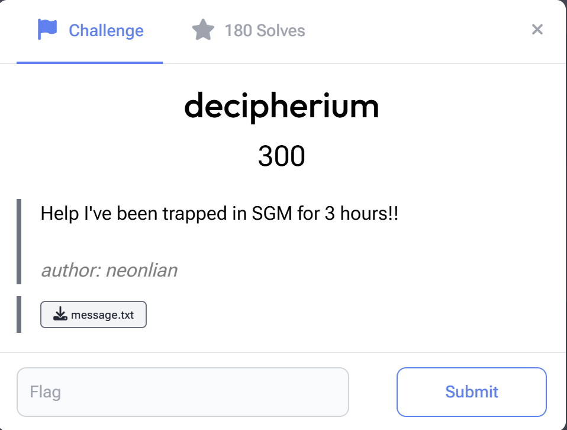
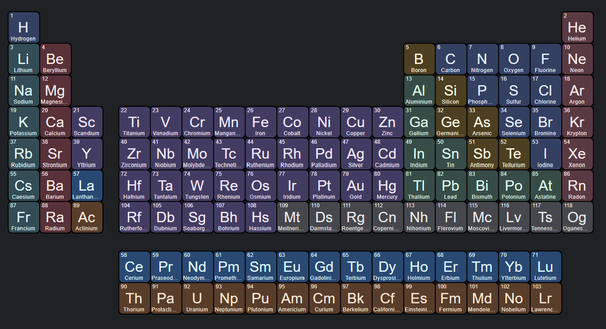

---
tags:
  - USCCTF
  - USCCTF-2024
  - Crypto 
  - Encoding
  - periodic table
---

# چالش decipherium

<center>
{ width="400" }
</center>

## شرح چالش

این چالش یک دنباله کد را به شکل زیر به ما داده که براساس اسم چالش و حروف داخل کد که حروف بزرگ و سپس کوچک دارد به نظر نمادهای عناصر شیمیایی  جدول تناوبی را ارائه می‌داد که به صورت پشت سر هم و بدون هیچ فاصله‌ای نوشته شده‌اند. در اینجا، هدف هر نماد عنصری احتمالاً به عدد اتمی آن عنصر اشاره دارد.

```
TeSbILaTeSnTeNoISnTeCsCsDyICdTeIISnTeLaSbCdTeTeTeLaTeSbINoTeSbSbInICdTeBaSbSbISnIYbSbCdTeXeINoSbSbTeHoTeITeFmTeITeMdITeSbICsEr
```

<center>

</center>

## راه‌ حل چالش

برای کدگشایی، ابتدا نمادهای شیمیایی را از هم جدا می‌کنیم و نماد هر عنصر را به عدد اتمی متناظر با آن تبدیل کردیم و در  یک لیست قرار می‌دهیم. سپس دیکشنری شامل نمادهای شیمیایی هر عنصر و اعداد اتمی آن‌ها استفاده می کنیم. .

**تبدیل اعداد به کاراکترهای ASCII:** سپس اعداد به‌دست‌آمده را به کاراکترهای ASCII تبدیل کردیم، چرا که این اعداد به نظر در بازه‌ای قرار دارند که با استاندارد ASCII همخوانی دارند. در نتیجه، هر عدد(عدد اتمی) به یک کاراکتر خاص تبدیل شد.
 پس از تبدیل به ASCII، خروجی به‌دست‌آمده شامل رشته‌ای از کاراکترهای hex بود. در این مرحله، این رشته hex را به متن قابل‌ خواندن (text) تبدیل کردیم.


```python title="solve.py" linenums="1"

import binascii
import re

encoded_text = "TeSbILaTeSnTeNoISnTeCsCsDyICdTeIISnTeLaSbCdTeTeTeLaTeSbINoTeSbSbInICdTeBaSbSbISnIYbSbCdTeXeINoSbSbTeHoTeITeFmTeITeMdITeSbICsEr"
elements = re.findall(r'[A-Z][a-z]?', encoded_text)

#atomic numbers dict
atomic_numbers_dict = {
    "H": 1, "He": 2, "Li": 3, "Be": 4, "B": 5, "C": 6, "N": 7, "O": 8, "F": 9, "Ne": 10,
    "Na": 11, "Mg": 12, "Al": 13, "Si": 14, "P": 15, "S": 16, "Cl": 17, "Ar": 18, "K": 19, "Ca": 20,
    "Sc": 21, "Ti": 22, "V": 23, "Cr": 24, "Mn": 25, "Fe": 26, "Co": 27, "Ni": 28, "Cu": 29, "Zn": 30,
    "Ga": 31, "Ge": 32, "As": 33, "Se": 34, "Br": 35, "Kr": 36, "Rb": 37, "Sr": 38, "Y": 39, "Zr": 40,
    "Nb": 41, "Mo": 42, "Tc": 43, "Ru": 44, "Rh": 45, "Pd": 46, "Ag": 47, "Cd": 48, "In": 49, "Sn": 50,
    "Sb": 51, "Te": 52, "I": 53, "Xe": 54, "Cs": 55, "Ba": 56, "La": 57, "Ce": 58, "Pr": 59, "Nd": 60,
    "Pm": 61, "Sm": 62, "Eu": 63, "Gd": 64, "Tb": 65, "Dy": 66, "Ho": 67, "Er": 68, "Tm": 69, "Yb": 70,
    "Lu": 71, "Hf": 72, "Ta": 73, "W": 74, "Re": 75, "Os": 76, "Ir": 77, "Pt": 78, "Au": 79, "Hg": 80,
    "Tl": 81, "Pb": 82, "Bi": 83, "Po": 84, "At": 85, "Rn": 86, "Fr": 87, "Ra": 88, "Ac": 89, "Th": 90,
    "Pa": 91, "U": 92, "Np": 93, "Pu": 94, "Am": 95, "Cm": 96, "Bk": 97, "Cf": 98, "Es": 99, "Fm": 100,
    "Md": 101, "No": 102, "Lr": 103}

ascii_sequence = [atomic_numbers_dict.get(symbol, None) for symbol in elements]
ascii_decoded= ''.join(chr(num) if 32 <= num <= 126 else '?' for num in ascii_sequence)
decoded_text = binascii.unhexlify(ascii_decoded).decode('utf-8', errors='replace')
print("FLag:", decoded_text)
```

 

??? success "FLAG :triangular_flag_on_post:"
    <div dir="ltr">`CYBORG{PERI0DIC_C1PH3R_0F_3LEMENT5}`</div>

--- 

!!! نویسنده
    [HIGHer](https://twitter.com/HIGH01012) 

