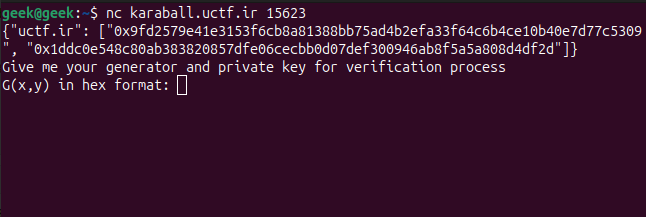
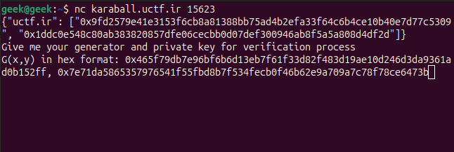
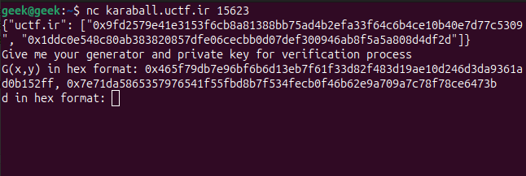
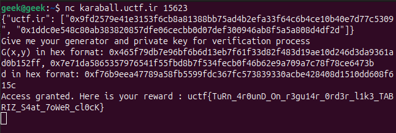

---
tags:
  - Urmia-CTF
  - Urmia-CTF-2024
  - Crypto
  - ECC
  - Elliptic Curve
  - Elliptic Curve Cryptography
---

# چالش  Karaball 

<center>
 
</center>

## آشنایی با مساله

در این سوال به ما دو فایل
`challenge.py`
و 
`ECC.py`
داده شده است.

=== "challenge.py"
    ```py title="challenge.py" linenums="1"
    from ECC import Curve, Coord
    from secrets import randbelow

    flag = "uctf{test_flag}"
    signatures = {}
    valid_hosts = {'uctf.ir'}

    a = 0x0
    b = 0x7
    p = 0xfffffffffffffffffffffffffffffffffffffffffffffffffffffffefffffc2f
    Gx = 0x79be667ef9dcbbac55a06295ce870b07029bfcdb2dce28d959f2815b16f81798
    Gy = 0x483ada7726a3c4655da4fbfc0e1108a8fd17b448a68554199c47d08ffb10d4b8

    ecc = Curve(a, b, p)
    G = Coord(Gx, Gy)

    assert ecc.is_on_curve(G)


    for host in valid_hosts:
        d = randbelow(p)
        Q = ecc.sign(G, d)
        signatures[host] = [hex(Q.x),hex(Q.y)]
        
    print(signatures)
    print("Give me your generator and private key for verification process")

    data0 = input("G(x,y) in hex format: ")
    data1 = input("d in hex format: ")

    try:
        Coordinates = data0.split(',')
        PrivateKey = data1
        G1 = Coord(int(Coordinates[0], 16), int(Coordinates[1], 16))
        d1 = int(PrivateKey, 16)
    except Exception as e:
        print('Wrong format! try again.')
        exit()


    if not ecc.is_on_curve(G1):
        print('Point is not on the curve!')
        exit()

    if d1 < 2:
        print("Security Issues Discovered!")
        exit()

    sig = ecc.sign(G1, d1)

    if sig.x == int(signatures['uctf.ir'][0], 16) and sig.y == int(signatures['uctf.ir'][1], 16):
        print(f"Access granted. Here is your reward : {flag}".encode())
    else:
        print("Verficication process failed!")
    ```
=== "ECC.py"
    ```py title="ECC.py" linenums="1"
    class Coord:

        def __init__(self, x, y) -> None:
            self.x = x
            self.y = y

    class Curve:

        def __init__(self, a, b, p) -> None:
            self.a = a
            self.b = b
            self.p = p

        def addition(self, P, Q):

            x3 = -1
            y3 = -1

            if P.x == 0 and P.x == 0:
                x3 = Q.x
                y3 = Q.y
            elif Q.x == 0 and Q.x == 0:
                x3 = P.x
                y3 = P.y
            elif P.x == Q.x and P.y == -Q.y:
                x3 = 0
                y3 = 0
            elif P.x == Q.x and P.y == Q.y :
                slope = ((3 * P.x**2 + self.a) * pow(2*P.y, -1, self.p)) % self.p
                x3 = (slope**2 - (P.x + Q.x)) % self.p
                y3 = (slope*(P.x - x3) - P.y) % self.p
            else:
                slope = ((Q.y - P.y) * pow(Q.x - P.x, -1, self.p)) % self.p
                x3 = (slope**2 - (P.x + Q.x)) % self.p
                y3 = (slope*(P.x - x3) - P.y) % self.p

            R = Coord(x3, y3)
            return R


        def double_and_add(self, P, n):

            if n == -1:
                return Coord(P.x, self.p - P.y)
            
            Q = Coord(P.x, P.y)
            R = Coord(0, 0)

            while n > 0:
                if (n % 2) == 1:
                    R = self.addition(R, Q)
                Q = self.addition(Q, Q)
                n //= 2

            return R
        

        def get_y(self, x):
            
            assert (self.p + 1) % 4 == 0
            y2 = (x**3 + self.a * x + self.b) % self.p
            y = pow(y2, (self.p+1)//4, self.p)
            return y


        def sign(self, G, d):
            return self.double_and_add(G, d)
        

        def is_on_curve(self, G):
            return G.y == self.get_y(G.x) or G.y == -self.get_y(G.x) % self.p
    ```

اگر نگاهی به محتویات دو فایل داده شده کنیم متوجه می شویم که با `Elliptic Curve Digital Signature Algorithm` یا  `ECDSA`  سر و کار داریم.


در رمزنگاری، الگوریتم امضای دیجیتال منحنی بیضوی `ECDSA` گونه ای از الگوریتم امضای دیجیتال (DSA) را ارائه می دهد که از `Elliptic Curve Cryptography` استفاده می کند.


## راه حل

!!! note "آسیب پذیری CurveBall"
    در این چالش، وظیفه ما بهره‌برداری از `CVE-2020-0601` بود که به عنوان آسیب‌پذیری `CurveBall` شناخته می‌شود. این آسیب‌پذیری در `CryptoAPI` ویندوز `Crypt32.dll` وجود دارد و بر نحوه اعتبارسنجی گواهی‌های رمزنگاری منحنی بیضوی `ECC` تأثیر می‌گذارد.

    این نقص به مهاجم اجازه می‌دهد تا گواهی‌های `ECC` را جعل کند، که می‌تواند منجر به حملات `Man In The Middle (MITM)` یا امکان امضای کدی شود که به نظر می‌رسد از طرف مراجع معتبر است. این آسیب‌پذیری عمدتاً بر سیستم‌های ویندوز 10 و ویندوز سرور 2016/2019 تأثیر می‌گذارد.

خب بیاید با تعریف منحنی مورد نظر روی فیلد متناهی $\mathbb{F}_p$ شروع کنیم $(p,a,b,G,n)$:

$$E:y^2 = x^3 + ax + b$$

که

```py
a = 0x0
b = 0x7
p = 0xfffffffffffffffffffffffffffffffffffffffffffffffffffffffefffffc2f
Gx = 0x79be667ef9dcbbac55a06295ce870b07029bfcdb2dce28d959f2815b16f81798
Gy = 0x483ada7726a3c4655da4fbfc0e1108a8fd17b448a68554199c47d08ffb10d4b8
```
در واقع $G$ یک نقطه پایه و $n$ مرتبه $G$ هست.

خب بریم ببینیم که دقیقا این چالش چیکار میکنه و چه چیزی از ما میخواد!؟

توی فایل `ECC.py` کلاس های مربوط به `Coord` و `Curve` و عملیاتی که روی منحنی انجام میشه رو میبینیم.

توی فایل `challenge.py` در واقع در ابتدا مشخصات منحنی و `generator` رو میبینیم و در ادامه به ازای هر `valid host` اومده عملیات مربوط به امضا رو انجام داده و در دیکشنری `signatures` ذخیره کرده و بعدش میاد اونو چاپ میکنه.

در واقع میاد یک نقطه $Q$ به این صورت تولید میکنه :

$$Q = kG$$

که $k < p$ هست.

و اینکه از ما یک نقطه پایه $G$ و یک عدد صحیح $k$ میخواد که نتیجه ضرب اسکالرش برابر با متخصات امضایی باشه که خودش برای یک `valid host` تولید کرده یعنی $Q$.

اگه دقت کنید میبیند در واقع جایی چک نکرده که نقطه پایه ما همون $G$ ای باشه که خودش اول کار تعریف کرده و این کارمون رو راحت میکنه.

در واقع میایم و یک عدد صحیح تصادفی مانند $k'$ انتخاب میکنیم و معکوسشو نسبت به مرتبه منحنی حساب میکنیم و با استفاده از این عدد و امضایی که تولید شده یک نقطه پایه مثل $G'$ تعریف میکنیم:

$$G' = [1/k']Q$$

خب خیلی پر واضح هست که اگر $k'$ و نقطه $G'$ رو به عنوان ورودی بدیم نتیجه نقطه $Q$ خواهد بود.


```py title="solve.sage" linenums="1" hl_lines="15 20"
a = 0x0
b = 0x7
p = 0xfffffffffffffffffffffffffffffffffffffffffffffffffffffffefffffc2f
Gx = 0x79be667ef9dcbbac55a06295ce870b07029bfcdb2dce28d959f2815b16f81798
Gy = 0x483ada7726a3c4655da4fbfc0e1108a8fd17b448a68554199c47d08ffb10d4b8

# define elliptic curve
E = EllipticCurve(GF(p), [a, b])

# related signature 
Q = E("...", "...")
CG = Zmod(E.order())

# k'
kprime = CG.random_element()

kprimeinv = kprime.inverse_of_unit()

# G'
Gprime = ZZ(kprimeinv) * Q
```

<center>
 
</center>

<center>
 
</center>

<center>
 
</center>

<center>
 
</center>

---
??? success "FLAG :triangular_flag_on_post:"
    <div dir="ltr">`uctf{TuRn_4runD_On_r3gu14r_0rd3r_l1k3_TABRIZ_S4at_7oWeR_cl0cK}`</div>


!!! نویسنده
    [MohamadAli](https://github.com/w0h4w4d4li)

