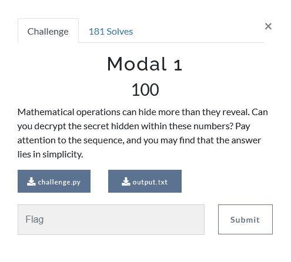

---
tags:
  - Urmia-CTF
  - Urmia-CTF-2024
  - Crypto
---

# چالش  Modal 1 

<center>
 
</center>

## آشنایی با مساله

تو این سوال به ما دو فایل
`challenge.py`
و 
`output.txt`
داده شده است.

=== "challenge.py"
    ```py title="challenge.py" linenums="1"
    from secret import flag

    size = len(flag)
    for i in range(size-1):
        print(ord(flag[i]) + ord(flag[i+1]), end=",")
    ```
=== "output.txt"
    ```txt title="output.txt" linenums="1"
    216,215,218,225,206,187,153,163,166,174,217,167,169,199,153,173,227,156,155,199,203,156,96,155,222,210,207,163,148,196,200,171,187,225,233,
    ```

همانطور که در کد مشخص است در این سوال کد اسکی حروف کنارهم باهم جمع شده اند و بصورت لیستی در اختیار ما قرار گرفته است و ما باید فلگ را بازیابی کنیم.

## راه حل

از آنجا که ما میدانیم فلگ با
`uctf`
شروع میشود، بسادگی میتوانیم حروف بعدی را بدست بیاوردیم.

```py
lst = [216,215,218,225,206,187,153,163,166,174,217,167,169,199,153,173,227,156,155,199,203,156,96,155,222,210,207,163,148,196,200,171,187,225,233]

known = [ord('u')]
for i in range(len(lst)):
    known.append( lst[i]-known[-1])
print( ''.join(map(chr, known)) )
```


---
??? success "FLAG :triangular_flag_on_post:"
    <div dir="ltr">`uctf{Sh1r4z_Haf3zi3h_l00ks_p3aceFul}`</div>


!!! نویسنده
    [mheidari98](https://github.com/mheidari98)

