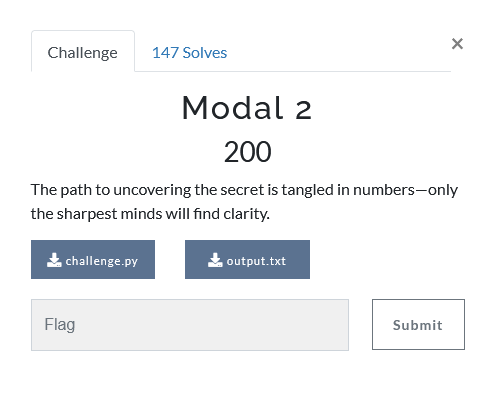

---
tags:
  - Urmia-CTF
  - Urmia-CTF-2024
  - Crypto
  - z3
---

# چالش  Modal 2 

<center>
 
</center>

## آشنایی با مساله

تو این سوال به ما دو فایل
`challenge.py`
و 
`output.txt`
داده شده است.

=== "challenge.py"
    ```py title="challenge.py" linenums="1"
    from secret import flag

    p = 4066351909

    for f in flag:
        print((ord(f)*2022684581 - 127389238) % p, end=",")
    ```
=== "output.txt"
    ```txt title="output.txt" linenums="1"
    678296017,867140740,2721963345,2868842574,615347776,1035002716,2847859827,1391709415,2784911586,636330523,909106234,2763928839,1223847439,699278764,1223847439,2742946092,825175246,3393411249,2889825321,3393411249,1370726668,594365029,
    ```


## راه حل

میبینیم بر روی هر حرف یکسری عملیات ریاضی انجام شده‌است، در نتیجه اگر بدانیم هر حرف بعد از این عملیات ریاضی چه مقداری میشود، میتوانیم فلگ را بدست بیاوریم (روش یک)  

همچنین میتوانیم با استفاده از 
[**z3**](https://github.com/Z3Prover/z3)
 که یک 
`SMT solver` 
هست نیز برای حل این مساله استفاده کنیم (روش دو)


=== "روش یک"
    ```py
    p = 4066351909
    d = {(i*2022684581 - 127389238)%p:chr(i) for i in range(0x20, 0x80)}
    enc = [678296017,867140740,2721963345,2868842574,615347776,1035002716,2847859827,1391709415,2784911586,636330523,909106234,2763928839,1223847439,699278764,1223847439,2742946092,825175246,3393411249,2889825321,3393411249,1370726668,594365029]
    print( ''.join(map(d.get, enc)) )
    ```

=== "روش دو"
    ```py
    from z3 import Int, BitVec, sat, Solver, Or, And, BV2Int, Int2BV, Distinct, LShR

    def solve(k):
        x = Int('x')
        s = Solver()
        s.add( 0x20<=x, x<=0x80 ) # ascii printable
        s.add( (x*2022684581 - 127389238) % p == k)
        if s.check() == sat:
            return chr(s.model()[x].as_long())

    p = 4066351909
    enc = [678296017,867140740,2721963345,2868842574,615347776,1035002716,2847859827,1391709415,2784911586,636330523,909106234,2763928839,1223847439,699278764,1223847439,2742946092,825175246,3393411249,2889825321,3393411249,1370726668,594365029]
    print( ''.join(map(solve, enc)) )
    ```

---
??? success "FLAG :triangular_flag_on_post:"
    <div dir="ltr">`uctf{Sh1ny_pAsArg4d43}`</div>


!!! نویسنده
    [mheidari98](https://github.com/mheidari98)

