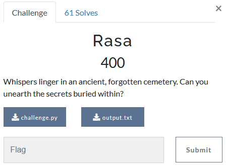

---
tags:
  - Urmia-CTF
  - Urmia-CTF-2024
  - Crypto
  - RSA
---

# چالش  Rasa

<center>
 
</center>

## آشنایی با مساله

تو این سوال به ما دو فایل
`challenge.py`
و 
`output.txt`
داده شده است و با یک چالش RSA روبرو هستیم

=== "challenge.py"
    ```py title="challenge.py" linenums="1" hl_lines="10-13 15-20"
    from Crypto.Util.number import bytes_to_long as b2l, getPrime

    flag = b'uctf{test_flag}'

    p = getPrime(1024)
    q = getPrime(1024)

    n = p*q

    m1 = b2l(b'There were a mysterious underground cemetery found in Tabriz about 10 years ago near Blue Mosque while worker were digging in nearby locations')
    m2 = b2l(b'It is an unknown cemetry which no historical records have registered it so far and it still remains a mystery for everyone. Can you help recover the secrets behind it?')
    c1 = pow(m1, 3, n)
    c2 = pow(m2, 3, n)

    m = b2l(flag)
    e1 = 0x10001
    e2 = 0x8001

    c3 = pow(m, e1, n)
    c4 = pow(m, e2, n)

    print(f"c1 = {c1}")
    print(f"c2 = {c2}")
    print(f"c3 = {c3}")
    print(f"c4 = {c4}")
    ```
=== "output.txt"
    ```txt title="output.txt" linenums="1"
    c1 = 4936633143250099145681291328210001176670359282546365786292865384622623361917110615562758660249052523031506088031700534616606749381625728677237156077617826946875709884450395542780430312659290677772295937476148531787640370697669307849964423347138244267351336993740071512677413967434174012186875518514690404901438236513973973395253840690000166777131214571393320611453097925692591851223326058542960514875484643852157917652871230480556241497368576832917365259103114474725832240988095092805553314611077752110183073117538171055377471224283460770171715772867976004611438041214829527591840481131799601637619379905899583860712
    c2 = 4249331536346418460740685788906543925055782403358018301375515791080675882438975807411393426018555834858225200534436826327143112782412976181064308114143610230808152454979956336163181387394297190117506455826589435279580099443952129127333797498819113173051369150785544385865084642580220593149922403491429455092325552294004240140132984526281327416220424446699283709195243151544057883172103044629176938001704498969174450112983641950977449501500123793579066569108384601438382737438759665028964888855650246036617753485994755112223716040976552625303149225846444715069544294992357019251748194377109635699409363098856124503699
    c3 = 4787730241430407816296391985321087885201370459144782639526466882754388923528184628791272849631052410285220886389167214674630256805522835914688042548573626544377485769841886945444459876619789728367069642352268475748536583963023522112592993980785323816295341827344428122526603444607716141518774871446218667618421223737290165550770412688789619499529376265486836452146361577425118214998254432061719598918843214075420099737330174389738219425742513859924405512134177840243888506903615520834351259404535422900496211231416550898788627764973097843838005700761898234670278519963815795607630007649490013904165159258781137615552
    c4 = 113853085592314229610057343788641880655891250427192578969753251544147449953199573591088659415009844978594734104944672086567536305628603582050894135670233009762019371733407446723867335589702887825100467744887937813587982148481739185877044985898927930604908042166328371077554586238105449762553659899420117810500522089687710757086460435245873020822270761629087884311667866993927962976808946115928598470754875980383790845489200805783304924769488036699713713161371066099847782788173089390687106687733633630013935758733014765989697270620709766398298734385710754514139112019541573165601226954169390363781943939505248469355
    ```


## راه حل

برای حل این مساله در ابتدا با استفاده از $c1$ و $c2$ میایم $n$ را بدست میاوریم   
و در ادامه با استفاده از 
$n$, $e1$, $c3$, $e2$, $c4$
فلگ رمز شده را رمزگشایی میکنیم و به فلگ میرسیم.


### بدست آوردن N

میدانیم

$$
c_1 = m_1^3 \mod n \\
c_2 = m_2^3 \mod n
$$

براساس تعریف 
[هم‌نهشتی](https://fa.wikipedia.org/wiki/%D9%87%D9%85%E2%80%8C%D9%86%D9%87%D8%B4%D8%AA%DB%8C_(%D9%86%D8%B8%D8%B1%DB%8C%D9%87_%D8%A7%D8%B9%D8%AF%D8%A7%D8%AF))
داریم

$$
m_1^3 = x_1 \cdot n + c_1 \quad \text{for some integer} \ x_1  \\
m_2^3 = x_2 \cdot n + c_2 \quad \text{for some integer} \ x_2
$$

در نتیجه خواهیم داشت

$$
\gcd(m_1^3 - c_1, m_2^3 - c_2) = \gcd(x_1 \cdot n, x_2 \cdot n)  \\
\Rightarrow \gcd(n \cdot \text{(some terms)}) = n
$$

```py
from Crypto.Util.number import *

m1 = bytes_to_long(b'There were a mysterious underground cemetery found in Tabriz about 10 years ago near Blue Mosque while worker were digging in nearby locations')
m2 = bytes_to_long(b'It is an unknown cemetry which no historical records have registered it so far and it still remains a mystery for everyone. Can you help recover the secrets behind it?')
c1 = 4936633143250099145681291328210001176670359282546365786292865384622623361917110615562758660249052523031506088031700534616606749381625728677237156077617826946875709884450395542780430312659290677772295937476148531787640370697669307849964423347138244267351336993740071512677413967434174012186875518514690404901438236513973973395253840690000166777131214571393320611453097925692591851223326058542960514875484643852157917652871230480556241497368576832917365259103114474725832240988095092805553314611077752110183073117538171055377471224283460770171715772867976004611438041214829527591840481131799601637619379905899583860712
c2 = 4249331536346418460740685788906543925055782403358018301375515791080675882438975807411393426018555834858225200534436826327143112782412976181064308114143610230808152454979956336163181387394297190117506455826589435279580099443952129127333797498819113173051369150785544385865084642580220593149922403491429455092325552294004240140132984526281327416220424446699283709195243151544057883172103044629176938001704498969174450112983641950977449501500123793579066569108384601438382737438759665028964888855650246036617753485994755112223716040976552625303149225846444715069544294992357019251748194377109635699409363098856124503699

n = GCD(pow(m1, 3)-c1, pow(m2, 3)-c2)
```


### رمزگشایی فلگ رمز شده

داریم

$$
\gcd(e_1,e_2)=1
$$

بر اساس 
[الگوریتم تعمیم‌یافته اقلیدس](https://fa.wikipedia.org/wiki/%D8%A7%D9%84%DA%AF%D9%88%D8%B1%DB%8C%D8%AA%D9%85_%D8%AA%D8%B9%D9%85%DB%8C%D9%85%E2%80%8C%DB%8C%D8%A7%D9%81%D8%AA%D9%87_%D8%A7%D9%82%D9%84%DB%8C%D8%AF%D8%B3)
خواهیم داشت 

$$\exists a,b\in\mathbb{Z} : e_1\cdot a + e_2\cdot b = 1$$

در نتیجه خواهیم داشت

$$m\equiv c_3^a\cdot c_4^b \bmod n$$

???+ Info "اثبات"
    تمام محاسبات زیر به‌صورت پیمانه‌ای نسبت به n انجام می‌شود.

    $$
    c_3^a\cdot c_4^b  \\
    (m^{e_1})^a\cdot (m^{e_2})^b\\
    m^{e_1a}\cdot m^{e_2b} \\
    m^{e_1a+e_2b}\\
    m^1
    $$

???+ warning "توجه"
    در عمل یکی از $a$ یا $b$ منفی خواهند بود. برای حل این مساله فرض کنید $b$ منفی است :
    
    $$
    i\equiv c_4^{-1} \bmod n \\
    m\equiv c_3^a\cdot i^{-b} \bmod n
    $$


```py
from Crypto.Util.number import *

def egcd(a, b):
    """return (g, x, y) such that a*x + b*y = g = gcd(a, b)"""
    if a == 0:
        return (b, 0, 1)
    g, y, x = egcd(b % a, a)
    return (g, x - (b // a) * y, y)

def attack(c1, c2, e1, e2, N):
    if GCD(e1, e2) != 1:
        raise ValueError("Exponents e1 and e2 must be coprime")
    g, a, b = egcd(e1, e2)
    if a < 0:
        c1 = pow(c1, -1, N)
        a *= -1
    else:
        c2 = pow(c2, -1, N)
        b *= -1
    return (pow(c1, a, N)*pow(c2,b,N))%N

e1 = 0x10001
e2 = 0x8001
c3 = 4787730241430407816296391985321087885201370459144782639526466882754388923528184628791272849631052410285220886389167214674630256805522835914688042548573626544377485769841886945444459876619789728367069642352268475748536583963023522112592993980785323816295341827344428122526603444607716141518774871446218667618421223737290165550770412688789619499529376265486836452146361577425118214998254432061719598918843214075420099737330174389738219425742513859924405512134177840243888506903615520834351259404535422900496211231416550898788627764973097843838005700761898234670278519963815795607630007649490013904165159258781137615552
c4 = 113853085592314229610057343788641880655891250427192578969753251544147449953199573591088659415009844978594734104944672086567536305628603582050894135670233009762019371733407446723867335589702887825100467744887937813587982148481739185877044985898927930604908042166328371077554586238105449762553659899420117810500522089687710757086460435245873020822270761629087884311667866993927962976808946115928598470754875980383790845489200805783304924769488036699713713161371066099847782788173089390687106687733633630013935758733014765989697270620709766398298734385710754514139112019541573165601226954169390363781943939505248469355

m = attack(c3, c4, e1, e2, n)
print( long_to_bytes(m) )
```

## کدنهایی
```py
from Crypto.Util.number import *

def egcd(a, b):
    """return (g, x, y) such that a*x + b*y = g = gcd(a, b)"""
    if a == 0:
        return (b, 0, 1)
    g, y, x = egcd(b % a, a)
    return (g, x - (b // a) * y, y)

def attack(c1, c2, e1, e2, N):
    if GCD(e1, e2) != 1:
        raise ValueError("Exponents e1 and e2 must be coprime")
    g, a, b = egcd(e1, e2)
    if a < 0:
        c1 = pow(c1, -1, N)
        a *= -1
    else:
        c2 = pow(c2, -1, N)
        b *= -1
    return (pow(c1, a, N)*pow(c2,b,N))%N

m1 = bytes_to_long(b'There were a mysterious underground cemetery found in Tabriz about 10 years ago near Blue Mosque while worker were digging in nearby locations')
m2 = bytes_to_long(b'It is an unknown cemetry which no historical records have registered it so far and it still remains a mystery for everyone. Can you help recover the secrets behind it?')
c1 = 4936633143250099145681291328210001176670359282546365786292865384622623361917110615562758660249052523031506088031700534616606749381625728677237156077617826946875709884450395542780430312659290677772295937476148531787640370697669307849964423347138244267351336993740071512677413967434174012186875518514690404901438236513973973395253840690000166777131214571393320611453097925692591851223326058542960514875484643852157917652871230480556241497368576832917365259103114474725832240988095092805553314611077752110183073117538171055377471224283460770171715772867976004611438041214829527591840481131799601637619379905899583860712
c2 = 4249331536346418460740685788906543925055782403358018301375515791080675882438975807411393426018555834858225200534436826327143112782412976181064308114143610230808152454979956336163181387394297190117506455826589435279580099443952129127333797498819113173051369150785544385865084642580220593149922403491429455092325552294004240140132984526281327416220424446699283709195243151544057883172103044629176938001704498969174450112983641950977449501500123793579066569108384601438382737438759665028964888855650246036617753485994755112223716040976552625303149225846444715069544294992357019251748194377109635699409363098856124503699
n = GCD(pow(m1, 3)-c1, pow(m2, 3)-c2)

e1 = 0x10001
e2 = 0x8001
c3 = 4787730241430407816296391985321087885201370459144782639526466882754388923528184628791272849631052410285220886389167214674630256805522835914688042548573626544377485769841886945444459876619789728367069642352268475748536583963023522112592993980785323816295341827344428122526603444607716141518774871446218667618421223737290165550770412688789619499529376265486836452146361577425118214998254432061719598918843214075420099737330174389738219425742513859924405512134177840243888506903615520834351259404535422900496211231416550898788627764973097843838005700761898234670278519963815795607630007649490013904165159258781137615552
c4 = 113853085592314229610057343788641880655891250427192578969753251544147449953199573591088659415009844978594734104944672086567536305628603582050894135670233009762019371733407446723867335589702887825100467744887937813587982148481739185877044985898927930604908042166328371077554586238105449762553659899420117810500522089687710757086460435245873020822270761629087884311667866993927962976808946115928598470754875980383790845489200805783304924769488036699713713161371066099847782788173089390687106687733633630013935758733014765989697270620709766398298734385710754514139112019541573165601226954169390363781943939505248469355
m = attack(c3, c4, e1, e2, n)
print( long_to_bytes(m) )
```


---
??? success "FLAG :triangular_flag_on_post:"
    <div dir="ltr">`uctf{TABRIZ_myst3r1ous_c3meterY_near_Blue_Mosque}`</div>


!!! نویسنده
    [mheidari98](https://github.com/mheidari98)

