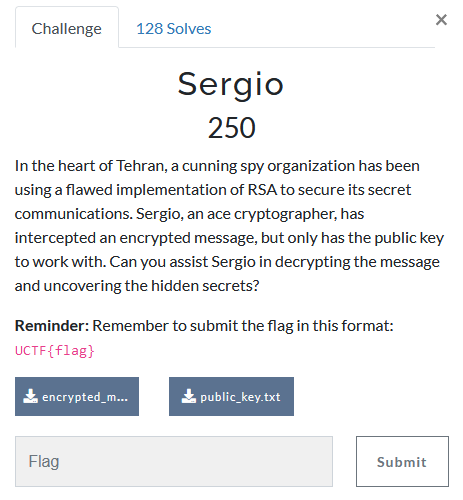
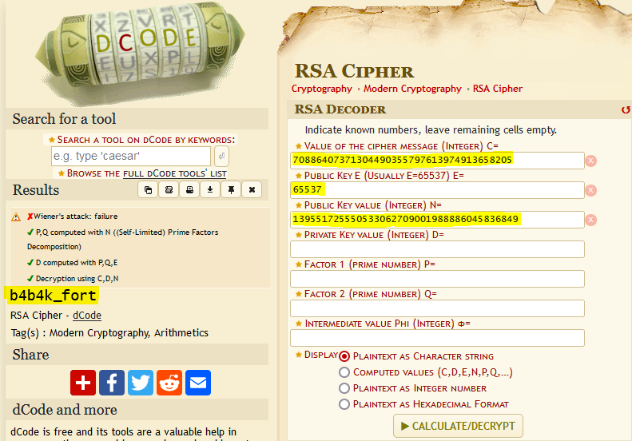

---
tags:
  - Urmia-CTF
  - Urmia-CTF-2024
  - Crypto
  - RSA
---

# چالش  Sergio

<center>
 
</center>

## آشنایی با مساله

در این سوال به ما دو فایل
`public_key.txt`
و 
`encrypted_message.txt`
داده شده است

```txt title="public_key.txt" linenums="1"
Constant Number = 65537
Public Key = 139551725550533062709001988886045836849
```
```txt title="encrypted_message.txt" linenums="1"
70886407371304490355797613974913658205
```
که ظاهرا فلگ با رمزنگاری rsa رمز شده است و باید بتوانیم متن رمز را رمزگشایی کنیم تا به فلگ برسیم

## راه حل

برای این چالش از آنجا که **N** کوچک است، بسادگی به کمک سایت 
[factordb](https://factordb.com/index.php?query=139551725550533062709001988886045836849)
میتوانیم عوامل اول **N** را بدست آوردیم و به فلگ برسیم.


```py
pad = lambda s: '0'+s if len(s)%2  else s
long_to_bytes = lambda c: bytes.fromhex(pad(hex(c)[2:]))
inverse = lambda a, b: pow(a, -1, b)

e = 65537
N = 139551725550533062709001988886045836849
c = 70886407371304490355797613974913658205

p, q = 10073925425153076761, 13852765397894786009
assert p*q == N
phi = (p-1)*(q-1)
d = inverse(e, phi)
long_to_bytes(pow(c, d, N))
```

همچنین میتوانستیم از 
[این صفحه](https://www.dcode.fr/rsa-cipher)
سایت dcode.fr نیز برای بدست آوردن فلگ استفاده کنیم.

<center>
 
</center>


---
??? success "FLAG :triangular_flag_on_post:"
    <div dir="ltr">`UCTF{b4b4k_fort}`</div>


!!! نویسنده
    [mheidari98](https://github.com/mheidari98)

