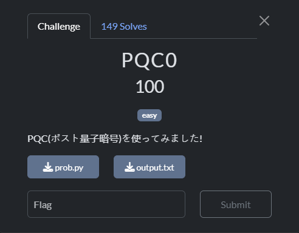
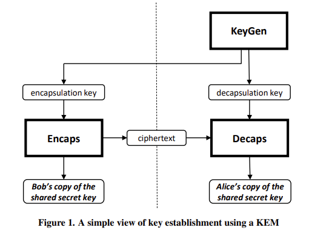

---
tags:
  - TsukuCTF
  - TsukuCTF 2025
  - Crypto  
  - post-quantum cryptography
  - ML-KEM
  - Openssl
  - Pem file
---

# چالش  PQC0


<center>
 { width="400" }
</center>

## بررسی اولیه چالش
در ابتدا چالش کد زیر همراه را با  فایل خروجی [ouput](./output0.txt){:download}  به ما داده است: 

```py  title="prob.py" linenums="1"
# REQUIRED: OpenSSL 3.5.0

import os
from Crypto.Cipher import AES
from Crypto.Util.Padding import pad
from flag import flag

# generate private key
os.system("openssl genpkey -algorithm ML-KEM-768 -out priv-ml-kem-768.pem")
# generate public key
os.system("openssl pkey -in priv-ml-kem-768.pem -pubout -out pub-ml-kem-768.pem")
# generate shared secret
os.system("openssl pkeyutl -encap -inkey pub-ml-kem-768.pem -secret shared.dat -out ciphertext.dat")

with open("priv-ml-kem-768.pem", "rb") as f:
    private_key = f.read()

print("==== private_key ====")
print(private_key.decode())

with open("ciphertext.dat", "rb") as f:
    ciphertext = f.read()

print("==== ciphertext(hex) ====")
print(ciphertext.hex())

with open("shared.dat", "rb") as f:
    shared_secret = f.read()

encrypted_flag = AES.new(shared_secret, AES.MODE_ECB).encrypt(pad(flag, 16))

print("==== encrypted_flag(hex) ====")
print(encrypted_flag.hex())
```

طبق اسم چالش، این سوال احتمالا مربوط رمزنگاری‌های پساکوانتمی PQC است. با بررسی کد می‌بینیم که با استفاده از openssl 3.5 ابتدا کلید خصوصی `priv-ml-kem-768`، سپس از روی آن کلیدعمومی `pub-ml-kem-768` تولید شده و با کلیدعمومی عمل کپسوله سازی برای تولید secret shared انجام شده است. در نهایت مقادیر  مقادیر ciphertext, private-key را به ما داده و با استفاده از secret shared که به عنوان کلید AES در نظر گرفته و در اختیار ما نیست پرچم رو رمز کرده. پس باید به دنبال راهی برای رسیدن به secret shared باشیم.  

!!! اطلاعات info  
    به تازگی opessl در نسخه 3.5 پروتکل‌ مثل ML-KEM که بر پایه الگوریتم رمزنگاری پساکوانتمی [Kyber](https://pq-crystals.org/kyber/) است  را پیاده‌سازی کرده است.


## حل چالش
در کل با توجه به اینکه مقدار کلید خصوصی رو به ما داده حل این سوال سخت نیست
ولی خب برای حل چالش بد نیست یک نگاهی به فرایند کپسوله کردن و کپسوله زدایی در پروتکل پساکوانتمی ML-KEM بندازیم. 

در اینجا نمی‌خواهیم زیاد وارد جزئیات پروتکل  بشیم اما همان‌طور که در تصویر زیر می‌بینید بعد از عمل کپسوله کردن، ciphertext و secret shared  تولید می‌شود با استفاده از آن ciphertext و کلیدخصوصی می توان کپسوله زدایی کرد و مقدار secret shared را بدست آورد.

<center>
 { width="400" }
</center>


!!! اطلاعات info  
    برای جزئیات بیشتر در مورد پروتکل استاندارد ML-KEM  که توسط NIST معرفی شده می توانید به [اینجا](https://csrc.nist.gov/pubs/fips/203/final) مراجعه کنید. برای بررسی امضاهای دیجیتال پساکوانتمی استاندارد مانند ML-DSA به [اینجا](https://csrc.nist.gov/pubs/fips/204/final) مراجعه کنید.

 با استفاده از openssl و دستور decap آن  می‌توانیم با کد زیر به secret shared برسیم و فلگ بدست بیاوریم.

```py  title="solve.py" linenums="1"
import os
from Crypto.Cipher import AES
from Crypto.Util.Padding import pad, unpad
#from flag import flag

enc_flag='5f2b9c04a67523dac3e0b0d17f79aa2879f91ad60ba8d822869ece010a7f78f349ab75794ff4cb08819d79c9f44467bd'
ciphertext='83daaca5593e84b6b902645a25920e6f60c7c72ca8101b56b878434f20cd838f0f2086d3385e528f2687625a38822b74097d109f6d7b3ac730b7fd6a47c988324a6f3b3133b868d3db8b473b597151df4e4091e3ebf77843b6f84c420ffea899f6465d60ffabb3e1de10da2055a43abff172ecf44130a8f3663ff5c39a61d6a10d13cd72f0f289815c75c17687fd35a82503cfbdf790c5164ea739e0f34e7b23cd017a493bf60f8d0d083ce50257bdff7ec5a882e8c1132fc0ef7fed7543d74eb17624266413093d8ef1b80eb94ce97af443fa479a131b59393495d45f8b79271105abed644a423bad0a76bb86de6c5303c2f2eaf36b9d517201d3c670b46fde3e9282346abee87b9aea188936abef98ab9a10914007a26f6f05ccb007f0784870444e4c49002e256b8acd2842ac5d574b1b8592949c9e615882a811a101262713b3c673a885b44a4eac81000746a7ea7ec7e02b4511dd12f57dca62fb263cdc1dd9a1e5599b7c4823d02811acb4c51dff09060591be3370e250246ccd15dcd29ed037805a478ff87edecf184db4f5ce2f929212fc36b9f9d22fec6a5ca69d966ca10fff9d0aac6fcb197fdf03ddd5d32fcff27200f96d3eb7e6628df601874b83ead5e2bb965fb02d01e5e9593938b5ad49e473998fad055010fa8caf04366cab97838cbeed94d9b3b1051ea79d0e8d2dfae83b96efcc82b81539534d00825f8a22492bfac3869ee52af470a7718ee2149c1aa69377f675f922ac2d79477bdf5788f5af3a4b9bad63838b09c07069b1651416f9631475397e86739502dfd89b4c603bc7ed2c6c8fe46762db2412104c0dfdbf265b4f9dfc95d4e2408f9237e4c37e395fe219254569b48d7e3bd38807285204cb434f3a8e17ce96d95182a38c4e788f6bb7fac129e457f26769b80489d47631033f4d47702fc64649e40bb17818438ce04659ecf440b70e29ab332bf348897e504025250a12aea1297b47e6f6a8b4334152dea44f12dead1c2ae07e944dc214fc15a7eb3eedcbe7528c75daf7891ea59b92c26dd2a8e7d8e8a5e61d621c3c29132fade8a5c03a25fb8918dab80fe1b2ef0ac88a33d1b85f6e09f495813bea33a310e98f74f9286f78e451ef9a43f35f738a0d1148bd427fc51cc5e1da59d6c3ad4531f63b3aacda096d062b73e66b1f5a74d015da0dfb215b52c65203ba2a1c7ca67996081451669989f919b33b4c016faa9e81722dbe2c6132976c997172a34fd95ba6023bb4798b6ebded93deb0f80a493bb4d430b6faf01010f4e14504c8a46213ab749aacd6f0f08dc0157f132859f6d02312ed6c015c6e2cc63c97e6ad6e7408135f45a0e1f4ae9a858c1d7dbd40cf7ac33f74d61a3dfcaa8fda39768e088ead498093d71e930f03d320ef46f47d45995453950d21fba2704486c203789cf616fbf6b7c9f120c06c43ec0548b8a90201aa54e0d756d1c3e5c1e7bf56cc887c8eeaa173229b644da640671872cbcf9a96150c2deafdc7ea5036a9a9fa828ee3558e4e65a988131ea7ab65'

enc_flag=bytes.fromhex(enc_flag)
c=bytes.fromhex(ciphertext)

with open("ciphertext.dat", "wb") as f:
    f.write(c)

# genrate shared secret using private key and ciphertext
os.system("openssl pkeyutl -decap -inkey priv-ml-kem-768.pem -in ciphertext.dat -out shared_secret.dat")


with open("shared_secret.dat", "rb") as f:
    shared_secret = f.read()
    
flag = unpad(AES.new(shared_secret, AES.MODE_ECB).decrypt(enc_flag),16)
print(flag)
```


---
??? success "FLAG :triangular_flag_on_post:"
    <div dir="ltr">`TsukuCTF25{W3lc0me_t0_PQC_w0r1d!!!}`</div>


!!! نویسنده
    [HIGHer](https://twitter.com/HIGH01012) 


