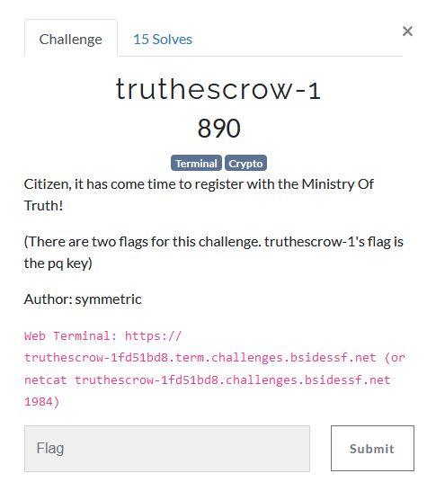

---
tags:
  - BSidesSF
  - BSidesSF 2024
  - Crypto  
  - RSA
  - half p and q
---

# چالش truthescrow-1 [:material-cloud-download-outline:](https://github.com/BSidesSF/ctf-2024-release/tree/main/truthescrow/challenge/src)


<center>
 
</center>

## آشنایی اولیه با خواسته مساله

خب با دستور زیر از طریق netcat به سرور سوال وصل میشیم  
```bash
ncat --proxy-type socks5 --proxy 127.0.0.1:2080 truthescrow-1fd51bd8.challenges.bsidessf.net 1984
```
و با خروجی زیر روبرو میشیم  
```

                                       ##
                                      ####
                                     ##  ##
                                   ##########
                           ##########      ##########
                       #####      ###       ##      ######
                    ####         ####      ####         #####
                 ####           ## ###    ### ##           ####
               ###             ##    ##  ###   ##             ###
             ###              ##      #####     ###             ###
            ###              ##       ####       ###              ###
          ###               ##        ####        ##               ###
         ###               ##        ### ###       ###               ##
        ##                ##        ##    ###       ###               ##
       ##               ###        ##      ###       ###               ##
      ###              ###        ##        ###       ###               ##
     ###              ###        ##############        ###              ###
     ##              ###      ##### #### ###  #####     ###              ###
    ###             ###    ####  ######  ######  ####    ###              ##
    ##             ###   ###  ########    ########  ###    ##             ###
   ###            ###   ##  #########      #########  ###   ##            ###
   ###           ###  ###  ##########      ########### ###   ##           ###
   ###          ##     ##  ##########      ##########  ###    ##          ###
   ###         ##       ###  ########      ######### ###       ##         ###
   ###        ##        #####  #######    #######  #####        ##        ###
   ###       ##        ###  #### ####### ###### #####  ##        ##       ###
    ##      ##        ###     ######        ######      ##        ##      ###
    ###    ##        ###           ##########            ##        ##     ##
    ###   ##        ###                                   ###       ###  ###
     ######################################################################
      ####        ##                                        ###       #####
      ###        ##            MINISTRY OF TRUTH             ###       ###
     ###        ##                SINCE 1984                  ###       ###
    ####      ####                                            ####       ###
   ##########################################################################
           ###                                                    ###
             ###       WAR IS PEACE     FREEDOM IS SLAVERY       ###
              ####           IGNORANCE IS STRENGTH             ###
                ####      PRIVATE KEYS ARE PUBLIC KEYS      ####
                   ####                                  ####
                      #####                          ######
                         ######                  ######
                              ####################

Try "help" for a list of commands
```

در ادامه میایم دستورات مختلف رو امتحان میکنیم و ببینیم هر دستور چه کاری انجام میده  

??? Info "خروجی دستور help"
    ```
    truthescrow> help
    help

    truthescrow help:


    Commands:
        help                 // Prints this help

        help types           // Display help about the censorship types

        listkeys             // Display all current private keys
        genkey               // Generate a new keypair

        listtruth            // Get a list of unread truth
        sendtruth            // Speak truth to a citizen
        readtruth            // Read truth from citizens

        exit                 // Exit the keyservice
    ```

??? Info "خروجی دستور help types"
    ```
    truthescrow> help types
    help types

    At the ministry of truth we believe in choice. Your private key
    can be censored by masking half of p and q or masking half of d.

    Choose "pq" or "d" to select between these.

    WAR IS PEACE
    FREEDOM IS SLAVERY
    IGNORANCE IS STRENGTH
    PRIVATE KEYS ARE PUBLIC KEYS
    ```

??? Info "خروجی دستور listkeys"

    ```
    truthescrow> listkeys
    listkeys

    Citizen  0. (Nicholas Howgrave-Graham)
    Public n: 0xbd94491c739fbbf037263e855f4773051c5624294461786822dbb724282426232a8c66f01901b402b7d9193463145acd3e8b891637c99b6997ad15979364ea3268f4a3bf97be351b7b7f24c2f3da4f65c23f1d6aa61ef1d85d84006a2b96a50e3bc7addb816c66c7f12d11c56d35a99e6a6c60fcbdc8d90ec8ea3c1339d2d50cd1db8264dbf806661f430373c876431d8fa0344de2f075179cdde3f718249de992a1de8701a5e9253eb55334cdaaf27c5b894e60ccdc0b0d595f92e79882f42d25be63737fdfcbd428ba09db56099324d12127185c31859c5697d4ea0c256e841b7db55e9c217e72c5415fa6074032328c919b29d0be8b0e7a7249915585c86d
    Public e: 0x10001
    Private p: 0xd192d28df547f3587e841b9177b323ea93fc043a28a297e189a50b9cc10785cf3bc53c26d8a31391f5aaf9ef3c8eb9b2e31dd5bf4355b1a724a8c9705264cd65[...]
    Private q: 0x[...]76008af358febf9d20fc174333a006fdd5de7edd7f9c715861dec66945baec90a98bda4bc5685dbd7b5a09a7d7564921b379615cea51f54023bae030f862f025

    Citizen  1. (Nadia Heninger Hovav Shacham)
    Public n: 0xc17c59923900220c886dca8a49e4bc95e803b2be15cf452c25589c529bc5a03076337bfdda082c8f0ac634e8d3a3cb0a18e50002e9764c12306cd304c831a3e918042bfee0edbca556ecc19a506bb0580154166bcb6fbd537a62a9d6d69a7984d777baeb2066afac90bbeaa9b342adb8cd8b9eefa89574c23dd5f1f56dfc373726ce356067085c4a5a1567af6d3dd9f7a5a8f2f73d39f95453cbfdf25de50b6267f338c2edd1b0401ece05426701cc858f0f9b90e7628b5c505130c9f5c19c833d26e1c51f3f24c3cff0f915401f906ef1db3415e68622fe994ca6af85d27d210bb2069ad2ba38e994e3a2b63027da746cf87624a80661b5b7bf5a3a20a68125
    Public e: 0x10001
    Private d: 0x[...]6ebbc2bf14ca4042c502666e8ed67d391aaf8ba94e5c77f0328fe74705b377c5163bb9d70c90ead25ad926c6d07e672edc649e838aac35e0e745870e09fc3ee3e68844e58cf44bfafa3343a1110aaf9799c1d7edae6c53c3bf5134407c594d853698b944e96f66ace28939c46369ee6633f029f764ac1503d9788888cd7e0b41f975d801
    ```

??? Info "خروجی دستور listtruth"

    ```
    truthescrow> listtruth
    listtruth
    Citizen  0. (Nicholas, Howgrave-Graham): 1 unread truth
    Citizen  1. (Nadia Heninger, Hovav Shacham): 1 unread truth
    ```


??? Info "خروجی دستور readtruth"
    ```
    truthescrow> readtruth
    readtruth

    Enter citizen (by number) to read unread truth? 0
    0

    Welcome Nicholas(?), before we continue, you must prove it's you

    Please provide the signature for 167191240887922926367864635367418688498 : 123
    123
    Signature validation failed!
    ```

??? Info "خروجی دستور genkey"
    ```
    truthescrow> genkey

    First name? myName

    Last name? myFamily

    Mask which part of private key (pq / d)? pq

    Generating key for myName...
    myName, your key is ready!
    Public modulus: 20979142480287036782096448663659138925693237674236352794079268948084502992407162535815284022086411164153415552324026463075509151571302171135637480084305448742563933699548185852636262497346874930468833997334095726419709369992902285578489508950820146709218877805604917709398452431624208697101639920463933858368085556374738864559564823528330129197025514287755661274817687606841384703931455015768109579287479475972954536504802224629052561445762438733942237277343630121023374214450381316159943618195506783146813350739427763618750512315499303398456818791883300843331931426058789584475485596410344778964198791545947538224637
    Public exponent: 65537
    Private exponent: 14022480985534486568499243690000893855989628398003012559998815573963435213427464712778865626859563926419280227498267836718535764294686842647612796055556406032745061807966618570803232963002271332669900563852786415243532187200193548984020216665252857570491980747890861959812002514111089338488751952575226553943593659689546916399081320296009292913027617586275084566979677876621805855253182121379328651098722383743889540290848904868131988569803798941020272467228257061824600039403308054560967400846645718413769077794347736899600194785455471325830667173673079432162686620773386394396431587327310147957056130759558692869613
    Private p: 143520065613884667110088351015529900092179284102268966793203999148382800365697568275165099205910730725349989239598280077044163113655111898779184440951090653891630295115058143608933469290010237772969195292930865897494760083372491221513253179143844896176241644867128092872414079683202327239101048896938688495563
    Private q: 146175675091507456737522798829014782811865451051857842412175674804900309324739374468470976895700263032713808718431551484030630157258985979150141144011800212233928309647511279576187170951230583778519784908700581474500862022004789022487123778222560461579933747277144333069595042839003536837263302708609396365399

    !PRIVATE KEYS ARE PUBLIC KEYS!
    ```

??? Info "خروجی دستور sendtruth"
    ```
    truthescrow> sendtruth

    Enter citizen (by number) to send truth? 2

    Truth for citizen 2? salam
    Truth sent!
    ```


خب براساس خروجی دستورات بالا باید تو پارت اول این سوال `truth` فرد `Nicholas` بخونیم.  
برای خوندن `truth` نیاز داریم تا کلیدخصوصی هر فرد رو براساس اطلاعات نمایش داده شده از خروجی دستور `listkeys` بدست بیاریم و سپس `signature`  عدد رندوم `k` رو از طریق فرمول زیر برای دستور `readtruth` ارسال کنیم تا به فلگ برسیم

$$
signature \equiv k^d \pmod{n}
$$

براساس خروجی `help types` و `listkeys` در پارت اول سوال، به ما `n` و `e` داده شده است ولی نصف بیت های پایین(کم ارزش) `p`  و نصف بیت های بالا(پرارزش) `q` سانسور شده است.


## راه حل

با اندکی بازی با دستورات `genkey` و `listkeys` پی میبریم که `p` و `q` ما `1024` بیتی بوده و در تسک اول `512` بیت کم ارزش `p` و `512` بیت پرارزش `q` سانسور شده است و باید بدستشون بیاوریم


???+ tip "نکته"
    میدانیم
    
    $$
    n = p \times q
    $$

    از طرفی رابطه زیر صادق است
    
    $$
    n \bmod k = \left( (p \bmod k) \times (q \bmod k) \right) \bmod k
    $$

    بعنوان مثال زمانیکه مقدار `k` برابر $2^{512}$ باشد خواهیم داشت :

    $$
    n \bmod 2^{512} = \left( (p \bmod 2^{512}) \times (q \bmod 2^{512}) \right) \bmod 2^{512}
    $$

    حال اگر `512` بیت کم ارزش `p` را `p_low` و `512` بیت کم ارزش `q` را `q_low` بنامیم خواهیم داشت

    $$
    n \bmod 2^{512} = \left( p\_low \times q\_low \right) \bmod 2^{512}
    $$

    و به عبارتی خواهیم داشت
    
    $$
    p\_low = \left( (n \bmod 2^{512}) \times (q\_low^{-1}) \right) \bmod 2^{512}
    $$


با توجه به رابطه بالا بسادگی میتوانیم `512` بیت کم ارزش `p` را بدست بیاوریم و در ادامه مقدار کامل `p` محاسبه میشود و در انتها میتوان کلید خصوصی `Nicholas` را بدست اورد و `signature` خواسته شده مساله را محاسبه کرد و به فلگ رسید

```python
n = 0xbd94491c739fbbf037263e855f4773051c5624294461786822dbb724282426232a8c66f01901b402b7d9193463145acd3e8b891637c99b6997ad15979364ea3268f4a3bf97be351b7b7f24c2f3da4f65c23f1d6aa61ef1d85d84006a2b96a50e3bc7addb816c66c7f12d11c56d35a99e6a6c60fcbdc8d90ec8ea3c1339d2d50cd1db8264dbf806661f430373c876431d8fa0344de2f075179cdde3f718249de992a1de8701a5e9253eb55334cdaaf27c5b894e60ccdc0b0d595f92e79882f42d25be63737fdfcbd428ba09db56099324d12127185c31859c5697d4ea0c256e841b7db55e9c217e72c5415fa6074032328c919b29d0be8b0e7a7249915585c86d
e = 0x10001
p_high = 0xd192d28df547f3587e841b9177b323ea93fc043a28a297e189a50b9cc10785cf3bc53c26d8a31391f5aaf9ef3c8eb9b2e31dd5bf4355b1a724a8c9705264cd65
q_low = 0x76008af358febf9d20fc174333a006fdd5de7edd7f9c715861dec66945baec90a98bda4bc5685dbd7b5a09a7d7564921b379615cea51f54023bae030f862f025

known = 512
p_low = (pow(q_low, -1, 2**known)*n)%2**known
p = p_high<<known|p_low
assert n % p == 0
q = n//p
d = pow(e, -1, (p-1)*(q-1))

k = 101047600963885791387700255279083702888
signature = pow(k, d, n)
print(f'{signature}')
```

---
??? success "FLAG :triangular_flag_on_post:"
    <div dir="ltr">`CTF{we_are_the_oprah_of_private_key_bits}`</div>


!!! نویسنده
    [mheidari98](https://github.com/mheidari98)


