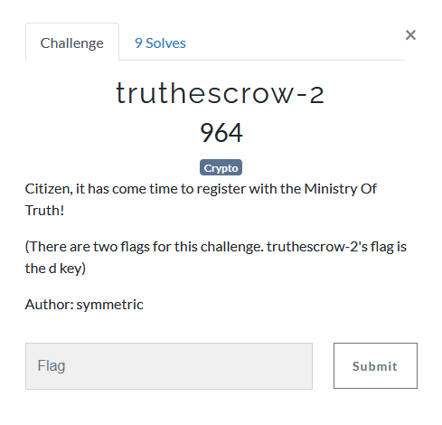

---
tags:
  - BSidesSF
  - BSidesSF 2024
  - Crypto  
  - RSA
  - half d
---

# چالش truthescrow-2 [:material-cloud-download-outline:](https://github.com/BSidesSF/ctf-2024-release/tree/main/truthescrow/challenge/src)


<center>
 
</center>

## آشنایی اولیه با خواسته مساله

در ادامه چالش قبلی، اینبار باید `truth` فرد `Nadia` را بخونیم.  
براساس خروجی `help types` و `listkeys` در پارت دوم سوال، به ما `n` و `e` به همراه نصف بیت های کم ارزش `d` داده شده است و باید بتوانیم `d` کامل را بدست بیاوریم.


## راه حل

با اندکی سرچ به [این ریپو](https://github.com/jvdsn/crypto-attacks) گیت هاب رسیدم   
برای استفاده از ابزار ابتدا فایل به آدرس زیر را باز کنید

```
attacks/rsa/partial_key_exposure.py
```
سپس کد زیر را به انتها فایل بالا اضافه کنید
```python
logging.basicConfig(level=logging.DEBUG)

N = 0xc17c59923900220c886dca8a49e4bc95e803b2be15cf452c25589c529bc5a03076337bfdda082c8f0ac634e8d3a3cb0a18e50002e9764c12306cd304c831a3e918042bfee0edbca556ecc19a506bb0580154166bcb6fbd537a62a9d6d69a7984d777baeb2066afac90bbeaa9b342adb8cd8b9eefa89574c23dd5f1f56dfc373726ce356067085c4a5a1567af6d3dd9f7a5a8f2f73d39f95453cbfdf25de50b6267f338c2edd1b0401ece05426701cc858f0f9b90e7628b5c505130c9f5c19c833d26e1c51f3f24c3cff0f915401f906ef1db3415e68622fe994ca6af85d27d210bb2069ad2ba38e994e3a2b63027da746cf87624a80661b5b7bf5a3a20a68125
e = 65537
partial_d = 0x6ebbc2bf14ca4042c502666e8ed67d391aaf8ba94e5c77f0328fe74705b377c5163bb9d70c90ead25ad926c6d07e672edc649e838aac35e0e745870e09fc3ee3e68844e58cf44bfafa3343a1110aaf9799c1d7edae6c53c3bf5134407c594d853698b944e96f66ace28939c46369ee6633f029f764ac1503d9788888cd7e0b41f975d801


p_, q_, d_ = attack(N, e, PartialInteger.lsb_of(partial_d, 1060, 1056), m=4, t=4)
print(f'{p_ = }')
print(f'{q_ = }')
print(f'{d_ = }')
```
در انتها دستور زیر را اجرا میکنیم
```bash
sage -python attacks/rsa/partial_key_exposure.py
```

و از خروجی میتوان `d` را بدست اورد و مساله را حل کرد

```
INFO:root:Using Blomer-May (Section 6)...
INFO:root:Trying m = 4, t = 4...
DEBUG:root:Generating shifts...
DEBUG:root:Creating a lattice with 35 shifts (order = 'invlex', sort_shifts_reverse = False, sort_monomials_reverse = False)...
DEBUG:root:Reducing a 35 x 35 lattice...
DEBUG:root:Reconstructing polynomials (divide_original = True, modulus_bound = True, divide_gcd = True)...
DEBUG:root:Reconstructed polynomial has gcd 4 with polynomial at 4, dividing...
DEBUG:root:Reconstructed polynomial has gcd 4 with polynomial at 4, dividing...
DEBUG:root:Reconstructed polynomial has gcd 8 with polynomial at 8, dividing...
DEBUG:root:Reconstructed polynomial has gcd 16 with polynomial at 0, dividing...
DEBUG:root:Reconstructed polynomial has gcd 2 with polynomial at 1, dividing...
DEBUG:root:Row 14 is too large, ignoring...
DEBUG:root:Row 15 is too large, ignoring...
DEBUG:root:Row 16 is too large, ignoring...
DEBUG:root:Row 17 is too large, ignoring...
DEBUG:root:Row 18 is too large, ignoring...
DEBUG:root:Row 19 is too large, ignoring...
DEBUG:root:Row 20 is too large, ignoring...
DEBUG:root:Row 21 is too large, ignoring...
DEBUG:root:Row 22 is too large, ignoring...
DEBUG:root:Row 23 is too large, ignoring...
DEBUG:root:Row 24 is too large, ignoring...
DEBUG:root:Row 25 is too large, ignoring...
DEBUG:root:Row 26 is too large, ignoring...
DEBUG:root:Row 27 is too large, ignoring...
DEBUG:root:Row 28 is too large, ignoring...
DEBUG:root:Row 29 is too large, ignoring...
DEBUG:root:Row 30 is too large, ignoring...
DEBUG:root:Row 31 is too large, ignoring...
DEBUG:root:Row 32 is too large, ignoring...
DEBUG:root:Row 33 is too large, ignoring...
DEBUG:root:Row 34 is too large, ignoring...
DEBUG:root:Reconstructed 14 polynomials
DEBUG:root:Computing pairwise gcds to find trivial roots...
DEBUG:root:Using Groebner basis method to find roots...
DEBUG:root:Sequence length: 14, Groebner basis length: 2
DEBUG:root:Found Groebner basis with length 2, trying to find roots...
p_ = 135910664629928214982882802610812446223246942959119370715736186055734275683591232700237383770019000628786324922720286581455880901684249073202371978652383340260722984522202935328798589197300372600240925502733900876553287019527495229592943493322053755848030380760246614012062400218594889494929908613811634043557
q_ = 179715934285566366979761174730521685494085840836841514810594725362065959057689486042102979782441969862729151818439593494992034948393051332904613055534437043486894053801587425382559373679124097689993197938679159734722173952736332370889269689473463709996937739163800728716211361515169500844964535234606065001601
d_ = 23964288361013640476094822164847162632875998342130294892366450689547010575893047965414578820035905154669339806925765459916031658314480084559148571717004939501582718670344208391351899159630294958475472016763076636356405365292267018333906036640906157978048159310091800041776026331453168320232771068604558034921235209490659541126328683833363895246483320539934934853435235071839002168598584116057968941320338064169286071451736499832016207523779221343422851261744824345624761173336307556639698314443936432242816865234219421958556439970565806590965132224299652404650193202242039016916497317418038387032178147582396775913473
```


---
??? success "FLAG :triangular_flag_on_post:"
    <div dir="ltr">`CTF{half_a_d_is_too_much_d}`</div>


!!! نویسنده
    [mheidari98](https://github.com/mheidari98)


