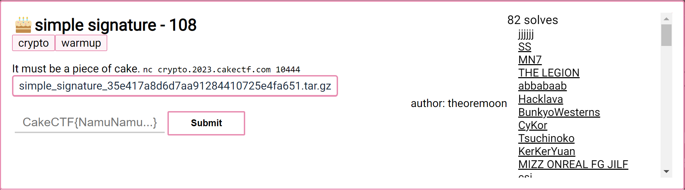

---
tags:
  - CakeCTF
  - CakeCTF-2023
  - Crypto
  - Signature
  - Extended Euclidean
---

 
زمان مطالعه: ۱۰ دقیقه $~~~~~~~~~~~~~~~~~~~~~~~~~~~~~~~~~~~~~~~~~~~~~~~~~~~~~~~~~~~~~~~~~~~~~~~~~~~~~~~~~~~~~~~~~~$  <a href="https://tools.pdf24.org/en/webpage-to-pdf" target="_blank">دانلود PDF :closed_book:</a> 

---


# چالش Simple signature
این چالش در ابتدا چالش ساده‌ای به نظر می‌رسید و همون‌طور که توی تصویر زیر هم می‌بینید تعداد حل بالایی داشت. اما کم دقتی و توجه نکردن به یک سری نکات ریز باعث شد نتونم این چالش  سریع حل کنم.  

<center>



</center>

خب بریم سراغ چالش، همان‌طور که در تصویر بالا دیده میشه این یک چالش [امضای دیجیتال](https://fa.wikipedia.org/wiki/%D8%A7%D9%85%D8%B6%D8%A7%DB%8C_%D8%AF%DB%8C%D8%AC%DB%8C%D8%AA%D8%A7%D9%84#:~:text=%D8%AF%D8%B1%D9%88%D8%A7%D9%82%D8%B9%20%D8%A7%D9%85%D8%B6%D8%A7%DB%8C%20%D8%AF%DB%8C%D8%AC%DB%8C%D8%AA%D8%A7%D9%84%20%DB%8C%DA%A9%20%D9%81%D8%B1%D8%A7%DB%8C%D9%86%D8%AF,%D8%AF%D8%B1%DB%8C%D8%A7%D9%81%D8%AA%20%D9%BE%DB%8C%D8%A7%D9%85%20%D8%A7%D8%B3%D8%AA%D9%81%D8%A7%D8%AF%D9%87%20%D9%85%DB%8C%20%D9%86%D9%85%D8%A7%DB%8C%D9%86%D8%AF.) است که یک آدرس  و پورت همراه با  کد سمت سرور داریم. به محض اتصال به سرور، مقادیر p ،g و زوج مرتب  vkey که در واقع کلید عمومی است رو به ما میده و از ما میخواد که انتخاب کنیم که می خواهیم متنی رو امضا کنیم یا می‌خواهیم یک امضا رو تصدیق کنیم. با انتخاب گزینه امضا (S)، از ما درخواست متنی که قرار امضا بشه رو می کنه و به عنوان خروجی یک زوج مرتب (s,t) به ما میده که این زوج مرتب همان امضای متن است. اگر گزینه تصدیق (V)  را انتخاب کنیم ابتدا متن پیام و سپس زوج مرتب  (s,t)  رو درخواست میکنه که در صورت مطابقت امضا با متن، پیغام verified رو مانند زیر برای چاپ می‌کنه.  

```
nc crypto.2023.cakectf.com 10444
p = 12461009808507152374125098342823537614498371034076199996167157368441261794610538037894190371927225429503534827434519767137513866506265282544292894789347283
g = 2
vkey = (5448899759769600714412864084543015451282235347653116129095778847832346990329692376807722729655674724571428765510035749357005239091437770716002180076321509, 3128459027502179540614599819430166489651929559502820417514699625737390655587377320258316509423668978901229663058253736473439065076432361719276985133909415)
[S]ign, [V]erify: S
message: Hello
(s, t) = (1308751768992585221054130031165608289293359932202519581128562608636988438770667093582175287614159633116263153448959960762986514580832902309161213800131493, 322900803100515903279808703477899387035730952811976099474443242190074336807561942151320888385917232910170637701378305826484578987612226990801594826583715)
[S]ign, [V]erify: V
message: Hello
s: 1308751768992585221054130031165608289293359932202519581128562608636988438770667093582175287614159633116263153448959960762986514580832902309161213800131493
t: 322900803100515903279808703477899387035730952811976099474443242190074336807561942151320888385917232910170637701378305826484578987612226990801594826583715
verified
```

حالا باید به کد سمت سرور نگاه بندازیم و ببینیم که سرور در چه صورتی  فلگ  رو برای ما ارسال  میکنه.  با دقت در کد سرور متوجه میشیم که اگر متن  "cake_does_not_eat_cat" رو برای امضا بدیم و سپس سرور اون تصدیق کنه فلگ برای ما نمایش داده میشه. اما سرور به این عبارت حساس است و اجازه امضای این متن نمیده. پس باید عمل امضا کردن را به صورت local روی سیستم خودمون انجام بدیم و تنها برای انجام تصدیق به سرور بفرستیم. اما برای امضا کردن نیاز به کلیدخصوصی (x,y,u) داریم که در هر بار اتصال به سرور به صورت تصادفی تولید میشن. در واقع تازه از این نقطه به بعد حل این چالش شروع میشه. :slight_smile:   

```python title="server.py" linenums="1" hl_lines="16 25 30" 

import os
import sys
from hashlib import sha512
from Crypto.Util.number import getRandomRange, getStrongPrime, inverse, GCD
import signal

flag = os.environ.get("FLAG", "neko{cat_does_not_eat_cake}")
p = getStrongPrime(512)
g = 2

def keygen():
    while True:
        x = getRandomRange(2, p-1)
        y = getRandomRange(2, p-1)
        w = getRandomRange(2, p-1)
        v = w * y % (p-1)
        if GCD(v, p-1) != 1:
            continue
        u = (w * x - 1) * inverse(v, p-1) % (p-1)
        return (x, y, u), (w, v)

def sign(m, key):
    x, y, u = key
    r = getRandomRange(2, p-1)
    return pow(g, x*m + r*y, p), pow(g, u*m + r, p)

def verify(m, sig, key):
    w, v = key
    s, t = sig
    return pow(g, m, p) == pow(s, w, p) * pow(t, -v, p) % p

def h(m):
    return int(sha512(m.encode()).hexdigest(), 16)

if __name__ == '__main__':
    magic_word = "cake_does_not_eat_cat"
    skey, vkey = keygen()
    print(f"p = {p}")
    print(f"g = {g}")
    print(f"vkey = {vkey}")
    signal.alarm(1000)
    while True:
        choice = input("[S]ign, [V]erify: ").strip()
        if choice == "S":
            message = input("message: ").strip()
            assert message != magic_word
            sig = sign(h(message), skey)
            print(f"(s, t) = {sig}")
        elif choice == "V":
            message = input("message: ").strip()
            s = int(input("s: ").strip())
            t = int(input("t: ").strip())
            assert 2 <= s < p
            assert 2 <= t < p
            if not verify(h(message), (s, t), vkey):
                print("invalid signature")
                continue
            print("verified")
            if message == magic_word:
                print(f"flag = {flag}")
                sys.exit(0)
        else:
            break
```

با دیدن کد سرور می‌فهمیم که طبق تابع keygen کلیدعمومی دو متغیر (w,v) و کلیدخصوصی شامل سه متغیر (x,y,u) است. با اولین نگاه به خط ۱۶ متوجه میشیم که متغیر v با استفاده از y بدست آمده، چون مقدار v عمومی است و سرور به ما میده، پس با یک معکوس‌گیری ساده روی w مثل رابطه زیر به مقدار y می‌رسیم و اولین متغیر از کلیدخصوصی رو بدست  میاوریم.

$$
y\equiv v \times w^{-1} \ mod  \ p-1
$$

از خط ۱۹ کد هم می‌فهمیم که با بدست آوردن x می‌تونیم به مقدار u  برسیم، پس تنها مشکل ما بدست آوردن مقدار x است. اینکه چطور تونستم مقدار x رو بدست بیارم وقت زیادی گرفت تا اینکه با دیدن خط ۲۵ به فکر رابطه تعمیم اقلیدسی یعنی [$a u + b v = gcd(a,b)$](https://web.archive.org/web/20230511143526/http://www-math.ucdenver.edu/~wcherowi/courses/m5410/exeucalg.html) افتادم. چون مقدار m و y رو داریم  و مقدار gcd آن ها را می توانیم داشته باشیم پس قادر خواهیم بود مضارب آنها یعنی x و r بدست بیاوریم. اما مقدار r برای ما مهم نیست چون طبق رابطه زیر که از خط ۳۰ تابع verify استخراج کردم مقدار r عملا تاثیری در تصدیق کردن امضا ندارد.
 
\begin{equation}
  \nonumber
  \begin{split}
    g^{m}\ mod \ p 
                &= s^{w}\ mod \ p \times t^{-v} \ mod \ p \\
                &= (g^{xm+ry})^w \times  (g^{um+r})^{-v}\ mod \ p \\
                &= g^{w(x m+r y) -v(u m + r )} \ mod \ p \\
                &= g^{wxm + wry - vum - vr} \ mod \ p \\
                &= g^{wxm - vum + r(wy-v)} \ mod \ p 
  \end{split}
\end{equation}
 
  طبق کد پایتون سرور $wy=v$ است پس در رابطه بالا ضریب r یعنی $wy-v$ همیشه مقداری برابر صفر داره، این یعنی مقدار تصادفی r هیچ نقشی در برقراری تساوی نداره و تنها وابسته به مقدار $wxm-vum$ است.
  بعد از بدست آوردن متغیر x با روش تعمیم اقلیدسی همه متغیرهای کلیدخصوصی یعنی x،y و u را داریم و می‌تونیم متن "cake_does_not_eat_cat" را  روی سیستم خودمون امضا کنیم و برای تصدیق به سرور بفرستیم تا فلگ را برای ما نمایش بده. کد پایتون زیر کل مراحل اتصال به سرور، استخراج کلیدها، انجام امضا و ارسالش به سرور برای تصدیق رو اجرا می‌کنه:

```python title="solve.py" linenums="1"

from pwn import *
from Crypto.Util.number import getRandomRange, getStrongPrime, inverse, GCD
from hashlib import sha512

def egcd(a, b):
  if (a == 0):
    return (b, 0, 1)
  else:
    g, y, x = egcd(b % a, a)
    return (g, x - (b // a) * y, y)

def sign(m, key):
    x, y, u = key
    r = getRandomRange(2, p-1)
    return pow(g, x*m + r*y, p), pow(g, u*m + r, p)

def h(m):
    return int(sha512(m.encode()).hexdigest(), 16)

host='crypto.2023.cakectf.com'
port=10444
r=remote(host,port) 

p=int(r.recvline()[3:-1])
g=int(r.recvline()[4:-1])

pub_key=(r.recvline()[8:-2]).decode()
w=int(pub_key.split(',')[0])
v=int(pub_key.split(',')[1])  # fetch public key(variables)

y=(v*pow(w,-1,p-1))%(p-1)
x=egcd(h_m,y)[1]
u = (w * x - 1) * inverse(v, p-1) % (p-1)    # x, y, u  are private key(variables)

h_m = h('cake_does_not_eat_cat')
s=sign(h_m,(x,y,u))

r.sendline(b'V')
r.sendline(b'cake_does_not_eat_cat')
r.sendline(bytes(str(s[0]), 'utf-8'))
r.sendline(bytes(str(s[1]), 'utf-8'))
print(r.recvline())
print(r.recvline())
```

به نظر من این چالش در حد نزدیک به متوسط بود و واقعا یک چالش ساده یا دست گرمی حداقل برای من نبود. امیدوارم که  روش حل این چالش رو واضح توضیح داده باشم. 

---
??? success "FLAG :triangular_flag_on_post:"
    <div dir="ltr">`CakeCTF{does_yoshiking_eat_cake_or_cat?}`</div>


!!! نویسنده
    [HIGH0101](https://twitter.com/HIGH01012)$~~~~~~~~~~~~~~~~~~~~~~~~~~~~~~~~~~~~~~~~~~~~~~~~~~~~~~~~~~~~~~~~~~~~~~~~~~~~~~~~~~~~~~~~~~~~~~~~~~~~~~~~~~~~~~~~~~~~~~~~~~~$تاریخ نگارش ۱۴۰۲/۰۸/۳۰