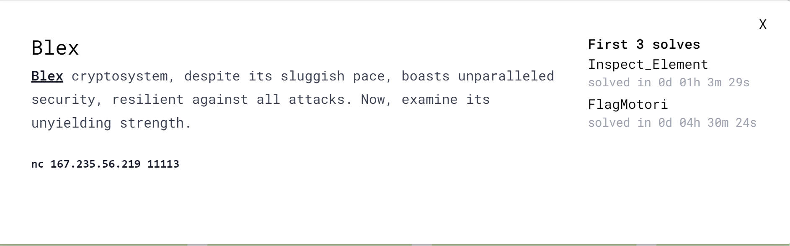
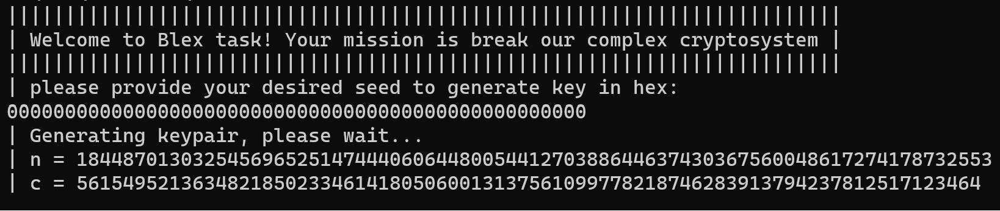
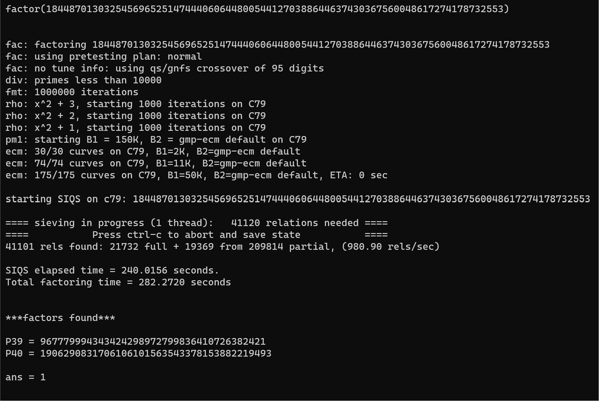

---
tags:
  - SNAPP-CTF
  - SNAPP-2023
  - Crypto  
  - Seed
  - Factorzation
  - Yufu
---

# چالش Blex 

<center> 

</center>

برای این چالش کد زیر و آدرس سرور بالا به ما داده شده:

```python title="server.py" linenums="1"  hl_lines="19 20 21 24"
import sys
from Crypto.Util.number import *
from flag import flag
	
def die(*args):
	pr(*args)
	quit()
	
def pr(*args):
	s = " ".join(map(str, args))
	sys.stdout.write(s + "\n")
	sys.stdout.flush()
	
def sc(): 
	return sys.stdin.buffer.readline()

def keygen(r):
	assert len(r) <= 60
	v, l = int(r, 16), len(r)
	e = (64 - l) << 4
	u, w = v << e, 2 ** (e >> 1)
	for _ in range(110):
		r = getRandomRange(1, w)
		p = r + u
		while p >> e == v:
			if isPrime(p):
				while True:
					x, y = [2 * getRandomNBitInteger(p.bit_length() >> 2) for _ in '__']
					P, Q = x * p | 1, y * p | 1
					if isPrime(P) and isPrime(Q):
						return P, Q
			p += 1

def main():
	border = "|"
	pr(border*72)
	pr(border, f"Welcome to Blex task! Your mission is break our complex cryptosystem", border)
	pr(border*72)
	pr(border, f"please provide your desired seed to generate key in hex:")
	seed = sc().decode()
	try:
		_b = len(seed) <= 60 and int(seed, 16) >= 0
	except:
		die(border, f"The seed you provided is either not in hex or is not valid!")
	if _b:
		pr(border, f"Generating keypair, please wait...")
		p, q = keygen(seed)
		e, n =  65537, p * q
		m = bytes_to_long(flag)
		assert m < n
		c = pow(m, e, n)
		pr(border, f'n = {n}')
		pr(border, f'c = {c}')
	else:
		die(border, f"Your seed is too long!!!")

if __name__ == '__main__':
	main()
```

 سرور با دریافت  یک seed، اعداد اول موردنیاز رمزنگاری RSA را تولید می کند. با تحلیل کد می فهمیم که **مقدار** و **طول** seed روی  متغیرهای  w ,u (خط‌های 19 تا 21) تاثیر داره و در ادامه‌اش روی مقدار p (خط 24) اثر داره. پس باید طولانی ترین و کم ارزش ترین حالت ممکن برای seed  در نظر بگیریم تا اندازه اعداد اول  تا جای ممکن کوچک بشه. با توجه به کد سرور حداکثر طول که می توانیم برای سرور بفرستیم 60 کاراکتر hex (خط 42) است اما در ادامه‌ی کد چون این طول باعث می شود مقدار m ازn بزرگتر شود باید تعداد کاراکتری کاهش دهیم و ارسال کنیم. پس با سعی و خطا متوجه میشیم که بهترین حالت برای seed یک رشته hex با **طول** حدود 50 کاراکتر hex است و بهترین **مقدار** 0 است که با عث صفر شدن متغیرهای v, u می شود.

```
seed='0'*50
```

پس با ارسال این مقدار به سرور کاری میکنیم کوچکترین حالت ممکن برای پیمانه n تولید شود. 

<center>

</center>

باتوجه  عکس بالا بنظر  مقدار  n  قابل تجزیه (factorzation) است. اول سایت [factodb](http://factordb.com) چک کردم که فاکتور های  آن در سایت نبود پس با ابزار yufu  مقدارهای  p و q   بدست آوردیم.

<center>

</center>

بعد از بدست آوردن p و q،  مقدار  c  با استفاده از کد زیر رمزگشایی می کنیم و فلگ بدست میاریم:

```python title="solve.py" linenums="1"
from Crypto.Util.number import *
p=967779994343424298972799836410726382421
q=1906290831706106101563543378153882219493
c=561549521363482185023346141805060013137561099778218746283913794237812517123464
e=65537
n=p*q
phi=(p-1)*(q-1)
d=pow(e,-1,phi)
print(long_to_bytes(pow(c,d,n)))
```

---
??? success "FLAG :triangular_flag_on_post:"
    <div dir="ltr">`SNAPP{b3Y0nd_4Ny_FoRM_1n_8lEx!?}`</div>


!!! نویسنده
    [HIGHer](https://twitter.com/HIGH01012)
    $~~~~~~~~~~~~~~~~~~~~~~~~~~~~~~~~~~~~~~~~~~~~~~~~~~~~~~~~~~~~~~~~~~~~~~~~~~~~~~~~~~~~~~~~~~~~~~~~~~~~~~~~~~~~~~~~~~~~~~~~~~~$تاریخ نگارش ۱۴۰۲/۱۲/۰۴