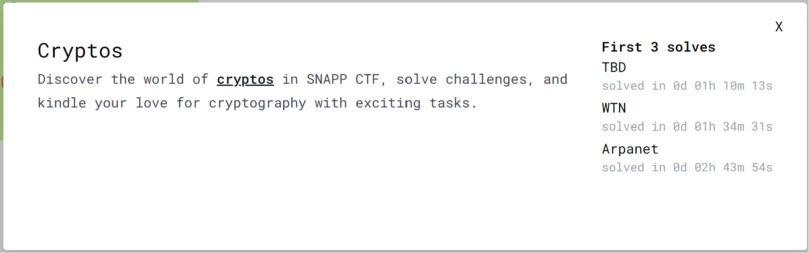

---
tags:
  - SnappCTF
  - SnappCTF-2024
  - Crypto  
  - Encoding
  - Decimal number
---

# چالش Cryptos 

<center> 

</center>

 در این سوال کد زیر همراه با یک فایل حاوی متن کد شده c داده شده: 

```python title="cryptos.py" linenums="1" hl_lines="12"
from decimal import *
from Crypto.Util.number import *
from flag import flag

def encode(n, p):
	getcontext().prec = p + len(str(n)) + 2
	x, y = Decimal(n), Decimal(1)
	r = Decimal(10) ** Decimal(-p)
	while x >= r + y:
		x = (x + y) / 2
		y = n / x
	result = str(round(x - (r / 2), p)).replace('.', '')[::-1]
	return result

def encrypt(msg, n):
	assert n >= 2
	m = n * bytes_to_long(msg)
	c = encode(m, p).lstrip('0')
	return c

global p
p = 1024
n = getRandomNBitInteger(p >> 6)
c = encrypt(flag, n)
print(f'c = {c}')
```

```
c = 5045178894357626075431384420860360647034114401723872009235472900716359915220507491073960091678247276121410336208043903213023270852375878447784137648224298070437468162688759757920721723781604874151511572882769621941513872944171938170800255953999521262507633248122058585326636562475057264132441892290385234155811673238225858794265110896113943435633328964169010801463217935967353264871894098875705195581754210881067786818256285938683517110450003983693265702180080692280190636422223594905498601205618208238650519192521153660957941553495169629553425307135627310090665836554328620333233651748363605006405700561070148067374204713428800371202120708720303368873063856187395746236050232433322757367599705756026681249243491427692831512293583163552663661247047141621453850846452005560242532098020050458041224274532870717854358073569467859182280543593485795867269334718276231423506951784977870960076921603401799962900400216905993065516167476079796078242649399762978533503541077936264107413956207423841535073828559129349967201715665207852577917834390795702440085535969037233161141789375751

```

این یک چالش کدکردن است  که یک متن (flag) رو به کد c تبدیل می کنه. برای حل چالش، هدف اصلی بدست آوردن n  است که مقدار آن برابر $n=x*y$ است. بدست آوردن مقدار x از روی مقدار c ساده است اما مسئله مهم بدست آوردن y است. با تحلیل کد متوجه میشیم که مقدار x و y در موقع خروج از حلقه، اعداد اعشاری هستند که قسمت صحیح آن ها یکسان است. پس مقدار $n=x^2$. حالا از روی c  با معکوس کردن خط 12 به x (با تنظیم دقت محاسبه روی 1033)می رسیم و مقدار n بدست میاریم. بقیه مراحل، با استفاده از کد زیر به فلگ می رسیم.


```python title="solve.py" linenums="1"

from decimal import *
from Crypto.Util.number import *

getcontext().prec = 1033
c = 5045178894357626075431384420860360647034114401723872009235472900716359915220507491073960091678247276121410336208043903213023270852375878447784137648224298070437468162688759757920721723781604874151511572882769621941513872944171938170800255953999521262507633248122058585326636562475057264132441892290385234155811673238225858794265110896113943435633328964169010801463217935967353264871894098875705195581754210881067786818256285938683517110450003983693265702180080692280190636422223594905498601205618208238650519192521153660957941553495169629553425307135627310090665836554328620333233651748363605006405700561070148067374204713428800371202120708720303368873063856187395746236050232433322757367599705756026681249243491427692831512293583163552663661247047141621453850846452005560242532098020050458041224274532870717854358073569467859182280543593485795867269334718276231423506951784977870960076921603401799962900400216905993065516167476079796078242649399762978533503541077936264107413956207423841535073828559129349967201715665207852577917834390795702440085535969037233161141789375751

a = str(c)[::-1]
k = len(a)-1024

r = Decimal(10) ** Decimal(-1024)

x = Decimal(f"{a[:k]}.{a[k:]}") + (r / 2)
n = int(x**2)

for i in range(1, 2**16):
    if n%i==0 :
        if (msg:=long_to_bytes(n//i)).startswith(b'SNAPP'):
            print(msg)
```

---
??? success "FLAG :triangular_flag_on_post:"
    <div dir="ltr">`SNAPP{acCUr4cY4nd_pr3cI5iOn!n_Pyth0n!}`</div>


!!! نویسنگان
    [HIGHer](https://twitter.com/HIGH01012) ،[mheidari98](https://github.com/mheidari98)

