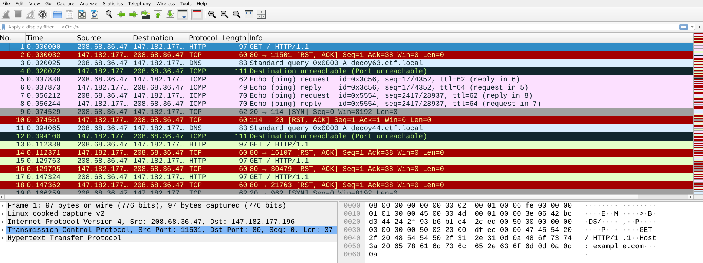
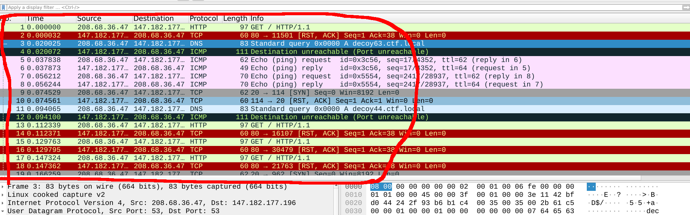
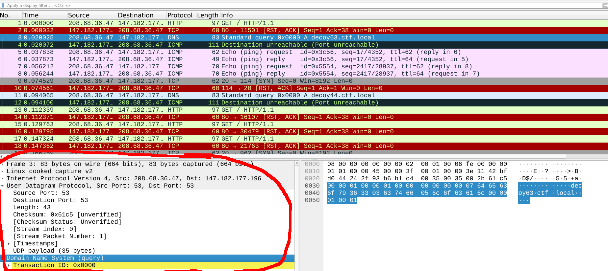
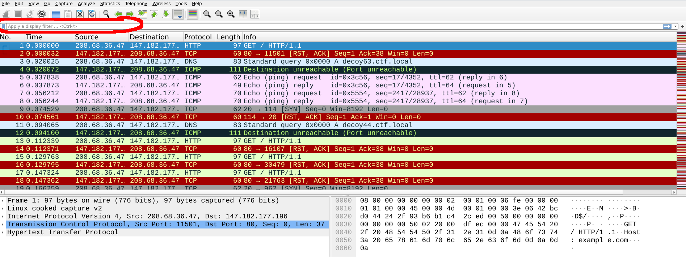
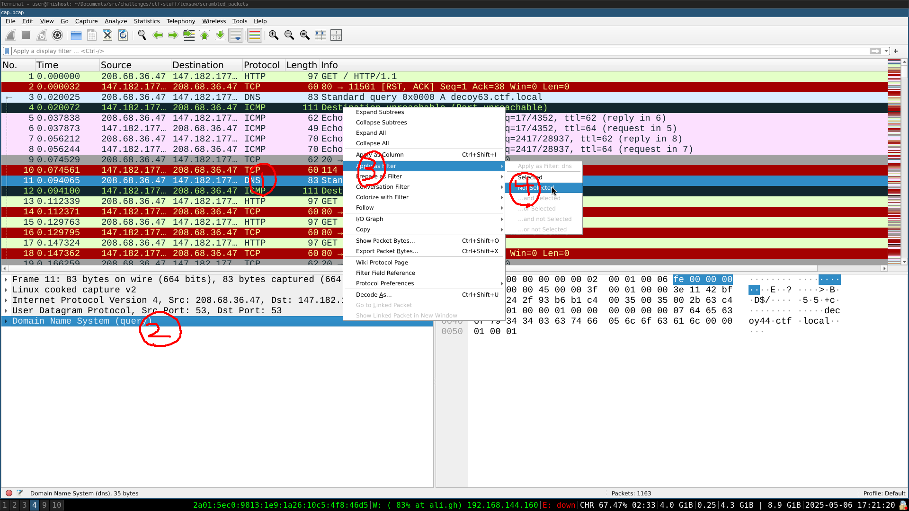
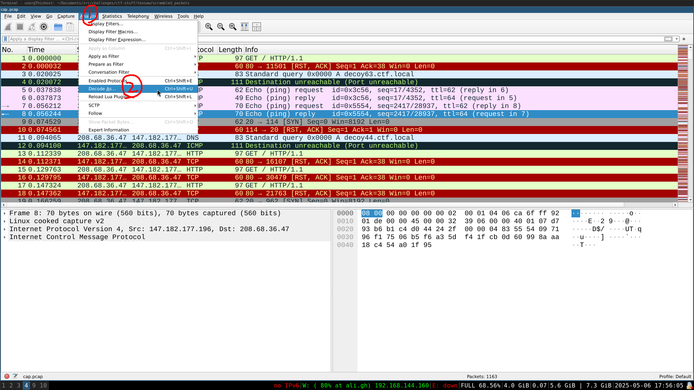
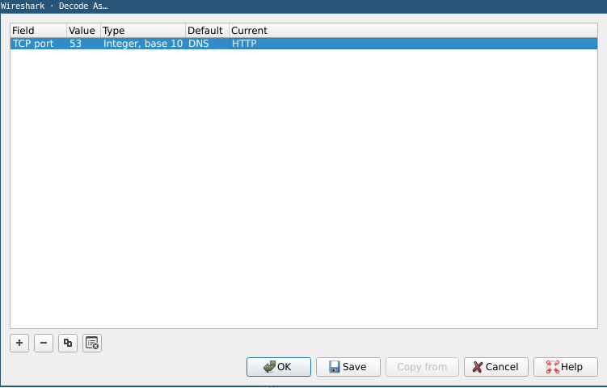
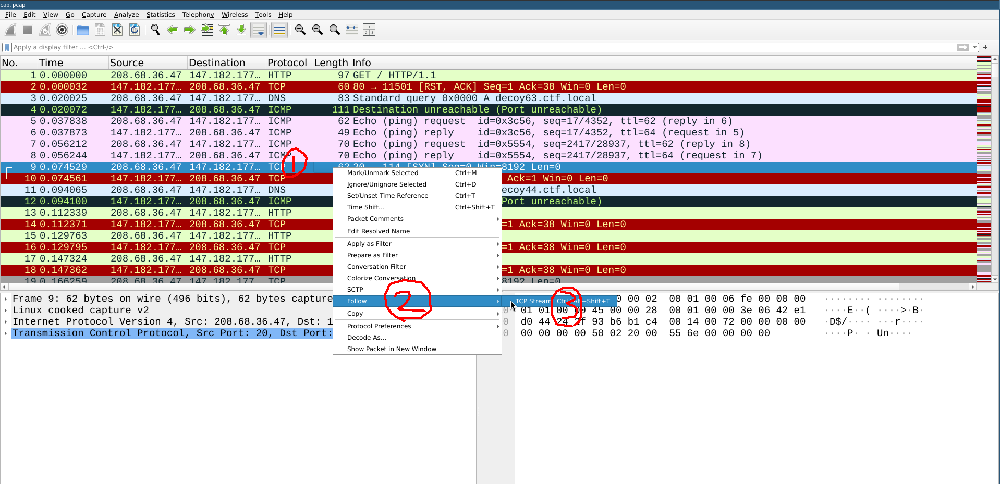
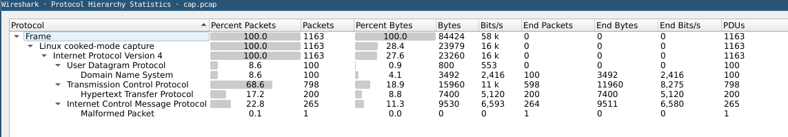
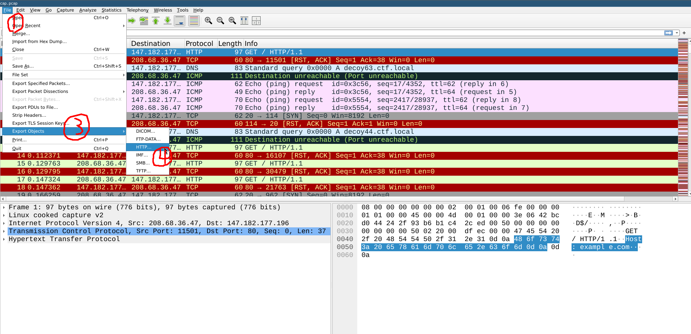

---
tags:
    - traffic analysis
    - wireshark
    - network
    - tcp/ip
---

## مقدمه  
وایرشارک یک ابزار قدرتمند برای آنالیز ترافیک شبکه هست. شما میتونین با استفاده از وایرشارک فایل های پکت کپچر رو نگاه کنین یا یک پکت کپچر شروع کنین. قراره یکم باهاش آشنا شیم و قابلیت هاشو بیشتر بشناسیم.  
## نگاه اولیه به ابزار  
با باز کردن یک فایل پکت کپچر با همچین صفحه ای رو به رو میشیم.  
  
  
حالا قراره به صورت کلی با این صفحه اشنا شیم:  
### لیست پکت ها  
  
این قسمت بهتون کل پکت های کپچر شده رو نشون میده، این لیست رشد میکنه اگه در حال کپچر باشین.  
همونطور که میبینین برای هر پکت یه سری اطلاعات نمایش داده میشه مثل آدرس ایپی مبدا و مقصد. اگه روی هر کدوم کلیک کنین پکت ها بر اساس اون پارامتر مرتب میشن و میتونین از قسمت `لایه های پکت` هر فیلدی رو انتخاب کنین و با `apply as column` کردن اون فیلد، به اطلاعاتی که برای هر پکت توی لیست نمایش داده میشه اضافه میشه.  
### لایه های پکت  
  
این قسمت لایه ها و فیلد های مختلف پکت رو از هم جدا میکنه و بهمون کمک میکنه که پکت انتخاب شده رو با دقت بیشتری مطالعه کنیم، خیلی وقتا در کنار اطلاعات استخراج شده از پکت، expert info هم بهمون ارائه میشه که از آنالیز ترافیک توسط خود وایرشارک بدست میاد و داخل پکت نبوده، مثلا ممکنه بگه که پکت توی فرم درستی نیست.  
یکی از ویژگی های خیلی خوب وایرشارک اینه که وقتی روی فیلدی یا پروتکلی از این قسمت کلیک کنین براتون بایت هاش رو داخل هگز دامپ سمت راست صفحه هایلایت میکنه، همونطور که الان هدر DNS رو هایلایت کرده.  
### فیلتر کردن پکت ها  
  
در این قسمت میتونیم به وایرشارک بگیم که چه پکت هایی رو بهمون نشون بده و چه پکت هایی رو نشون نده، برای یادگیری سینتکسش میتونین از این روش استفاده کنین:  
فرض کنین که میخواین کلا پکت های DNS رو با فیلتر حذف کنین، برای اینکار  
1. روی یک پکت DNS کلیک کنین  
2. از قسمت لایه ها روی DNS راست کلیک کنین   
3. apply as filter (این کار رو میتونین با هر فیلدی و هر پروتکلی انجام بدین)  
4. not selected (همونطور که میبینین، میتوین به وایرشارک بگین که به فیلتر فعلی اضافه کنه به جای اینکه دوباره فیلتر رو بنویسه)  
  
این روش هم خیلی سریع و هم خیلی آسونه و نیاز شما رو به مطالعه اضافه خیلی کم میکنه، 
[ویکی وایرشارک](https://wiki.wireshark.org/DisplayFilters)
display filter هارو خیلی خوب توضیح داده.  
  
## forced decode  
بعضی مواقع ممکنه که وایرشارک پکتی رو اشتباه دیکد کنه، مثلا اگه داخل ترافیک از پروتکل ftp با پورت مقصد 443 استفاده شه ممکنه وایرشارک فکر کنه که این پکت tls هست و از dissector اون پروتکل استفاده کنه.  
توی همچین مواقعی میتونین به وایرشارک بگین که یسری پکت هارو طبق میل شما دیکد کنه. اسم این قابلیت وایرشارک forced decode هست.  
  
با استفاده از پنلی که باز میشه میتونین مشخص کنین که تحت چه شرایطی کدوم dissector استفاده شه. مثلا توی تصویر پایین از وایرشارک خواستیم که لایه اپلیکیشن پکت هایی که پورت مقصد ۵۳ دارن رو به عنوان http بشناسه.  
  
## follow stream  
وایرشارک توانایی اینو داره که وقتی داده هایی که به صورت تیکه تیکه داخل یک کانکشن ارسال شدن رو re-assemble کنه، مثلا وقتی فایلی رو با tcp ارسال کنیم و tcp اون فایل رو در قالب چندین پکت بفرسته، میتونیم با استفاده از ترافیک کپچر شده به فایل منتقل شده برسیم.  
  
برای اینکار:  
1. روی پکتی که جزو اون کانکشن هست راست کلید کنین  
2. follow  
3. stream  
  
## statistics  
وایرشارک خیلی اطلاعات زیادی در مورد ترافیکی که بهش میدین ارائه میده، مثلا از قسمت `statistics/protocol hierarchy` میتونین ببینین که هر پروتکل چه سهمی از کل ترافیک رو داره و خیلی چیزای دیگه. توی عکس زیر صفحه protocol hierarchy رو میبینین. 

  
## export objects  
همونطور که وایرشارک میتونه براتون follow stream کنه، میتونه دیتا هایی که با استفاده از یسری پروتکل های لایه اپلیکیشن(مثل http) فرستاده شدن هم استخراج کنه. مثلا اگه با http سایتی رو باز کنین و ترافیکشو کپچر کرده باشین تمام فایل هایی اون وب سرور براتون فرستاده رو میتونین با این قابلیت از ترافیک استخراج کنین.  
  
## قابلیت های دیگه  
وایرشارک کلی قابلیت دیگه هم داره که اینجا در موردشون صحبت نکردیم. توی ویدیو های زیر در مورد تعدادی ازشون صحبت شده.  
- [wpa2 decryption](https://www.youtube.com/watch?v=G_O_NeNAVuU&t=22s)  
- [tls decryption](https://www.youtube.com/watch?v=GMNOT1aZmD8)  
[دیسکورد رسمی وایرشارک](https://discord.com/invite/ts9GZCjGj5)  
[یوتیوب شارک فست](https://www.youtube.com/@WireSharkFest)  

!!! نویسنده
    [Ali](https://github.com/AliGhaffarian) 
