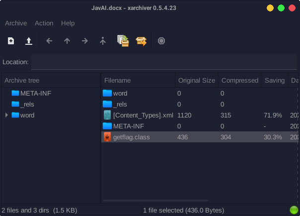
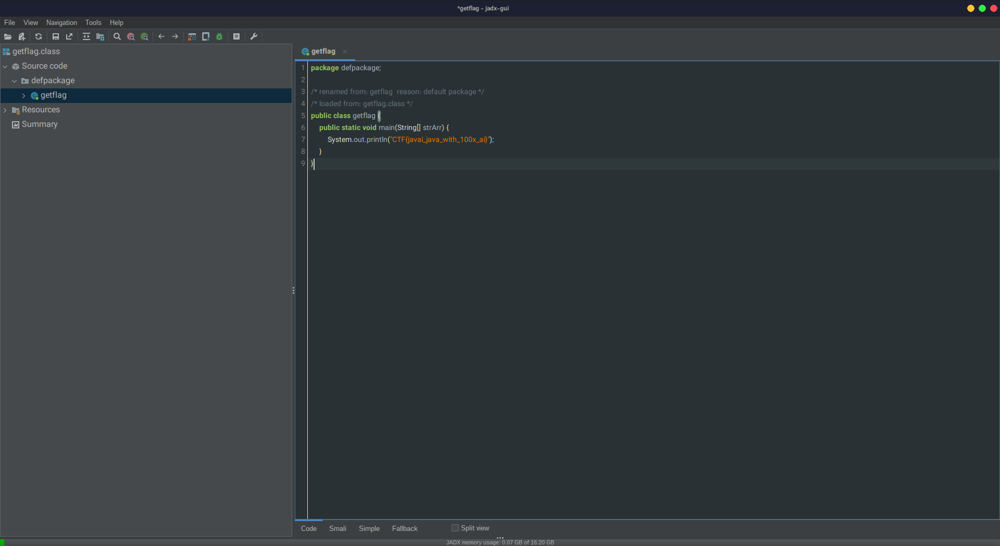

---
tags:
  - BSidesSF
  - BSidesSF-2024
  - Forensics
  - Word
---

اینجا هم یه فایل docx به ما دادن و بعد از باز کردنش متوجه میشیم باید با zip viewer هم یه فرصت بهش بدیم

عه این فایل getflag.class چیه اینجا؟

فایل رو اکسترکت میکنیم و میریم سراغ JadX و فایل رو باز میکنیم و فلگ رو دو دستی تقدیممون میکنه

---
??? success "FLAG :triangular_flag_on_post:"
    
`CTF{javai_java_with_100x_ai}`

!!! نویسنده
    [SafaSafari](https://twitter.com/SafaSafari3)
