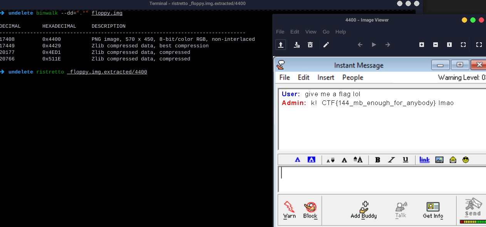

---
tags:
  - BSidesSF
  - BSidesSF-2024
  - Forensics
---

این چلنج ساده ترین چلنج بود =))

یه binwalk ساده میتونست فلگ رو در بیاره

```bash
binwalk --dd=".*" floppy.img
```



---
??? success "FLAG :triangular_flag_on_post:"
    <div dir="ltr">`CTF{144_mb_enough_for_anybody}`</div>


!!! نویسنده
    [SafaSafari](https://twitter.com/SafaSafari3)

