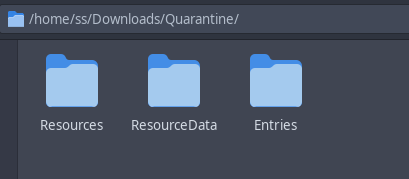
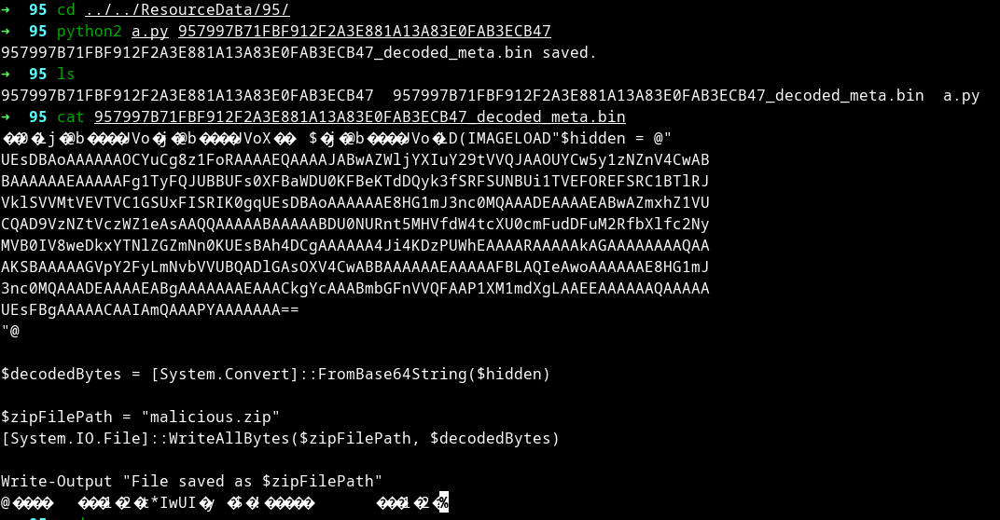
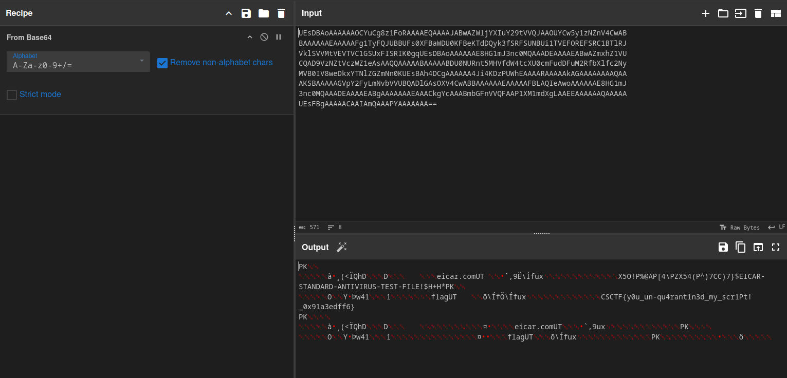
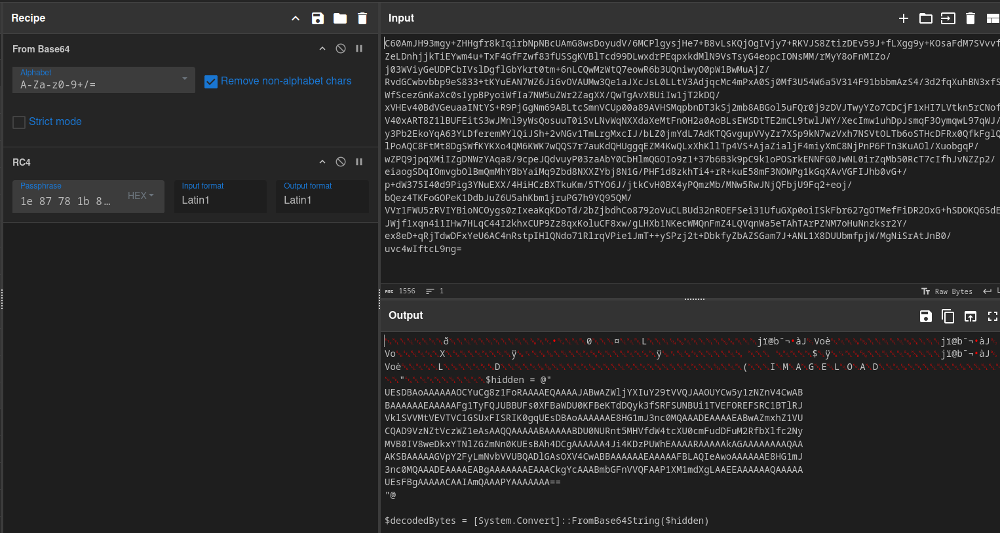

---
tags:
  - CyberSpace
  - CyberSpace-2024
  - Forensics
  - Defender
  - Quarantine
---

بعد از unzip کردن فایل با این فولدر ها مواجه میشیم

با یه سرچ ساده در گوگل و دیدن اسم فولدر اصلی به این پی میبریم که این مربوط به طرز ذخیره سازی فایل های قرنطینه تو ویندوز دیفندر مایکروسافت هست

پس میگردیم دنبال ابزار دکریپت این فایل ها و با این سورس مواجه میشیم

[windows_defender_unquarantine.py](https://gist.github.com/OALabs/30346d78a1fccf59d6bfafab42fbee5e)

بعد از اجرای موفق اسکریپت با python2

و بعد از دیکد کردن بیس ۶۴ با فایل zip مواجه میشیم که حتی نیازی با unzip کردنش نداریم و فلگ رو دودستی بهمون تقدیم میکنه =))

البته میتونستیم از سایبرشف هم برای دکریپت کردن استفاده کنیم

??? success "FLAG :triangular_flag_on_post:"
    
`CSCTF{y0u_un-qu4rant1n3d_my_scr1Pt!_0x91a3edff6}`

---
!!! نویسنده
    [SafaSafari](https://twitter.com/SafaSafari3)

