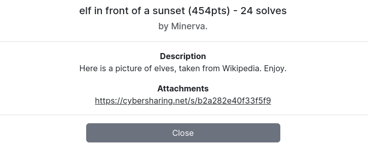
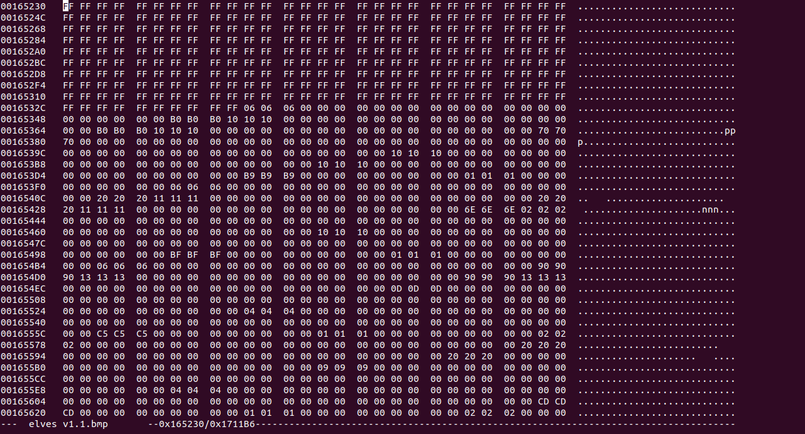
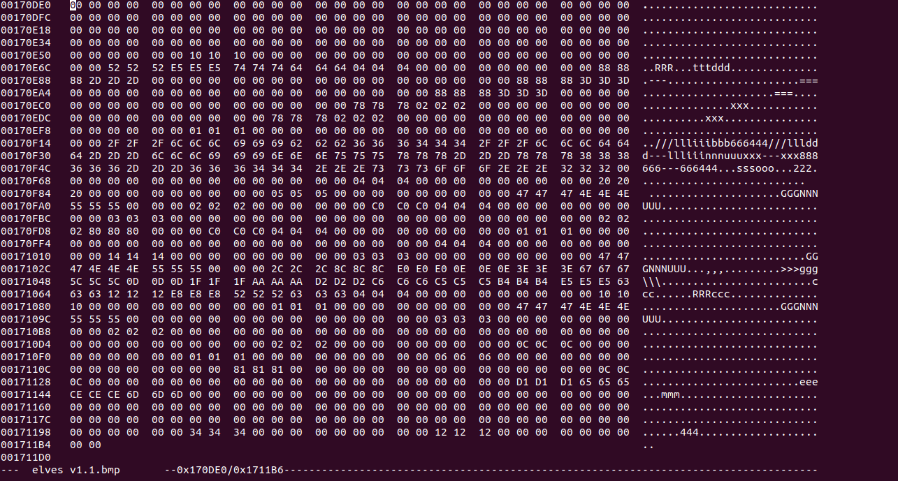
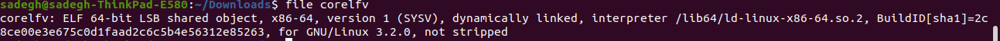

---
tags:
  - ImaginaryCTF
  - ImaginaryCTF-2024
  - Forensics
  - elf
---

# elf in front of a sunset
---

<center>

</center>

در این چلنج یه [عکس](./elves.bmp) از الف‌ها (موجودات تخیلی) در اختیار ما گذاشته شده. با باز کردن اون و نگاه کردنش و آزمایش‌های ساده با ابزارهایی مثل strings و exiftool و stegsolver و zsteg، دیتای خیلی مهمی پیدا نمیکنیم ولی یکسری هینت به دست میاریم. مثلا  وجود کلمات کلیدی مثل GGGNNNUUU و EEELLLFFF در خروجی strings این عکس و این اخطار 67056 bytes of extra data after image در خروجی zsteg نشون می‌ده که آثاری از یک فایل elf در انتهای این فایل وجود داره. بنابراین فایل را در یک ادیتور hex باز می‌کنیم و به صورت دستی بررسی می‌کنیم.

<center>

</center>

<center>

</center>

میبینیم که آخرای فایل یه تعداد زیادی بایت FF وجود داره و بعد از اون هم یکسری بایت اضافی و غیر مشابه به bmp وجود داره که مشکوک به یک فایل elf میتونن باشن. آفست اولین بایت غیر FF را در انتهای عکس از ادیتور پیدا می‌کنیم و سپس با کمک دستور dd از اون آفست تا انتها همه‌ی بایت‌ها رو داخل یک فایل جدید به نام im.data می‌ریزیم.
```sh
dd if=out1.data bs=1 skip=$(python -c "print(0x165336)") of=im.data
```
همچنین میتونیم مشاهده کنیم که بایت‌ها در این بخش، هر کدوم ۳ بار تکرار شدن. پس یه اسکریپت پایتون میزنیم که این رو درست کنه و از هر ۳ بایت فقط یکی رو نگه داره.
```python
def filter_bytes(input_filename, output_filename):
    with open(input_filename, 'rb') as infile:
        binary_data = infile.read()
    
    filtered_data = bytearray()
    
    for i in range(len(binary_data)):
        if i % 3 == 0:
            filtered_data.append(binary_data[i])
    
    with open(output_filename, 'wb') as outfile:
        outfile.write(filtered_data)

input_filename = 'im.data'
output_filename = 'out.data'
filter_bytes(input_filename, output_filename)
```
حالا فایل out.data رو که نگاه می‌کنیم، یکسری ساختارهای آشنا از فایل elf می‌توینم ببینیم ولی مشخصا نادرست هستن و به یک الگویی به هم ریخته شدن. با مطالعه بیشتر و تطابق دادن فایل با ساختار elf و همینطور پیدا کردن طول تقریبی بخش‌هایی که دیتای درستی دارن به صورت متوالی، میتونیم بفهمیم که این فایل 16256 بایتی به ۱۶ قسمت برابر به طول 1016 بایت تقسیم شده و همچنین ترتیب قرارگیری این ۱۶ بخش دقیقا برعکس ساختار اصلی elf هست. پس با یک اسکریپت پایتون دیگه، فایل out.data رو به ۱۶ بخش مساوی تقسیم می‌کنیم و ترتیبشونو برعکس می‌کنیم و داخل یه فایل جدید به نام corelfv می‌ریزیم. میبینیم که حالا این فایل یک elf ولید و درست هست.

<center>

</center>

حالا این فایل باینری رو دیکامپایل می‌کنیم و خروجی زیر رو به دست میاریم:

```C
#include <stdio.h>
#include <string.h>
#include <stdlib.h>

int main(int argc, const char **argv, const char **envp)
{
  unsigned long v3;
  unsigned int v4;
  char v6;
  int i;
  char s[40];

  strcpy(s, "_{f2isfsatutflwa_nh2}__asitib1leefwcuk");
  srand(0x123123Du);
  for ( i = 0; i < strlen(s); ++i )
  {
    v6 = s[i];
    v3 = rand();
    v4 = strlen(s);
    s[i] = s[(int)(v3 % v4)];
    s[(int)(v3 % v4)] = v6;
  }
  puts(s);
  return 0;
}

int displayhex(char *a1)
{
  int i;

  for ( i = 0; i < strlen(a1); ++i )
    printf("%2x ", (unsigned int)a1[i]);
  return putchar(10);
}
```

با اجرای این برنامه خروجی به درد بخوری نمیگیریم و همچین چیزی بهمون میده:
`aisb_wfhuwi2sf__af1ek}iuttfa_lens2t{lc`
که شبیه فلگ هست ولی به هم ریختس. این کد در واقع قرار نیست فلگ رو مستقیم به ما بده و هینت میده که چجوری فلگ تولید شده. در واقع فلگ اصلی ترتیب حروفش با جابجایی‌های رندومی که داخل کد میبینید و با سید رندوم 0x123123Du به هم ریخته و تبدیل به اون رشته‌ای که توی کد می‌بینید شده. حالا کافیه ما دقیقا برعکس همون کارو بکنیم. یعنی همون اعدادو برای جابجایی با همون سید رندوم تولید کنیم و بعد به ترتیب بر عکس روی رشته داخل کد اعمال کنیم تا به فلگ برسیم. کد زیر این کار رو برامون انجام میده. ناگفته نمونه این ایده بعد از کلی آزمون و خطا و بروت‌فورس ناموفق روی سید رندوم، توسط صفا صفری عزیز مطرح شد و سوال حل شد و این کد هم متعلق به اونه.

```python
import ctypes

libc = ctypes.CDLL("/usr/lib/libc.so.6")
libc.srand.argtypes = [ctypes.c_uint]
libc.rand.restype = ctypes.c_int

def decode(s):
    s = list(s)
    libc.srand(0x123123D)
    
    swaps = []
    for i in range(len(s)):
        v3 = libc.rand()
        v4 = len(s)
        j = v3 % v4
        swaps.append((i, j))
    
    for i, j in reversed(swaps):
        s[i], s[j] = s[j], s[i]
    
    return ''.join(s)

original = "_{f2isfsatutflwa_nh2}__asitib1leefwcuk"
decoded = decode(original)

print("Original:", original)
print("Decoded: ", decoded)
```

نهایتا بعد از ران کد به فلگ نهایی می‌رسیم.


---
??? success "FLAG :triangular_flag_on_post:"
    <div dir="ltr">`ictf{elf_waifus_best_waifus_2h12lntka}`</div>


!!! نویسنده
    [Sadegh](https://github.com/sadegh-majidi)

