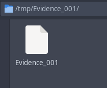
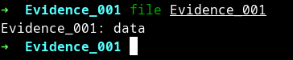
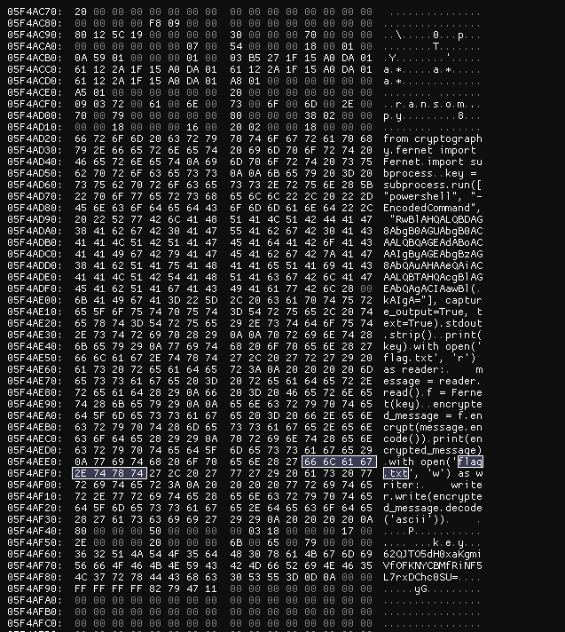
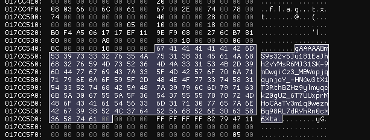
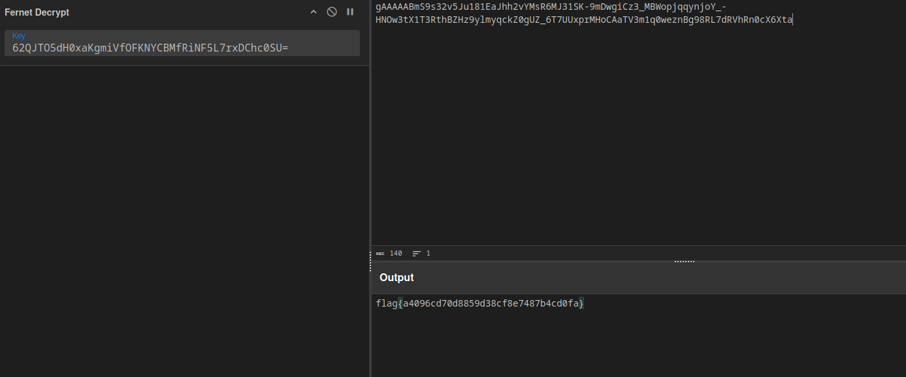

---
tags:
  - NahamCon
  - NahamCon-2024
  - Forensics
  - AD1
  - MFT
---



با یه فایل بدون پسوند روبرو ایم =))

خبر بد این که حتی file هم تشخیص نمیده این چه کوفتیه 😂



خوب، راهی نداریم جز این که بریم سراغ hex editor



بعد از گشتن دنبال کلمه کلیدی flag.txt میبینیم که این اسم تو یه فایل پایتونی استفاده شده

```python
from cryptography.fernet import Fernet
import subprocess

key = subprocess.run(["powershell", "-EncodedCommand", "RwBlAHQALQBDAG8AbgB0AGUAbgB0ACAALQBQAGEAdABoACAAIgByAGEAbgBzAG8AbQAuAHAAeQAiACAALQBTAHQAcgBlAGEAbQAgACIAawBlAHkAIgA="], capture_output=True, text=True).stdout.strip()

print(key)
with open('flag.txt', 'r') as reader:
    message = reader.read()
f = Fernet(key)

encrypted_message = f.encrypt(message.encode())
print(encrypted_message)
with open('flag.txt', 'w') as writer:
    writer.write(encrypted_message.decode('ascii'))
```

با دیکد کردن کامند لاینی که وارد پاورشل شده، به همچین دستوری میرسیم

```Get-Content -Path "ransom.py" -Stream "key"```

که به پاورشل میگه بره و از تو MFT قسمت استریم key رو بخونه و ریترن کنه

اگه دوباره به عکس بالا نگاه کنید، در آخر عکس، این استریم رو میبینید که این زیر میزارم

```62QJTO5dH0xaKgmiVfOFKNYCBMfRiNF5L7rxDChc0SU=```

الان رمز اینکریپشن Fernet رو داریم و فقط مونده خود متن انکریپت شده

همه متن های cipher ای که با Fernet انکریپت شدن، با gAAAAA شروع میشن و این میتونه راهنمای خوبی باشه برای پیدا کردن فایل



اما خوب یه راه اصولی تر هم هست، اونم این که کلمه flag.txt رو یه بار به بصورت utf-16 سرچ کنیم


بعدش هم یه دکریپت سادس که با کمک [سایبرشف](https://gchq.github.io/CyberChef/#recipe=Fernet_Decrypt('62QJTO5dH0xaKgmiVfOFKNYCBMfRiNF5L7rxDChc0SU')&input=Z0FBQUFBQm1TOXMzMnY1SnUxODFFYUpoaDJ2WU1zUjZNSjMxU0stOW1Ed2dpQ3ozX01CV29wanFxeW5qb1lfLUhOT3czdFgxVDNSdGhCWkh6OXlsbXlxY2taMGdVWl82VDdVVXhwck1Ib0NBYVRWM20xcTB3ZXpuQmc5OFJMN2RSVmhSbjBjWDZYdGE) انجام میدیم



??? success "FLAG :triangular_flag_on_post:"
    <div dir="ltr">`flag{a4096cd70d8859d38cf8e7487b4cd0fa}`</div>
---
!!! نویسنده
    [SafaSafari](https://twitter.com/SafaSafari3)

