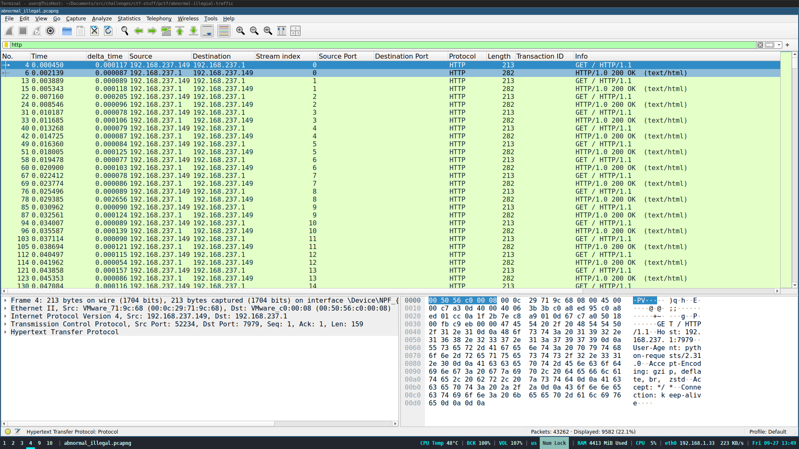
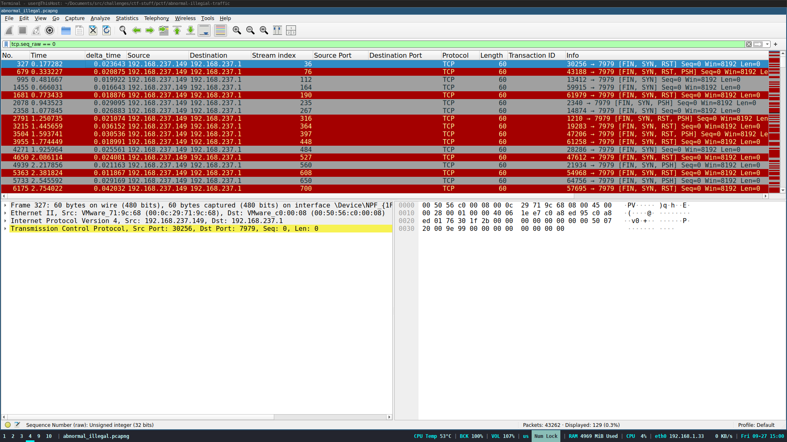

---
tags:
  - PatriotCTF
  - PatriotCTF-2024
  - Forensics
  - pcap
  - steganography
  - wireshark
  - tshark
  - TCP
  - IP
---

!!! note "توضیحات چلنج"
    <div style="text-align: left">
            We have recently discovered tons of traffic leaving our network. We have reason to believe they are using an abnormal method. Can you figure out what data they are exfiltrating?
    </div>
یک فایل
[packet capture](https://en.wikipedia.org/wiki/Pcap) 
بهمون داده شده که باید فلگ رو از داخلش در بیاریم

اول به
[protocol hierarchy statistics](https://www.wireshark.org/docs/wsug_html_chunked/ChStatHierarchy.html)
سر زدم که ببینیم  چی گذشته داخل این پکت کپچر

{ style="display: block; margin: 0 auto" }

به نسبت چلنجای قبلی که دیدم تعداد پروتکل کمی دیده میشه

اول فیلتر کردم روی
[http](https://en.wikipedia.org/wiki/HTTP)

{ style="display: block; margin: 0 auto" }

اینجا تعداد زیادی
http request
میبینیم که هیچ فرقی با هم ندارن

تنها دلیلی که امکان داره کسی بخواد همچین کاری کنه اینه که به روشی دیتا منتقل کنه که در حالت عادی دیده نشه 

!!! inline info end ""
	یک نکته مهم اینه که این 
	http request 
	ها از سمت سرور جواب گرفتن، 
	یعنی تا اینجا که میبینیم همه چیز به نظر استاندارد میاد (ولی به این دلیل نیست داخلش چیزی قایم نشده باشه)

	دونستن همین موضوع کلی از فیلد های هدر های مختلف رو از محدوده ای که دیتا میتونه اینکد شده باشه حذف میکنه 
 

هگز دامپ 
http request 
ها رو با هم مقایسه کردم و  این فیلد ها تغییر میکردن
!!! failure ""
	**`header checksum`**
		:احتمالش کمه که دیتا توش باشه چون از روی کل هدر محاسبه میشه

!!! failure ""
	**`tcp.acknowledge number`**:
	اگه دیتا بخواد از سمت کلاینت اینکد بشه داخل این فیلد کانکشن به هم میریزه

!!! failure ""
	**`tcp.srcport`**:
	از اونجایی که این فیلد در طول زمان پکت کپچر در حال افزایشه (الگو داره) میتونیم بگیم اینم دستکاری نشده

!!! success ""
	**`tcp.sequence number`**:
	احتمالش هست که دیتا داشته باشه ولی فقط داخل 
	[tcp syn request](https://www.geeksforgeeks.org/tcp-3-way-handshake-process/)
	ها
!!! success ""
	[**`IP.identification`**](https://datatracker.ietf.org/doc/html/rfc6864):
	اینم احتمال داره که دیتا داشته باشه

دو تا فیلد
IP.identification
و
tcp.sequence number
رو بررسی کردم از نظر اینکه حاوی فایل باشن یا
ascii art

!!! info inline end ""
	روش چک کردن ascii art من این بود که عدد هارو باینری میکردم و به الگو ها دقت میکردم اگه توش الگوی خاصی میدیدم با `ـ`  عدد هارو فاصله میدادم که ابعاد تصویر رو عوض کنم 

به نتیجه نرسیدم

مورد بعدی که توجهم رو جلب کرد 0 بودن 
tcp.sequence number 
بعضی پکت ها بود

اینو وقتی متوجه شدم که داشتم چک میکردم که  این فیلد ascii art داره یا نه

```
$ tshark -r abnormal_illegal.pcapng -Y "tcp.dstport==7979 && \
tcp.flags.syn==1" -T fields -e tcp.seq_raw | head -n 38 | tr $'\n' , 
```

```
...
,2013534552,3591265399,2745860309,4079469521,3520377327,
1580296753,0,2318756352, 
```

!!! info inline end ""
	دستگاه ها 
	tcp.sequence number 
	رو در ابتدای کانکشن رندوم در نظر میگیرن و برای پکت های بعدی طبق استاندارد tcp این عدد  افزایش پیدا میکنه

 احتمال اینکه
 tcp.sequence number 
 صفر باشه و اونم ۱۲۸ بار تکرار شه  تقریبا وجود نداره
```
$ tshark -r abnormal_illegal.pcapng -Y "tcp.dstport==7979 && \
tcp.flags.syn==1" -T fields -e tcp.seq_raw | grep -E "^0$" | wc -l
>>>128
```

اول برام عجیب بود که دقیقا 128 باشه تعداد این پکت ها ولی توجهی نکردم

داخل وایرشارک فیلتر کردم روی
`tcp.seq_raw == 0`

{ style="display: block; margin: 0 auto" }

از همون اول ترکیب فلگ های ست شده برام عجیب بود
??? info "چرا؟"
	طبق پروتکل tcp فعال بودن هر فلگ به معنی خاصی هست
	
	و فعال بودن بعضی با هم اصلا منطقی نیست و استفاده هم نمیشه
	
	مثلا فعال بودن فلگ های syn و fin باهم که معنیش اینه که دستگاه هم داره درخواست کانکت شدن میکنه و هم  میخواد که کانکشن رو ببنده


**ایده هایی که تست کردم و جواب نگرفتم**:

۱ـ هر ترکیب از فلگ ها یک استریم دیتا هست که فلگ توی یکی از اوناست، حالا این استریم دیتا میتونه هر کدوم از فیلدایی باشه که قبلا بررسیشون کرده بودیم و یا حتی فاصله زمانی بین پکت ها

در کل ۴ تا ترکیب
 tcp.flag 
 داخل فیلتر
`tcp.seq_raw==0`
 وجود داشت 

- 0x003 (fin, syn)
- 0x007 (fin, syn, rst)
- 0x00b (fin, syn, push)
- 0x00f  (fin, syn, rst, push)


??? info "تصویر ذهنیم  از این ایده"

	**اگه هر استریم دیتا داخل IP.id اینکد شده باشه**
	```python
	filter: tcp.seq_raw == 0 && tcp.flags == 0x003 #(fin, syn)

	data_1= []
	for packet in pcap:
		data_1.append(packet.IP.id)
	```

	```python
	filter: tcp.seq_raw == 0 && tcp.flags == 0x007 #(fin, syn, rst)

	data_2= []
	for packet in pcap:
		data_2.append(packet.IP.id)
	```

	```python
	filter: tcp.seq_raw == 0 && tcp.flags == 0x00b #(fin, syn, push)

	data_3= []
	for packet in pcap:
		data_3.append(packet.IP.id)
	```

	```python
	filter: tcp.seq_raw == 0 && tcp.flags == 0x00f #(fin, syn, rst, push)

	data_4= []
	for packet in pcap:
		data_4.append(packet.IP.id)
	```

	**اگه هر استریم دیتا داخل tcp.seq_raw اینکد شده باشه**

	```python
	filter: tcp.seq_raw == 0 && tcp.flags == 0x003 #(fin, syn)

	data_1= []
	for packet in pcap:
		data_1.append(packet.tcp.seq_raw)
	```

	```python
	filter: tcp.seq_raw == 0 && tcp.flags == 0x007 #(fin, syn, rst)

	data_2= []
	for packet in pcap:
		data_2.append(packet.tcp.seq_raw)
	```

	```python
	filter: tcp.seq_raw == 0 && tcp.flags == 0x00b #(fin, syn, push)

	data_3= []
	for packet in pcap:
		data_3.append(packet.tcp.seq_raw)
	```

	```python
	filter: tcp.seq_raw == 0 && tcp.flags == 0x00f #(fin, syn, rst, push)

	data_4= []
	for packet in pcap:
		data_4.append(packet.tcp.seq_raw)
	```

۲ـ تعداد کانکشن درست بین کانکشن های بد دیتا داره .یعنی مثلا ۳۰ بار درخواست شده از سرور و یک بار پکت بد فرستاده شده که در این حالت ۳۰ دیتای ماست
??? info "تصویر ذهنیم  از این ایده"
	```python
	filter: tcp.dstport==7979 && tcp.seq == 0

	data = []
	current_byte=0

	for packet in pcap:
		if packet.tcp.seq_raw == 0:
			data.append(current_byte)
			current_byte = 0
			continue
		current_byte += 1
	```

۳ـ شاید پکت های بد ابتدا و انتهای استریم دیتا رو دارن نشون میدن یعنی اول پکت بد بعد دیتای اینکد شده داخل یکی از فیلد هایی که بررسی کردیم و بعد پکت بد
??? info "تصویر ذهنیم  از این ایده"
	```python
	filter: tcp.dstport==7979 && tcp.seq == 0
	
	data_streams : list[list[int]]

	stream_number = 0
	for packet in pcap:
		if packet.tcp.seq_raw == 0:
			stream_number += 1
			continue

		data_streams[stream_number].append(packet.tcp.seq_raw)
	```

۴ـ این یکی خیلی جالب بود برای  همین مفصل تر میگم

شاید با یک الگوریتم غیر عادی داخل 
tcp.sequence number 
پکت هایی که به
http request
عادی مربوط هستن دیتا قایم شده
(همه ی صحبت های این ایده در مورد پکت های فیلتر
`tcp.dstport==7979 && tcp.flags.syn==1`
هستن
)
??? info "تصویر ذهنیم  از این ایده"
	```python
	filter: tcp.dstport==7979 && tcp.flags.syn==1
	
	encode_sequence = [1,2,4,8,16]
	data = []

	for i in encode_sequence:
		data.append(
			pcap[i].tcp.seq_raw % 100)
	```

مثلا دیدم که دو رقم کم ارزش tcp.sequence number پکت اول دقیقا کد اسکی حرف اول فلگ یعنی p رو داره پس شاید اگه یک دنباله از اعداد پیدا کنم همشون داخل قسمت مشخصی کاراکتر فلگ داشته باشن

به عنوان مثال:

اگه فرض کنیم واقعا فرض من درست بود و فلگ اینطور به دست میومد و دنباله شماره  پکت هایی که فلگ رو دارن این میبود

‍`2x + c`

که c شماره اولین پکت بده که ۲ رقم کم ارزش tcp.sequence number  اون کاراکتر فلگ مارو داره و x  شماره اون پکت در دنباله

در این صورت اگه دو رقم اخر tcp.sequence number  پکت های داخل فیلتر
`tcp.dstport==7979 && tcp.flags.syn==1 && tcp.seq==0`
و شماره های به ترتیب 

‍`c, 2+c, 4+c, ...`

رو کنار هم میزاشتیم فلگ به دست میومد

از اون جایی که فرمت فلگ رو میدونستم سعی کردم ۴ عدد اول رو پیدا کنم که ببینم توش الگوریتم ثابتی میبینم یا نه

!!! inline failure end ""
	فکر میکردم PCTF هست در حالی که pctf بود و این رو وقتی فهمیدم که رایتاپ رو دیدم 

شماره پکت هایی که به ترتیب tcp.seq_raw % 100 اونا کد اسکی PCTF میشد: 
	```
	0, 4, 101, 732 
	```

الگویی بینشون پیدا نکردم

بعد مسابقه که  رایتاپش منتشر شد متوجه شدم که فلگ چلنج داخل tcp.flags.push  و  tcp.flags.reset   به صورت تکست عادی اینکد شده بودن

!!! success "اکسترکت کردن بیت های دیتا و تبدیل به کاراکتر"
	‍‍‍```
	$tshark -r abnormal_illegal.pcapng -Y "tcp.flags.syn==1 and tcp.flags.fin==1" -Tfields -e tcp.flags.push -e tcp.flags.reset | sed "s/True/1/g;s/False/0/g" | tr -cd "[10]" | perl -lpe '$_=pack"B*", $_'
	```


??? success "FLAG :triangular_flag_on_post:"
    <div dir="ltr">`pctf{abnormal_flags_are_illegal}`</div>
---
!!! نویسنده
    [Ali](https://github.com/AliGhaffarian)

