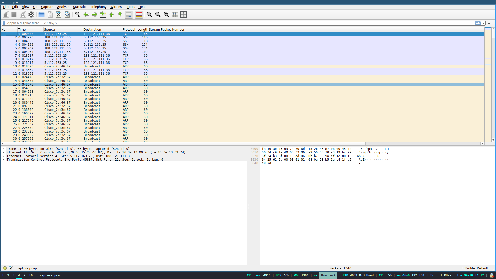
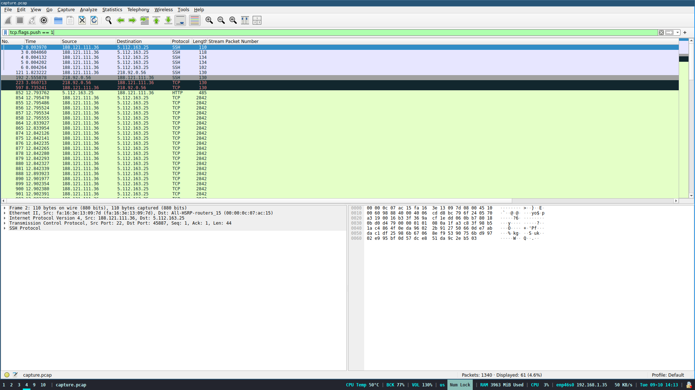
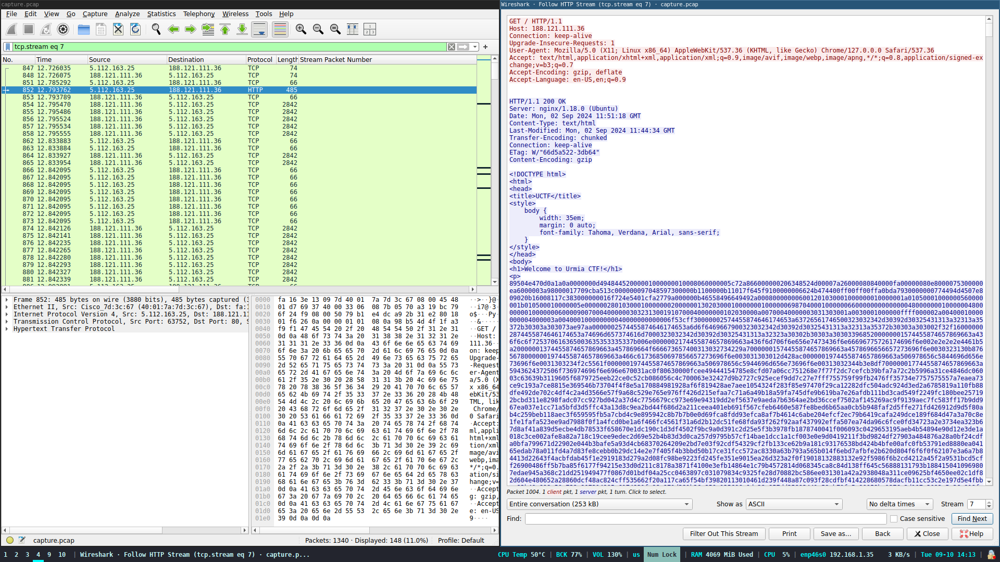
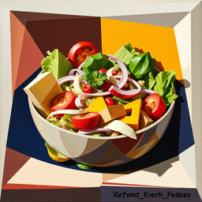

اسم چلنج:
Catch Me If You Can!

توضیحات:

>In the bustling bazaars of ancient Persia, where merchants traded silk and >spices, a secret message has been intercepted. Legend >has it that this message holds the key to discovering the whereabouts of a hidden treasure deep within the ancient emperor of Persia. However, the message has been cunningly encrypted and is hidden within a sea of network traffic. Can you decode it before >the secret slips through your fingers?

یک فایل [پکت کپچر](https://en.wikipedia.org/wiki/Pcap) بهمون داده شده که باید فلگ رو از داخلش در بیاریم

فایل رو اول که باز کردم با خودم گفتم این همه پیام [آرپ](https://en.wikipedia.org/wiki/Address_Resolution_Protocol) زیادیه برای یه شبکه، اونم پشت سر هم

 با این که مشکوک بود اول رفتم سراغ پیدا کردن پیام هایی که مخفی نشدن و اگه به جایی نرسیدم برگردم سر آرپ

همیشه اول فیلتر میزنم روی [فلگ پوش تی سی پی](https://datatracker.ietf.org/doc/html/rfc9293#section-3.1-6.14.2.10.1) ببینم پیامی هست که رمز نگاری نشده باشه

به نظر میاد چیزی پیدا کردیم

[http](https://en.wikipedia.org/wiki/HTTP)
نشونه خوبیه

[follow http stream](https://www.wireshark.org/docs/wsug_html_chunked/ChAdvFollowStreamSection.html)
کردم

به نظر میاد که فایل داخل ریسپانس هستش

فایل رو که سیو کردم و روش کامند 
file
روی زدم دیدم عکسه
>$ file a.png 
>a.png: PNG image data, 256 x 256, 8-bit/color RGBA, non-interlaced

بازش کردم 

پایین سمت راست عکس نوشته بی معنی میبینیم که اگه به الگوش دقت کنیم متوجه میشیم که احتمالا از سزار استفاده شده برای رمز نگاری این متن

چون

۱.حرف اول کلمه ها بزرگه 

۲.شبیه متن عادی هستش که صرفا معنی نمیده به این مظور که چینش و تکرار حروف اشناس

کلید از ۱ تا ۲۸ سزار رو تست کردم

و با کلید ۲۲ به متن زیر رسیدم

Tabriz_Grand_Bazaar

داخل فرمت 
UCTF{}
گذاشتم و قبول شد

---
??? success "FLAG :triangular_flag_on_post:"
    
`UCTF{Tabriz_Grand_Bazaar}`

!!! نویسنده
    [Ali](https://github.com/AliGhaffarian)

