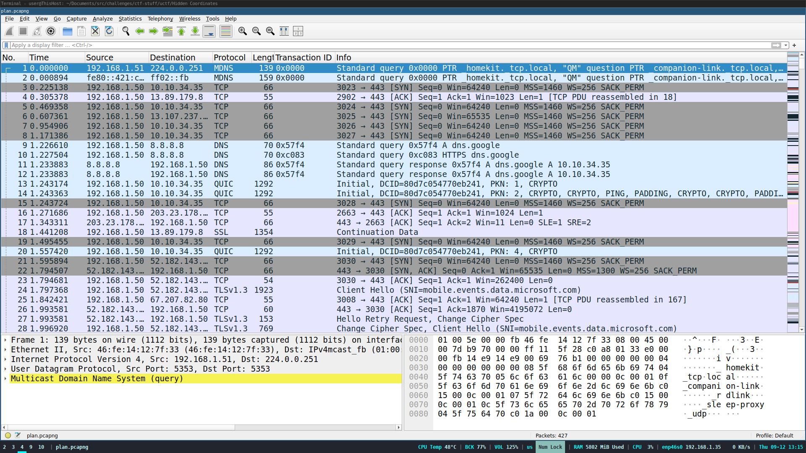
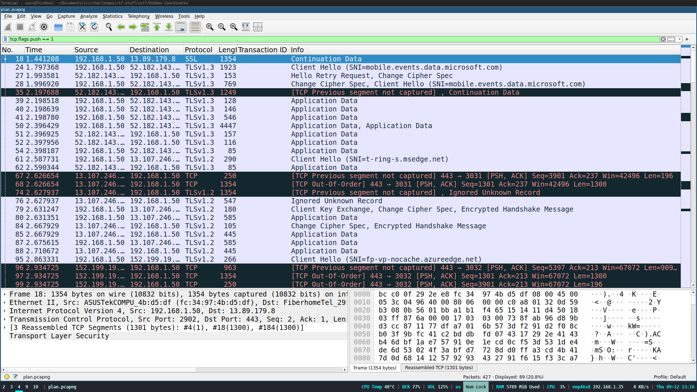
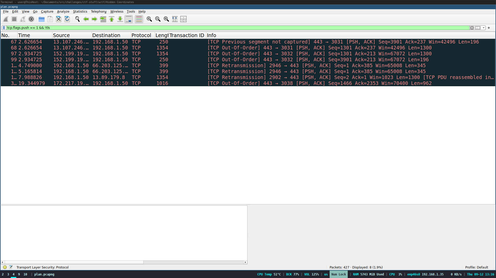
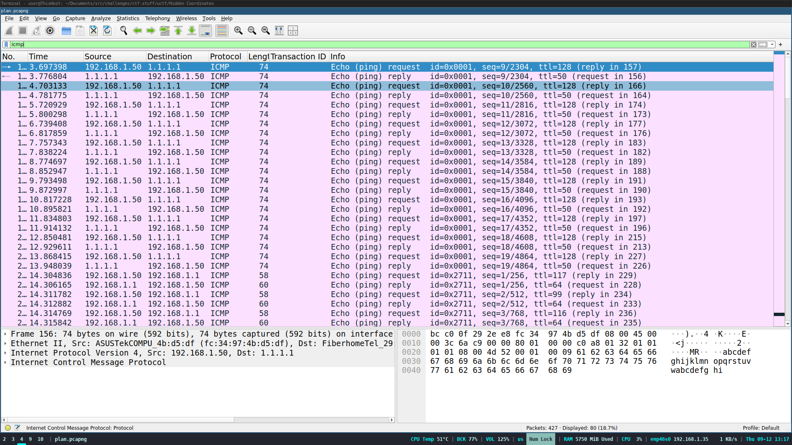
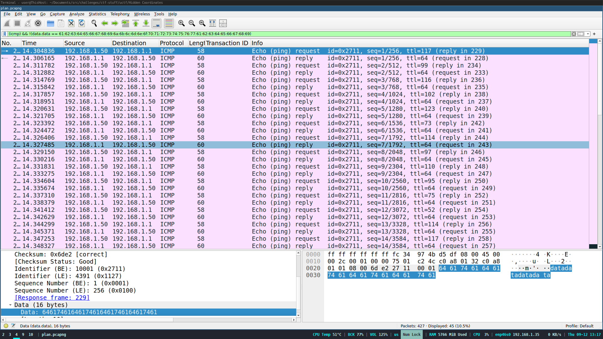

---
tags:
  - Urmia-CTF
  - Urmia-CTF-2024
  - Forensics
  - pcap
  - steganography
  - wireshark
  - scapy
  - ICMP
---


!!! note "توضیحات چلنج"
    <div style="text-align: left">
    Jack Sparrow may be searching for treasure, but he’ll never find the map if he can't decipher the signals. Buried within a seemingly ordinary pcap file are hidden details encoded in ICMP packets. Unearth the secrets concealed in these packets to reveal the flag.
    </div>
یک فایل
[packet capture](https://en.wikipedia.org/wiki/Pcap) 
بهمون داده شده که باید فلگ رو از داخلش در بیاریم

{ style="display: block; margin: 0 auto" }

طبق گفته چلنج احتمالا فلگ داخل پیام های 
[ICMP](https://en.wikipedia.org/wiki/Internet_Control_Message_Protocol)
مخفی شده ،ولی بهتره به استراتژی همیشگی بچسبیم و اول ببینیم پیامی هست که رمز نگاری و مخفی نشده باشه

مثل همیشه اول روی  [فلگ پوش TCP](https://datatracker.ietf.org/doc/html/rfc9293#section-3.1-6.14.2.10.1)
فیلتر میزاریم که ببینیم چی دستمون میاد

{ style="display: block; margin: 0 auto" }

کلی پیام  [TLS](https://en.wikipedia.org/wiki/Transport_Layer_Security) داریم میبینیم که فعلا استفاده ای برامون ندارن پس فیلترشون میکنیم که نبینیمشون

{ style="display: block; margin: 0 auto" }

خب مثل اینکه از 
`TCP`
چیزی در نمیاد فعلا

خب بریم سر 
`ICMP`
ببینیم چیزی دستمون رو میگیره یا نه

{ style="display: block; margin: 0 auto" }

!!! info inline end "`ICMP payload`"
	یکی از قسمت هایی که خیلی خیلی مهمه 
	`payload`
	داخل 
	`ICMP`
	هست که برای 
	[tunneling](https://en.wikipedia.org/wiki/ICMP_tunnel)
	 و در کل انتقال دیتا استفاده استفاده میشه چون سادس

 خب ما که به پکت های 
`ICMP` 
نگاه میکنیم میبینیم کلا دو جور 
`payload` دارن این پیاما
	
- `datadatadatadata`
	
- `abcdefghijklmnopqrstuvwabcdefghi`
	
برنامه هایی که 
پینگ
میگیرن معمولا اگه ازشون بخوای که یسری دیتا هم بفرستن که پینگ کردن یکم سنگین تر شه میان به ترتیب حروف الفبای انگلیسی میچینن 
 `payload`
رو
	
پس میتونیم با قاطعیت بگیم اونایی که 
 `payload` 
دومی رو دارن متعلق به نرم افزار پینگ استانداردن
	 
با فیلتر کردن
`ICMP`
هایی که  پیلود
 `abcdefghijklmnopqrstuvwabcdefghi`
 رو دارن رو حذف میکنیم
	   
{ style="display: block; margin: 0 auto" }
	   
خب اگه درست جلو اومده باشیم فلگ جاهای محدودی میتونه باشه
	   
باید بگردیم داخل فیلد های مختلف پکت که دیتا ممکنه داخلشون مخفی شده باشه

!!! failure ""
	`ICMP sequence number` 
	دیتایی نداشت

!!! failure ""
	`ICMP checksum`
	هم نمیتونه مهم باشه چون مقدار درستی داره

	تصور اینکه اینقدر خوب پکت رو درست کرده باشن که از 
	 `checksum` 
	فلگ در بیاد دور از انتظاره

فیلد 
 `ttl`
از هدر
`IP`
داخل پیام هایی که از سمت 192.168.1.50 میاد خیلی مشکوکه
		
ولی قبلش باید یه مقدمه بهتون بگم  از `ttl`
??? TTL
	 `ttl`
	یک فیلد داخل 
	 [IPv4](https://en.wikipedia.org/wiki/IPv4)
	هست که نشون میده پکت حق داره جند بار توسط روتر 
	 [forward](https://www.educative.io/answers/what-is-the-difference-between-routing-and-forwarding)
	شه

	حواستون باشه این با 
	[forward	کردن توی سویچ های link layer](https://en.wikipedia.org/wiki/Multilayer_switch#Layer-2_switching)
	فرق داره

	و هر دفعه که 
	 `forward` 
	میشه 
	 `router` 
	یکی از ttl  پکت کم میکنه


	یسری 
	 `router`
	ها به دلایل امنیتی اینکار رو نمیکنن
	
	وقتی به صفر برسه
	 `router` 
	اون پکت رو
	 `drop`
	میکنه

	
	تقریبا همیشه دستگاه فرستنده این فیلد رو یکی از اینا ست میکنه
	
	64, 128, 255 


دستگاه 192.168.1.50 مقدار ttl رو به صورت استاندارد ست نمیکنه	 

از کجا میدونیم؟

چون پکت کپجر روی این دستگاه انجام شده و  باید یکی از اعداد 255،128،64 رو میدیدیم داخل
 `ttl`
 
از کجا میدونیم پکت کپچر روی 192.168.1.50 انجام شده؟

وقتی به پیام های عادی که از سمت 192.168.1.50 هستن نگاه میکنیم میبینیم که ttl=128 دارن یعنی هنوز یکبار هم
 `forward` 
	نشدن
	
پس ما 192.168.1.50 هستیم
	
 فرمت فلگ
 `uctf{}`
 هست و
 `ttl`
 پیام اول فیلتر شده 117 که مطابق کد اسکی u هست که میشه کاراکتر اول فلگ
	
پیام هایی که فیلتر کردیم رو با وایرشارک
`export` میکنیم و با این برنامه فلگ رو به درست میاریم
	
```python
from scapy.all import *
pcap = rdpcap("icmp.pcapng")
for packet in pcap:
		 #if is not icmp echo request, skip the packet
     if packet[ICMP].type != 8:
         continue
     #print ttl of IP layer
     print(chr(packet[IP].ttl), end='')
```

??? success "FLAG :triangular_flag_on_post:"
    <div>`uctf{Iran_K4run_River}`</div>

!!! نویسنده
    [Ali](https://github.com/AliGhaffarian)


