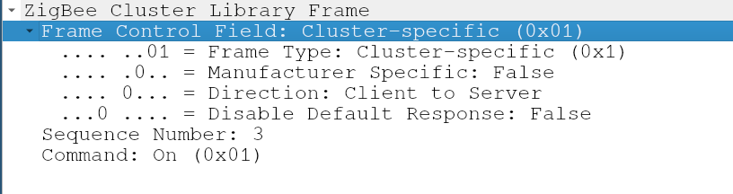

# Writeup of the Why2025CTF/enlighentment

این چالش در مورد آنالیز ترافیک اینترنت اشیا بود که من تجربه قبلی در این مورد نداشتم. توی این رایتاپ تلاشمو کردم که تجربم در مورد اولین آنالیز ترافیک اینترنت اشیا به اشتراک بزارم ( و در همین حین داشتم در موردش یادمیگرفتم).  
نکته: قسمتی که پروتکل 
ZigBee 
رو توضیح میدم به شدت از [این پست](https://www.exploitsecurity.io/post/zigbee-protocol) 
الهام گرفته ولی همچنان ممکنه حاوی اطلاعات اشتباه باشه.  
نکته۲: طراح چلنج هیچ تلاشی برای گول زدن وایرشارک نکرد، و همین باعث شد که بتونم با اعتماد کامل به تفسیر وایرشارک این چلنج رو حل کنم. اگه اینطور نبود باید پروتکل رو خیلی عمیق تر یادمیگرفتم
## توضیحات چالش

`My lights have been acting weird lately. Can you shed some light on what's going on?`  

- چیز هایی که بهمون داده شده  
	- کلیدی که ترافیک باهاش رمزنگاری شده: `d73581c3485ff294a9c70b840203fcc7`
	- فایل پکچر ترافیک  

وقتی که فایل pcap رو باز کردم با ترافیکی مواجه شدم که tcp/ip نبود.  

<center>

</center>

وقتی که به ترافیک نگاه کردم اصلا نفهمیدم که معنی هر پکت چی میتونه باشه، در مورد پروتکل سرچ کردم و [این پست](https://www.exploitsecurity.io/post/zigbee-protocol)
رو پیدا کردم که ازش خیلی چیزا یاد گرفتم، البته همش رو نخوندم.  
## پروتکل ZigBee
تا جایی که متوجه شدم از همون پستی که گفتم، ZigBee برای ارتباط دستگاه های IoT که باتری ضعیفی دارن استفاده میشه. این پروتکل دستگاه های داخل شبکه رو به سه دسته زیر تقسیم میکنه.  
1. ZigBee Route  
2. ZigBee Endpoint  
3. ZigBee Coordinator  

ZigBee
از استاندارد
IEEE 802.15.4
به عنوان پرونکل لایه
data link
و
physical
استفاده میکنه.  
### استاندارد IEEE 802.15.4
#### انواع نود ها
استاندارد
IEEE 802.15.4
دو نوع نود تعریف میکنه:

- full function device  
	- میتونه به عنوان هماهنگ کننده کار کنه و میتونه به هر نود دیگه ای ارتباط بگیره  
- reduced function device  
	- میتونه به عنوان یک endpoint عمل کنه و فقط میتونه با full function device ارتباط بگیره  

هر نود میتونه یا یک ایدی ۶۴ بیتی داشته باشه(که از ادرس MAC دستگاه گرفته میشه) یا یک ایدی ۱۶ بیتی داشته باشه (که بهش  PAN ID هم میگن) و توسط هماهنگ کننده PAN مدیریت میشه.  

#### ساختار پکت
۴ نوع پکت داریم:

1. data frame  
	- برای انتقال دیتا استفاده میشه  
2. Beacon frame  
3. Acknowledgement frame  
4. MAC command frame  

## حل چلنج
همینطور که ترافیک رو نگاه میکردم، تعدادی پکت که warning داشتن توجهم رو جلب کردن. شک کردم که شاید این پکت ها قسمتی از یک ارسال دیتا باشن.  
پکت هارو با فیلتر زیر، فیلتر کردم که فقط پکت های warning دار رو ببینم:  
`_ws.expert.severity == "warning" or _ws.expert.severity == "error"`  

توی warning ها، `Bad FCS` و `Encrypted Payload` دیدم. متاسفانه اون موقع متوجه نبودم که منظور از `Encrypted Payload` اینه که باید پکت هارو رمزگشایی کنم (خیلی باهوشم نه؟)، ادامه دادم به تلاش برای پیدا کردن الگو یا معنی از ترافیک.  
چیزایی که تست کردم:  

- پیلود پکت هایی که `Bad FCS` warning داشتن رو با xor, FCS کردم که شاید با xor رمزنگاری شده  
- تلاش کردم توی ترافیک یک file signature پیدا کنم که نشونه شروع ارسال دیتا باشه  
- پیلود پکت هارو کنار هم گذاشتم و از FCS به عنوان sequence number استفاده کردم

بعد از اینکه این ایده هارو تست کردم متوجه شدم که باید پکت ها رمزگشایی بشن. بعد از اینکه کلید رمزنگاری که توضیحات چالش داده بود رو توی
`wireshark->preferences->protocols->ZigBee`
گذاشتم دوباره همه این ایده هارو تست کردم که اطمینان داشته باشم که این ایده ها کار نمیکنن.  
در حالی که توی ترافیک رمزگشایی شده میگشتم، تعدادی پکت `OnOff` دیدم و همون لحظه شک کردم که ربطی به لامپ هایی داشته باشن که توضیحات جالش درموردشون گفته بود. دنبال یک response گشتم که ببینم حدسم درسته یا نه.  

<center>

</center>

با دیدن لایه اپلیکیشن این پکت نتیجه گرفتم که این پکت حتما یک درخواست روشن کردن لامپ هست (به حدس خودم و وایرشارک اعتماد کردم). حالا باید یک response پیدا میکردم که میگفت این درخواست قبول شده یا نه.  

<center>

</center>

و response رو پیدا کردم که کد ارور و وضعیت لامپ رو نشون میداد.  

<center>

</center>

حالا که یک سرنخ داشتم، جریان ترافیک رو از سرور به کلاینت فیلتر کردم که پکت هایی که  وضعیت لامپ رو نشون میدن ببینم.  
`zbee_zcl.dir == True`  

<center>

</center>

چقدر صفر و یک! شاید این نمایش باینری فلگ یا یک جور فایل باشه.  
هشت پکت اول رو استفاده کردم که ببینم ایا به کاراکتر اول فرمت فلگ (flag{}) میخوره یا نه، و دقیقا کاراکتر f بود.  
با وایرشارک پکت هارو به عنوان csv خروجی گرفتم که با پایتون فلگ رو بسازم.  
```python
pkts = open('./pkts.csv').readlines()
pkts = pkts[1:]
flag = ''
try:
    for i in range(0, len(pkts) , 8):
        char= 0
        for j in range(8):
            pkt= pkts[i+j].split(',')
            bit = eval(eval(pkt[4])) # "Response to Command" field in my dissection was at index 4
            char = (bit << (7 - j)) + char
        flag += chr(char)
except:
    pass
print(flag)
```
خروجی:  
```
flag{4`6© !ÉäÄÐÅÚ`á2
                    l&cVSS&G
```
فلگمون مشکل داره، معنیش اینه که یا بقیه فلگ جای دیگه ای هست (که خیلی شک داشتم این درست باشه) یا اینکه یسری نویز وجود داشته داخل ترافیک. این دفعه پکت ها رو با Sequence number‌ خروجی گرفتم و تلاش کردم که پکت های تکراری رو در نظر نگیرم.  

```python
pkts = open('./pkts.csv').readlines()
pkts = pkts[1:]
flag = ''
i = 0
last_seq = -1
while i < len(pkts):
    char= 0
    bit_index = 0
    j = 0
    while bit_index < 8:
        pkt= pkts[i+j].split(',')
        seq = pkt[-1]
        if last_seq == seq:
            print(f'dup seq {seq}', end='')
            j += 1
            continue
        last_seq = seq
        bit = eval(eval(pkt[4]))
        char = (bit << (7 - bit_index)) + char
        bit_index += 1
        j += 1
    i += j
    flag += chr(char)
print(flag)

```
نکته: همچنان چندین بار فلگ خراب به دست اوردم، متوجه شدم که این پکت ها در هر لایه sequence number خودشون رو دارن و باید sequence number لایه اپلیکیشن رو در نظر میگرفتم.  

خروجی:  
```
dup seq  Seq: 53"
dup seq  Seq: 53"
dup seq  Seq: 53"
dup seq  Seq: 53"
dup seq  Seq: 61"
dup seq  Seq: 80"
dup seq  Seq: 80"
dup seq  Seq: 80"
dup seq  Seq: 80"
dup seq  Seq: 80"
dup seq  Seq: 80"
dup seq  Seq: 80"
dup seq  Seq: 80"
dup seq  Seq: 111"
dup seq  Seq: 175"
dup seq  Seq: 188"
dup seq  Seq: 191"
dup seq  Seq: 202"
dup seq  Seq: 215"
dup seq  Seq: 231"
flag{4cb54d3909141f4b50bd803a2f5e9e2d}
```
