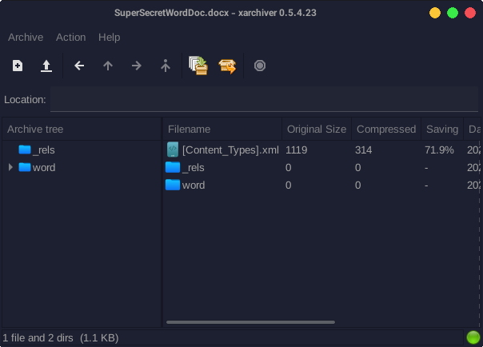
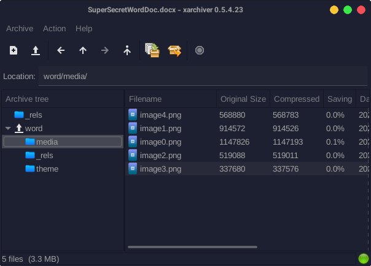

---
tags:
  - BSidesSF
  - BSidesSF-2024
  - Forensics
  - Word
---

تو این چلنج به ما یه فایل docx دادن که یه سری عکس رو نشون میده

در قدم اول مواجهه با فایل ورد، باید بازش کنیم و اگه فلگی توش نبود، در وهله دوم با zip viewer بازش کنیم

تو محتویات متنی این فایل هم فلگی نبود و پس با zip viewer بازش میکنیم =)))

یکم که تو فولدر ها بگردیم و یه سری چیزا مثل وجود داشتن یا نداشتن macro مطمئن بشیم، چشممون میخوره به عکس هایی که تو فایل ورود گنجونده شدن

اما wait, what?

چرا ۵ تا عکسه؟
مگه تو فایل ورد ۴ تا نبود؟

یه عکس اضافیه

که اونم image-0.png هست فلگ توشه

---
??? success "FLAG :triangular_flag_on_post:"
    
`CTF{st0ck_cut3_p1c5}`

!!! نویسنده
    [SafaSafari](https://twitter.com/SafaSafari3)

