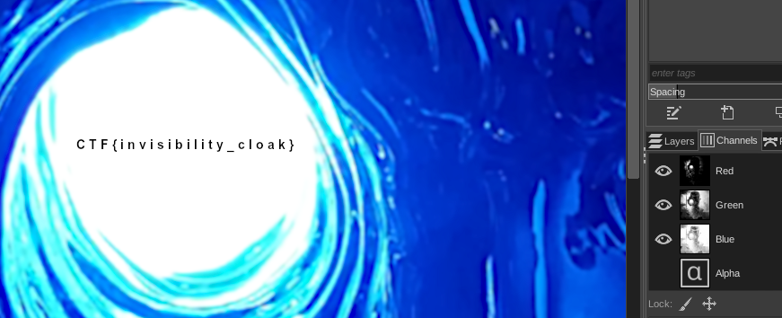
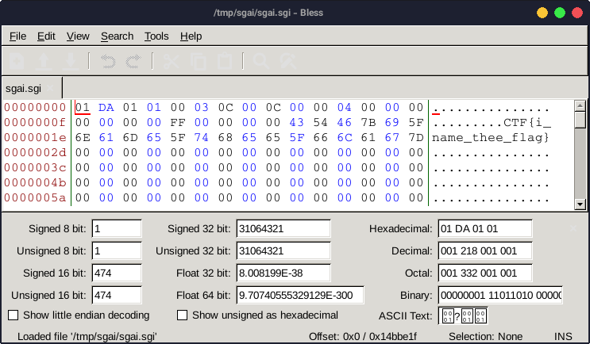
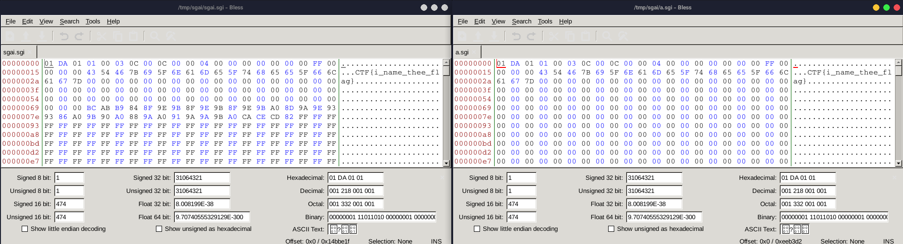
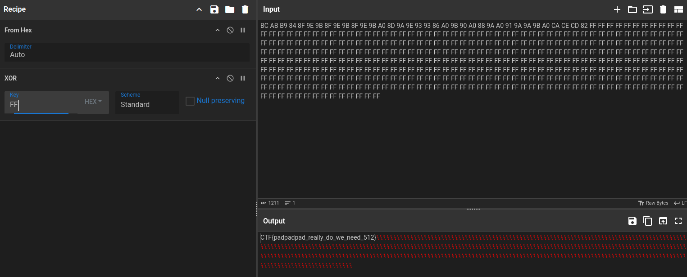

---
tags:
  - BSidesSF
  - BSidesSF-2024
  - Forensics
  - SGI
  - Steganography
---

این چلنج ۴ تا فلگ مختلف داشت که موفق شدم ۳ تاشون رو به دست بیارم

پسوند فایل چیه؟ sgi دیگه چه کوفتیه؟

مهم نیس

چون اگه دبل کلیک کنیم روش، با gimp باز میشه :joy:

به شخصه خیلی باهاش بازی بازی کردم و تا بالاخره فهمیدم اگه layer alpha رو مخفی کنم، یه فلگ میزنه بیرون



برا فلگ بعدی باید حرفه ای تر عمل کنیم :sunglasses:

پس میریم سراغ hex editor



زارت فلگ بعدی هم دراومد =)))

برا فلگ سوم بعد از ساعتها آزمون و خطا تصمیم گرفتم یه فایل sgi دیگه وردارم و با این مقایسه کنم

پس با این دستور، یه rebase از همین فایل sgi ساختم و هردو رو تو hex editor باز کردم

```bash
convert sgai.sgi a.sgi
```




تفاوت واضحه

یه مشت FF اینور هستن که اونور 00 ان

با بررسی struct فایل [از اینجا](https://en.wikipedia.org/wiki/Silicon_Graphics_Image)
فهمیدم که این تیکه پدینگه

پس کل پدینگ که میشه از 0x6c تا 0x1ff کپی کردم xor زدم با FF تا همشون 00 بشن



اینم از فلگ سوم

---
??? success "FLAG :triangular_flag_on_post:"
    <div dir="ltr">`CTF{i_name_thee_flag}`</div>
    <div dir="ltr">`CTF{invisibility_cloak}`</div>
    <div dir="ltr">`CTF{padpadpad_really_do_we_need_512}`</div>


!!! نویسنده
    [SafaSafari](https://twitter.com/SafaSafari3)

