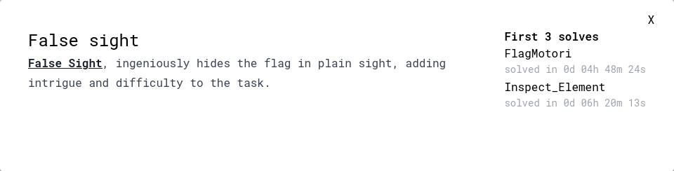
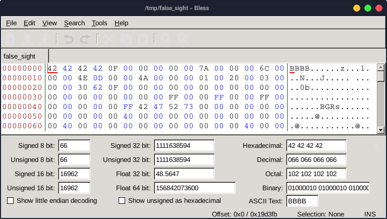
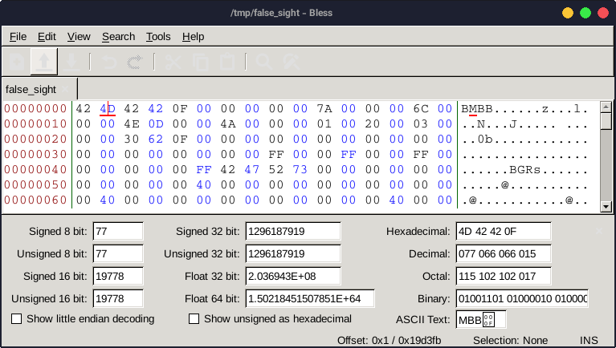
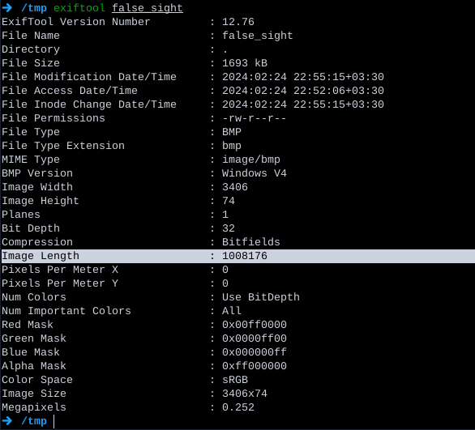
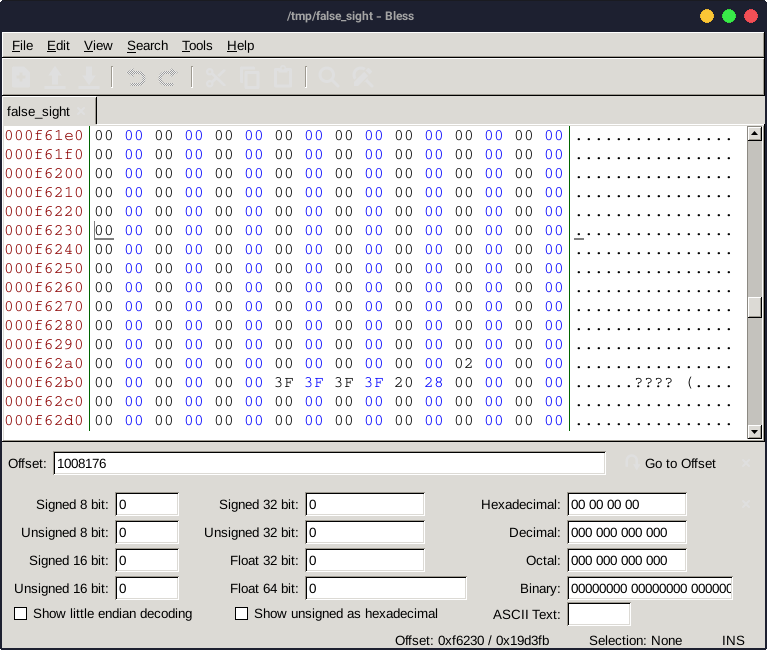
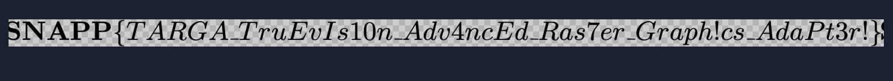

---
tags:
  - SnappCTF
  - SnappCTF-2024
  - Reverse
  - BMP
---



بدون فوت وقت میریم سراغ hex editor و میبینیم که به به



یه استرینگ به چشم میخوره به اسم
BGRs

با چندتا سرچ تو گوگل میفهمیم که فرمت فایل bmp هست

با [مجیک بایت](https://en.wikipedia.org/wiki/List_of_file_signatures) bmp فایل رو به این صورت فیکس میکنیم




خوردیم به در بسته =))

از اون جایی که ۹۹ درصد CTF های ایرانی رو اسیس طراحی کرده

از چلنج های قبلی اسیس یادمونه که یه چلنج بوده که همینجوری به فایل تصویری علامت سوال میرسیدیم و باید لنف تصویری رو جلو میرفتیم و یه عکس دیگه که چسبیده بوده به عکس رو پیدا کنیم و فلگ رو توش پیدا میکردیم

پس میریم سراغ [exiftool](https://en.wikipedia.org/wiki/ExifTool)



لاین سلکت شده به ما این رو میرسونه که فایل تصویریمون تا اینجا بیشتر نباید باشه، اما...



اما میبینیم که پاشو از گلیمش دراز تر کرده =)))

پس میزنیم کل عکسی که با علامت سوال پر شده رو پاک میکنیم :smiling_imp:

اون علامت سوالا رو میبینید آخرای صفحه؟

اونا توجه منو جلب میکنن

مخصوصا که چهار تان و مجیک بایت bmp هم چهار تاس

پس تا اونجا پاک میکنیم =))

حالا کی حال داره بشینه کل بایتا رو بازنویسی کنه؟

از قسمت اول همون فایل اولیه که مجیک بایتش رو فیکس کردیم، بایت ها رو تا جایی که به ۰۰ میرسیم کپی میکنیم و جوری میزاریم تو فایل که مجیک بایت بیفته رو علامت سوالا

یه همچین عکسی در میاد


کاملا واضحه که رزولوشن عکس مشکل داره

با خوندن فرمت فایل bmp متوجه میشیم که کجا باید رزولوشن رو ست کنیم

با این اسکریپت python میزنیم همه رزولوشن ها رو ست میکنیم رو عکس و تو یه فایل ذخیره میکنیم

برای این بروت فورس فقط نیازه x عکس رو بروت فورس کنیم

چون پیکسل های تصاویر از چپ به راست تکمیل میشن و ارتفاع تاثیری در پیکسل ها و ترتیبشون نداره

```python linenums="1"
hdr = bytearray.fromhex("42 4D 42 42 0F 00 00 00 00 00 7A 00 00 00 6C 00 00 00")
a = open("false_sight", 'rb').read()[0x16:]

for i in range(1, 10000):
    with open("res/{}.bmp".format(i), 'wb') as f:
        f.write(hdr + i.to_bytes(4, 'little') + a)
```

بعد از اجرای اسکریپت میریم سراغ عکسا و میبینیم این عکس خواناس


---
!!! نویسنده
    [SafaSafari](https://twitter.com/SafaSafari3)$~~~~~~~~~~~~~~~~~~~~~~~~~~~~~~~~~~~~~~~~~~~~~~~~~~~~~~~~~~~~~~~~~~~~~~~~~~~~~~~~~~~~~~~~~~~~~~~~~~~~~~~~~~~~~~~~~~~~~~~~~~~$تاریخ نگارش ۱۴۰۲/۱۲/۴