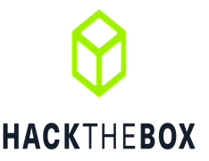

---
tags:
  - راهنمای شروع
  - beginner guide
---

#   راهنمای شروع CTF 
حال که با مسابقات CTF آشنا شدید سوال این است که: **از  کجا باید شروع کنم و نقشه راه مناسب چیست؟ چطوری به یک شخص ماهر در حل چالش‌های CTF تبدیل بشم؟** در این اینجا قصد داریم به این پرسش‌ها به شکل کلی جواب بدیم و یک راهنمایی اولیه برای افراد تازه وارد به این حوزه ارائه بدیم و سپس در هر دسته به طور تخصصی‌تر جزییاتی ارائه خواهیم داد.

با فرض اینکه یک آشنایی مقدماتی با کامپیوتر، یک زبان‌ برنامه‌نویسی و اندکی دانش زبان انگلیسی دارید می‌توانید شروع به حل چالش‌های CTF کنید. باید توجه داشت که "شروع" یک مفهوم نسبی و سلیقه‌ای است، با این حال **گام‌های زیر به ترتیب** حاوی نکاتی است که به شما در این مورد کمک می‌کند. 

###   ۱- یافتن حوزه مورد علاقه :star2: :dart:
 
 پیدا کردن حوزه مورد علاقه‌ در CTF می‌تواند اولین گام مهم برای موفقیت در این مسیر باشد. همان‌طور که در منوی بالا می‌بینید شاخه‌های مختلفی از امنیت در مسابقات  CTF  وجود دارد.
 دسته‌های مختلف CTF مانند رمزنگاری، وب، pwn، مهندسی معکوس و جرم‌شناسی حوزه‌های اصلی در CTF هستند.
با مراجعه به هر  شاخه از منوی بالا توضیحاتی در مورد آن دسته و چالش‌های آن ارائه می‌دهد که شاید به شما در انتخاب خود کمک کند.   
**- توصیه:** اگرچه می‌توانید در بسیاری از دسته‌ها فعالیت کنید اما پیشنهاد می‌کنیم یک حوزه را عمیق‌تر و تخصصی‌تر دنبال کنید و سایر حوزه‌ها را به عنوان دانش اضافی در کنار آن تقویت کنید.

###  ۲- استفاده از منابع آموزشی :globe_with_meridians: :books:
بعد از پیدا کردن حوزه مورد علاقه باید شروع به  مطالعه منابع آموزشی مختلف (وبسایت، کتاب، بلاگ) کنید تا دانش پایه آن حوزه کسب کنید. یک از سایت‌های خوب در این زمینه بخش یادگیری سایت [picoctf](https://primer.picoctf.org/) است که می‌توانید استفاده کنید. سایت‌های آموزشی دیگری هم به شکل تخصصی روی یک حوزه خاص آموزش یا چالش‌هایی را ارائه می‌دهند که می‌توانید به آن‌ها مراجعه کنید. 

| PWN  | رمزنگاری| مهندسی معکوس |
|:-------:|:-----------:|:-------:|
|   |   |   |
|osint|جرم‌شناسی|وب|
|  |   |  |

علاوه بر این، در کنار مطالعه هر حوزه، نیاز به یادگیری ابزارها و کتابخانه‌های مختلفی مانند Wireshark pwntools ،John the Ripper و غیره دارید که به حل چالش‌ها کمک می‌کند. در همین سایت، ما در هر بخش سعی کردیم ابزارها و کتابخانه‌های  کاربردی را به مرور معرفی کنیم.

###   ۳- پیوستن به گروه‌های  CTF :speech_balloon: :busts_in_silhouette:
یکی از راه‌های تقویت مهارت در حل چالش‌ها ایجاد ارتباط با افراد با تجربه و حرفه‌ای است. 
ارتباطات می‌تواند منبع ارزشمندی برای **افزایش سرعت یادگیری** و حتی **فرصت‌های شغلی آینده** باشد.
 شما می‌توانید در شبکه‌های اجتماعی مانند دیسکورد، تلگرام و توییتر عضو سرورهای CTF شوید تا سوالات خود را بپرسید یا به سوالات دیگران پاسخ دهید.  در کل این تعاملات باعث افزایش مهارت شما می‌شود.
بسیاری از گروه‌ها و سرورهای مرتبط با CTF در Discord فعالیت می‌کنند که می‌توانید به سرورهای معروف مانند  [Hack The Box](https://discord.gg/hackthebox) ،[Capture The Flag](https://discord.gg/S2rHpTpv) بپیوندید. در توییتر نیز با دنبال کردن افراد معروف و تیم‌ها مرتبط با CTF ([مثل تیم خودمون](https://x.com/FlagMotori) :smile:) می‌توانید از اخبار و چالش‌های جدید آگاه شوید.

### ۴- خواندن Write-up :open_book: :memo:
شاید **مهم‌ترین** عامل برای یادگیری و تقویت در CTF خواندن رایتاپ یا نحوه حل چالش توسط دیگران است. خواندن مداوم رایتاپ چالش‌ها می‌تواند کمک زیاد به تقویت شما کند.
  گاهی نوشتن نحوه حل برای خود و همچنین خلاصه یا نکته‌برداری یک چالش به ماندگاری آن در ذهن کمک می‌کند. 
### ۵- تمرین منظم و پیوسته :weight_lifter: :repeat:

گاهی خواندن به تنهایی کافی نیست و لازم است خود را به چالش بکشید و شروع به حل یک چالش CTF  کنید. برای مثال یک مدت زمانی را روی یک چالش صرف کنید و اگر هنوز گیر کرده‌اید سپس به دنبال یک راهنمایی باشید یا رایتاپ‌های مشابه را بررسی کنید.

برای این کار استفاده از wargame گزینه مناسبی است زیرا شما به اندازه کافی زمان دارید تا روی یک چالش CTF تمرکز کنید.  علاوه بر سایت‌های اشاره شده در بالا که به طور تخصصی روی یک دسته متمرکز بودند، در زیر تعدادی از سایت‌هایی که چالش از همه حوزه‌ها دارند را قرار دادیم. این سایت‌ها چالش‌هایی را از سطح مبتدی تا دشوار را ارائه می‌دهند که می‌توانید از آن‌ها برای تمرین کردن استفاده کنید.

**- توصیه:** در این بین  picoctf  شاید گزینه مناسب‌تری برای شروع باشد.

 
 
<figcaption> برخی از سایت‌های wargame معروف</figcaption>

###  ۶- شرکت کردن در مسابقه :trophy: :video_game:
راه دیگر  برای شروع و تقویت مهارت مسابقه دادن است. بعد از اینکه اندکی با حوزه چالش‌ها و نحوه حل آن‌ها آشنا شدید وقت خوبی است که در یک مسابقه شرکت کنید. برای این کار می‌توانید به سایت [ctftime](https://ctftime.org) سر بزنید. بهتر است که ابتدا در مسابقاتی با وزن کم (۰ تا ۲۵) شرکت کنید چون این مسابقات برای افرادی است که تازه وارد این عرصه شده‌اند. 

 **- توصیه:**

- **ایجاد یا پیوستن به یک تیم:**
استفاده از تجربه دیگران و
هم فکری گروهی باعث درک بهتری از چالش و ماندگاری بیشتر آن در ذهن می‌شود.

- **بررسی چالش‌ها بعد از اتمام مسابقه:** 
 دلایل یا اشتباهاتی که باعث شده نتوانید یک چالش را حل کنید را پیدا کنید. 
همچنین به خاطر سپردن الگو چالش‌ها و تفاوت آن با چالش‌های قبلی در ذهن بسپرید.

امیدواریم این موارد راهنمای شروع مناسبی باشد و شما را برای موفقیت کمک کند.

!!! نویسنده
    [HIGHer](https://twitter.com/HIGH01012)
