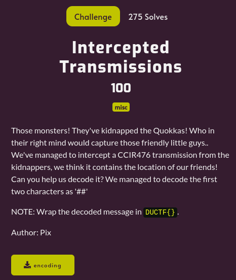

---
tags:
  - DownUnderCTF
  - DownUnderCTF-2024
  - Misc
---

# چالش Intercepted Transmissions
---

<center>

</center>

فایل تکست ضمیمه‌شده به چالش شامل یکسری صفر و یک متوالی هست. با توجه به توضیح سوال، هینتی که وجود داره اینه که این رشته احتمالا با استفاده از روش CCIR476 که یک انکدینگ قدیمی برای  انتقال داده‌ها در ارتباطات رادیویی با قابلیت تشخیص و اصلاح خطاهای یک بیتی  هست کد شده. برای آشنایی بیشتر با این روش کد کردن و چگونگی نوشتن کد انکودر و دیکودر، می‌تونین از [لینک ۱](https://en.wikipedia.org/wiki/CCIR_476) و [لینک ۲](https://blog.gcwizard.net/manual/en/ccitt-codes/08-what-is-ccir-476/) و [لینک ۳](https://github.com/AI5GW/CCIR476) استفاده کنید.

یک اسکریپت پایتون می‌نویسیم که طبق اون لینک‌های مرجع هندل کنه دیکود کردن این رشته باینری رو به صورت بلاک‌های ۵ بیتی.

```python
class CCIR476:
    def __init__(self):
        self.CCIR_MODE = 1  # Default to letter mode
        self.OLD_MODE = 1
    
    def decode(self, CCIR):
        if CCIR == 0x78: return '\r'  # CR
        if CCIR == 0x6C: return '\n'  # LF
        if CCIR == 0x5C: return ' '   # SP
        if CCIR == 0x0F: return ''    # ALPHA
        if CCIR == 0x33: return ''    # BETA
        if CCIR == 0x66: return ''    # REP
        if CCIR == 0x5A:
            self.CCIR_MODE = 1
            return ''
        if CCIR == 0x36:
            self.CCIR_MODE = 0
            return ''
        
        if self.CCIR_MODE == 1:
            return self.decode_letter_mode(CCIR)
        else:
            return self.decode_figure_mode(CCIR)
    
    def decode_letter_mode(self, CCIR):
        letter_mode_mapping = {
            0x47: 'A', 0x72: 'B', 0x1D: 'C', 0x53: 'D', 0x56: 'E', 0x1B: 'F', 0x35: 'G', 0x69: 'H',
            0x4D: 'I', 0x17: 'J', 0x1E: 'K', 0x65: 'L', 0x39: 'M', 0x59: 'N', 0x71: 'O', 0x2D: 'P',
            0x2E: 'Q', 0x55: 'R', 0x4B: 'S', 0x74: 'T', 0x4E: 'U', 0x3C: 'V', 0x27: 'W', 0x3A: 'X',
            0x2B: 'Y', 0x63: 'Z'
        }
        return letter_mode_mapping.get(CCIR, '')
    
    def decode_figure_mode(self, CCIR):
        figure_mode_mapping = {
            0x2D: '0', 0x2E: '1', 0x27: '2', 0x56: '3', 0x55: '4', 0x74: '5', 0x2B: '6', 0x4E: '7',
            0x4D: '8', 0x71: '9', 0x4B: "'", 0x1B: '!', 0x1D: ':', 0x1E: '(', 0x35: '&', 0x39: '.',
            0x3A: '/', 0x3C: '=', 0x47: '-', 0x53: '$', 0x59: ',', 0x63: '+', 0x65: ')', 0x69: '#',
            0x72: '?'
        }
        return figure_mode_mapping.get(CCIR, '')

def ccir476_decode(binary_string):
    n = 7
    segments = [int(binary_string[i:i+n], 2) for i in range(0, len(binary_string), n)]
    
    decoder = CCIR476()
    decoded_message = ''.join([decoder.decode(segment) for segment in segments])
    
    return decoded_message

binary_string = "101101001101101101001110100110110101110100110100101101101010110101110010110100101110100111001101100101101101101000111100011110011011010101011001011101101010010111011100100011110101010110110101011010111001011010110100101101101010110101101011001011010011101110001101100101110101101010110011011100001101101101101010101101101000111010110110010111010110101100101100110111101000101011101110001101101101001010111001011101110001010111001011100011011"
decoded_message = ccir476_decode(binary_string)
print(decoded_message)
```

فلگ زیر پس از اجرای کد به نمایش در می‌آید.

---
??? success "FLAG :triangular_flag_on_post:"
    <div dir="ltr">`DUCTF{##TH3 QU0KK4'S AR3 H3LD 1N F4C1LITY #11911!}`</div>


!!! نویسنده
    [Sadegh](https://github.com/sadegh-majidi)

