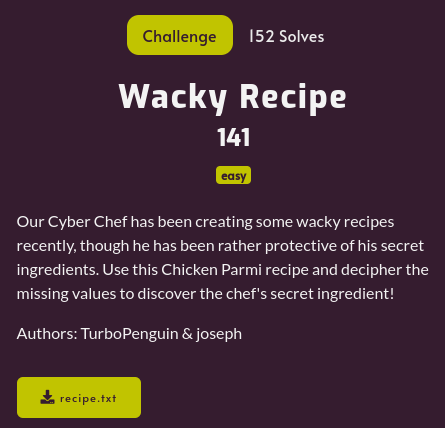
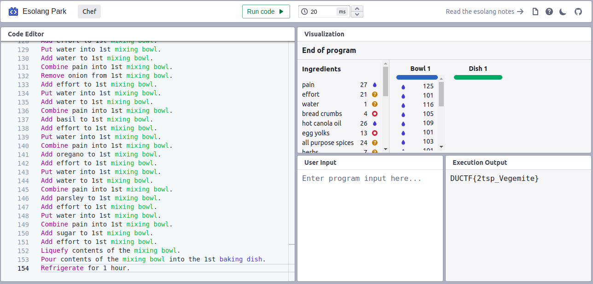

---
tags:
  - DownUnderCTF
  - DownUnderCTF-2024
  - Misc
---

# چالش Wacky Recipe
---

<center>

</center>

فایل تکست ضمیمه‌شده به چالش یک متن با فرمت یک دستور آماده کردن غذا به نظر میاد در نگاه اول. بعد از اینکه نشد یک الگوی مناسب از داخل این دستور پیدا کنیم، سراغ سرچ توی گوگل میریم. 

```
Chicken Parmi.

Our Cyber Chef has been creating some wacky recipes recently, though he has been rather protective of his secret ingredients.
Use this Chicken Parmi recipe and decipher the missing values to discover the chef's secret ingredient!
This recipe produces the flag in flag format.

Ingredients.
27 dashes pain
21 cups effort
1 cup water
4 kg bread crumbs
26 ml hot canola oil
13 kg egg yolks
24 teaspoons all purpose spices
7 teaspoons herbs
26 kg flour
26 kg sliced chicken breasts
1 dashes salt
11 dashes pepper
7 dashes pride and joy
10 kg tomato sauce
14 g cheese
13 kg ham
2 g pasta sauce
6 dashes chilli flakes
5 kg onion
9 dashes basil
19 dashes oregano
10 dashes parsley
20 teaspoons sugar

Cooking time: 25 minutes.

Pre-heat oven to 180 degrees Celsius.

Method.
Put water into 1st mixing bowl.
Add water to 1st mixing bowl.
Add water to 1st mixing bowl.
Add water to 1st mixing bowl.
Combine pain into 1st mixing bowl.
Remove bread crumbs from 1st mixing bowl.
Add effort to 1st mixing bowl.
Put water into 1st mixing bowl.
Add water to 1st mixing bowl.
Combine pain into 1st mixing bowl.
.
.
.
```

بعد از کمی سرچ متوجه می‌شیم که Chef یک زبان برنامه‌نویسی esoteric هست که با وجود این شکل عجیب غریبش حتی تورینگ-کامپلت هم هست و اساس کارش داده‌ساختار استک هست. میتونید برای مطالعه بیشتر به  [این لینک](http://progopedia.com/language/chef/) مراجعه کنید. قبل از اینکه بتونیم رانش کنیم باید دو مقدار pain و effort رو به جای علامت سوال با مقدار عددی درست جایگزین کنیم. میشه بروت‌فورس کرد اما کار هوشمندانه‌تر اینه که چون بر اساس استک هست و عملیات‌های استفاده‌شده روی متغیر‌ها هم همشون خطی هستند و ما دو حرف اول فلگ یعنی D و U رو می‌دونیم، یک دو معادله و دو مجهول تشکیل بدیم و مقادیر مناسب مجهولات رو پیدا کنیم که به ترتیب pain مقدار ۲۷ و effort مقدار ۲۱ داره. نهایتا بعد از جایگذاری این مقادیر در کد اصلی و ران کردنش به صورت [آنلاین](https://esolangpark.vercel.app/ide/chef) حروف فلگ قابل مشاهده است. 

<center>

</center>

---
??? success "FLAG :triangular_flag_on_post:"
    <div dir="ltr">`DUCTF{2tsp_Vegemite}`</div>


!!! نویسنده
    [Sadegh](https://github.com/sadegh-majidi)

